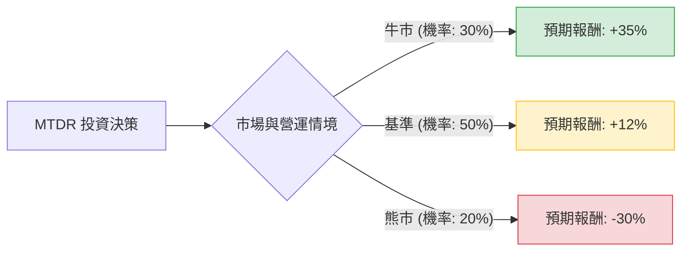

針對美股 **Matador Resources Company (MTDR)** 的投資評估，我們將結合當前能源市場環境（油價波動）、該公司的財務現況（特別是近期對 Ameredev 的收購案）以及行業趨勢，進行決策樹與期望值分析。

---

### 一、 核心假設 (Core Assumptions)

在建立模型前，基於 2024 年下半年的市場資訊，設定以下核心假設：

1.  **市場環境（油價 WTI）**：
    *   **樂觀**：全球經濟強韌且地緣政治風險升溫，油價維持在 $85 - $95 美元。
    *   **中性**：OPEC+ 維持減產且需求穩定，油價維持在 $70 - $80 美元。
    *   **悲觀**：全球經濟衰退導致需求大幅萎縮，油價跌破 $60 美元。
2.  **公司財務與運營 (MTDR)**：
    *   MTDR 以其在德拉瓦盆地（Delaware Basin）的高資本效率著稱。
    *   **收購因素**：近期以 19 億美元收購 Ameredev，將顯著提升產量，但也增加了短期債務壓力。
    *   **中流資產**：其擁有的 San Mateo 中流資產提供穩定的現金流屏障。
3.  **預期報酬設定**（以一年為期）：
    *   **牛市情境**：獲利超預期 + 債務快速償還，預期報酬 **+35%**。
    *   **基準情境**：產量穩定增長 + 穩定派息，預期報酬 **+12%**。
    *   **熊市情境**：油價崩跌 + 債務槓桿風險增加，預期報酬 **-30%**。

---

### 二、 決策樹分析 (Decision Tree)

以下為 MTDR 投資決策樹的結構：

#### 決策樹節點詳細標示：

| 節點名稱 (情境) | 機率 (Probability) | 預期報酬 (Return) | 期望值貢獻 (EV Component) |
| :--- | :--- | :--- | :--- |
| **牛市 (Bull Case)** | 30% (0.3) | +35% | 10.5% (0.3 * 35) |
| **基準 (Base Case)** | 50% (0.5) | +12% | 6.0% (0.5 * 12) |
| **熊市 (Bear Case)** | 20% (0.2) | -30% | -6.0% (0.2 * -30) |
| **總計 (Total)** | **100%** | -- | **10.5%** |

---

### 三、 計算過程 (Calculation Process)

期望值（Expected Value, EV）的計算方式為各情境之「機率」與「預期報酬」乘積之總和。

**計算公式：**
$$EV = \sum (Probability_i \times Return_i)$$

**步驟：**
1.  **牛市貢獻**：$0.30 \times 35\% = 10.5\%$
2.  **基準貢獻**：$0.50 \times 12\% = 6.0\%$
3.  **熊市貢獻**：$0.20 \times (-30\%) = -6.0\%$

**最終期望值計算：**
$$EV = 10.5\% + 6.0\% - 6.0\% = 10.5\%$$

---

### 四、 最終結論

#### **判斷：適合投資 (Suitable for Investment)**

#### **理由：**
1.  **正向期望值 (EV = 10.5%)**：
    根據模型計算，MTDR 的整體期望報酬率為正（10.5%），在目前的利率環境下，仍具備優於現金收益的吸引力。
    
2.  **風險對沖能力**：
    儘管熊市情境存在 -30% 的下行風險，但 MTDR 的基準情境（50% 機率）極為穩健。該公司擁有的中流（Midstream）資產在油價波動時能提供額外的現金流支持，降低了徹底崩盤的可能性。
    
3.  **成長動能清析**：
    Ameredev 的收購案提供了清晰的產量增長路徑。只要油價維持在每桶 70 美元以上（基準情境），MTDR 就能利用增長的產量與自由現金流（FCF）快速去槓桿，進而推升股價。

4.  **操作建議**：
    由於能源股受宏觀油價影響極大，建議採「分批買入」策略。目前 10.5% 的期望值顯示其盈虧比（Risk/Reward Ratio）良好，但投資者應關注 WTI 油價是否能守住 70 美元支撐線。

---
**免責聲明：** 本分析僅供參考，不構成任何形式的投資建議。投資美股具有市場風險，投資者在做出決策前應自行評估風險承受能力或諮詢專業理財顧問。