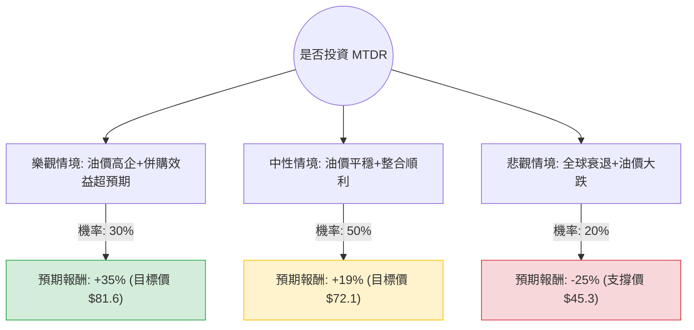

這份分析報告將結合您提供的基本面數據與最新的市場動態（包含 Ameredev 收購案、德拉瓦盆地產量及油價趨勢），利用**決策樹（Decision Tree）**與**期望值分析（Expected Value Analysis）**評估 Matador Resources (MTDR) 的投資價值。

---

### 一、 核心背景與市場動態分析

在進入計算前，我們先整合最新的外部資訊：
1.  **併購增長（Ameredev II 收購案）**：MTDR 於 2024 年第三季完成了對 Ameredev II 的收購，這顯著增加了其在德拉瓦盆地（Delaware Basin）的核心庫存，預計將推動 2025 年的產量大幅增長。
2.  **財務穩健性**：雖然 P/E 僅 9.93，但 Forward P/E 降至 7.44，且 PEG 為 0.69，顯示市場尚未完全反映其未來的增長潛力。
3.  **油價波動風險**：作為純 E&P（勘探與生產）公司，MTDR 的獲利高度依賴 WTI 原油價格。目前市場預期 2025 年油價將在 $70-$80 區間震盪。
4.  **分析師預期**：平均目標價約為 $72.14，較目前股價（$60.46）約有 19.3% 的上漲空間。

---

### 二、 決策樹分析 (Decision Tree)

我們將未來一年的情境分為三種：**樂觀（牛市）**、**中性（基準）**與**悲觀（熊市）**。

#### 節點詳細說明：

1.  **樂觀情境 (Bull Case) - 30% 機率**：
    *   **假設**：WTI 原油維持在 $85 以上；Ameredev 整合產生的協同效應高於預期；公司利用強勁現金流加速還債。
    *   **預期報酬**：考慮到 PEG 0.69 的低估值修復，股價有望突破分析師最高預期，達到約 $81.6（+35%）。

2.  **中性情境 (Base Case) - 50% 機率**：
    *   **假設**：WTI 原油維持在 $70-$80；產量符合公司指引；Forward P/E 回歸至行業平均水平。
    *   **預期報酬**：達到分析師平均目標價 $72.14，加上約 2.27% 的股息，總報酬約 +19%。

3.  **悲觀情境 (Bear Case) - 20% 機率**：
    *   **假設**：全球經濟衰退導致油價跌破 $60；高槓桿（Debt/Eq 0.63 在低油價下壓力增大）；收購案整合出現困難。
    *   **預期報酬**：股價回測 52 週低點區域，預估跌幅約 -25%（約 $45）。

---

### 三、 期望值計算 (Expected Value Calculation)

我們根據上述決策樹節點進行加權計算：

**1. 計算公式：**
$$EV = (P_{Bull} \times R_{Bull}) + (P_{Base} \times R_{Base}) + (P_{Bear} \times R_{Bear})$$

**2. 數值帶入：**
*   樂觀：$0.30 \times 35\% = 10.5\%$
*   中性：$0.50 \times 19\% = 9.5\%$
*   悲觀：$0.20 \times (-25\%) = -5.0\%$

**3. 總期望報酬率：**
$$EV = 10.5\% + 9.5\% - 5.0\% = 15.0\%$$

**4. 核心假設依據：**
*   **估值優勢**：P/E 9.93 與 Forward P/E 7.44 顯示安全邊際較高。
*   **增長動能**：EPS next Y 預期增長 11.76%，且 PEG < 1 具備吸引力。
*   **風險控制**：雖然 Current Ratio (0.79) 偏低，但 Oper. Margin (32.46%) 極高，足以支撐短期債務。

---

### 四、 最終結論

#### **判斷：適合投資 (Suitable for Investment)**

**理由如下：**

1.  **正向期望值 (15.0%)**：即便考慮了 20% 的極端悲觀情境，整體期望報酬率仍高達 15%，遠高於無風險利率及標普 500 的長期平均回報。
2.  **極具吸引力的估值**：PEG 0.69 顯示該股目前處於「增長被低估」的狀態。Forward P/E 僅 7.44，在能源板塊中極具競爭力。
3.  **併購帶來的規模效應**：收購 Ameredev 後，MTDR 在德拉瓦盆地的營運效率將提升，這將直接反映在未來的自由現金流（FCF）上。
4.  **技術面支撐**：目前股價高於 SMA200 (26.19%)，顯示長期趨勢向上；雖然短期 SMA20 略微回檔，但這提供了較佳的入場點。

**投資建議建議：**
*   **分批進場**：由於油價受地緣政治影響波動大，建議在 $58-$61 區間分批佈局。
*   **風險監控**：需密切關注 WTI 原油是否跌破 $65 支撐位，以及公司在下一季財報中關於 Ameredev 整合進度的說明。