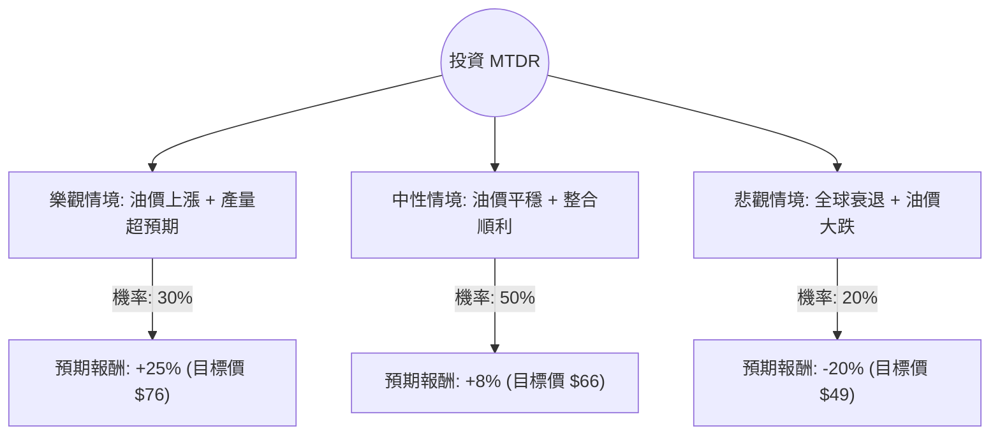

這份分析報告將針對 **Matador Resources Company (MTDR)** 進行深入評估。MTDR 是一家獨立的能源公司，主要在美國德拉瓦盆地（Delaware Basin）從事石油與天然氣的勘探、開發與生產。

以下結合您提供的數據與最新的市場動態（包含近期收購案與油價趨勢），進行決策樹與期望值分析。

---

### 一、 市場背景與最新動態分析

1.  **併購動能**：MTDR 近期完成了對 Ameredev II Parent, LLC 的收購，這顯著增加了其在德拉瓦盆地的核心庫存與產量。這類規模化經營有助於降低單位成本。
2.  **財務健康度**：P/E 僅 10.03，Forward P/E 降至 8.98，顯示估值相對便宜。雖然 Debt/Eq 為 0.63，但在能源產業中屬於可控範圍。
3.  **技術面**：股價目前處於 52 週高點附近（$61.05），且 SMA20/50/200 均呈現多頭排列，顯示短期動能極強。
4.  **外部風險**：油價波動是最大變數。目前 WTI 原油受地緣政治與全球需求疲軟雙重影響，波動較大。

---

### 二、 決策樹分析 (Decision Tree)

我們將未來一年的投資情境分為三種：**樂觀（牛市）、中性（基準）、悲觀（熊市）**。

#### 節點詳細說明：

| 情境 | 機率 (P) | 預期報酬 (R) | 說明 |
| :--- | :--- | :--- | :--- |
| **樂觀 (Bull)** | 30% | +25% | WTI 持續高於 $85，Ameredev 收購產生協同效應，EPS 增長超過預期的 58%。 |
| **中性 (Base)** | 50% | +8% | WTI 維持在 $70-$80，公司達到分析師平均目標價 ($64.48) 並加上股息收益。 |
| **悲觀 (Bear)** | 20% | -20% | 全球經濟衰退導致油價跌破 $65，高資本支出導致現金流受壓。 |

---

### 三、 核心假設與計算過程

#### 1. 核心假設
*   **市場假設**：假設未來 12 個月內不會發生極端的全球金融崩潰。
*   **產業假設**：德拉瓦盆地的開採成本保持穩定，MTDR 能維持其 32.46% 的營業利潤率。
*   **財務假設**：EPS next Y 增長 58.38% 是支撐股價的主要動力。

#### 2. 期望值 (Expected Value, EV) 計算
期望值計算公式：
$$EV = (P_{Bull} \times R_{Bull}) + (P_{Base} \times R_{Base}) + (P_{Bear} \times R_{Bear})$$

*   **樂觀貢獻**：$0.30 \times 25\% = 7.5\%$
*   **中性貢獻**：$0.50 \times 8\% = 4.0\%$
*   **悲觀貢獻**：$0.20 \times (-20\%) = -4.0\%$

**總期望報酬率 (Total EV) = 7.5% + 4.0% - 4.0% = 7.5%**

---

### 四、 綜合評估與最終結論

#### 1. 優勢分析 (Pros)
*   **估值吸引力**：PEG 僅 1.03，相對於其 58% 的預期 EPS 增長，目前股價並未過熱。
*   **營運效率**：ROE 14.13% 與 Profit Margin 20.76% 顯示公司獲利能力強健。
*   **動能強勁**：YTD 漲幅 43.85%，且站穩所有均線之上。

#### 2. 風險分析 (Cons)
*   **股價位階高**：目前股價距離 52 週高點僅一步之遙（-0.7%），短期內可能面臨獲利了結壓力。
*   **現金流壓力**：P/FCF 為 31.39，顯示相對於自由現金流，股價不算便宜（主要是因為近期大量的資本支出與收購）。

#### 3. 最終判斷：**適合投資 (建議：分批佈局 / 逢回買進)**

**理由：**
1.  **期望值為正 (7.5%)**：雖然目前股價接近歷史高點，但考慮到其極高的預期盈餘成長率 (EPS next Y: 58%) 與低本益比，長期價值依然存在。
2.  **產業整合優勢**：MTDR 在德拉瓦盆地的規模化擴張將提升其抗風險能力。
3.  **技術面支撐**：雖然短期有回檔風險，但強勁的 SMA 趨勢顯示市場資金高度認可。

**操作建議：**
由於目前股價處於高位，不建議一次性重倉。建議在股價回測 **SMA20 (約 $56-$57 區間)** 時進行分批買進，以優化風險報酬比。若 WTI 原油價格跌破 $65，則需重新評估悲觀情境發生的可能性。