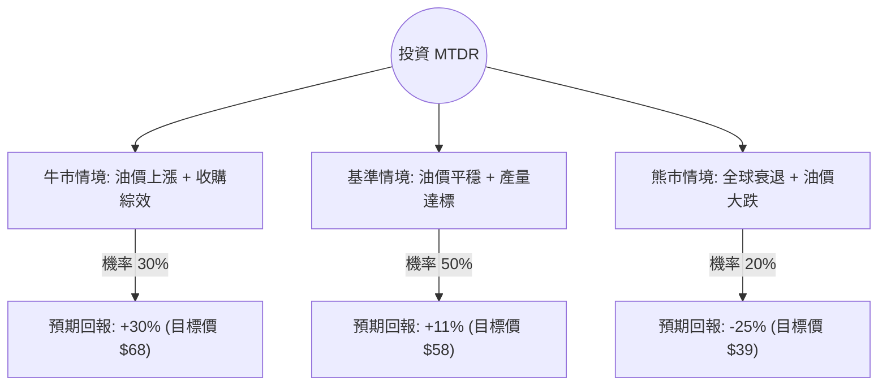

針對美股 **Matador Resources Company (MTDR)** 的投資評估，我結合了您提供的基本面數據，並檢索了最新的市場動態（如 2024 年第三季財報預期、Ameredev 收購案進度及油價走勢），進行決策樹與期望值分析。

---

### 一、 核心背景與現狀分析

1.  **基本面亮點**：
    *   **估值低廉**：P/E 僅 8.38，遠低於能源板塊平均水平；P/B 1.18 顯示股價接近帳面價值。
    *   **營運效率**：ROE 15.06% 表現穩健，營業利益率（Oper. Margin）高達 35.3%。
    *   **擴張動能**：MTDR 近期完成了對 Ameredev II 的收購（約 19 億美元），這顯著增加了其在德拉瓦盆地（Delaware Basin）的庫存與產量。
2.  **風險點**：
    *   **債務壓力**：Debt/Eq 0.58 雖屬合理，但收購案後需關注槓桿率。
    *   **增長放緩**：數據顯示 EPS 今年與明年預期下滑（-24%），反映了油價波動及資本支出增加的壓力。
    *   **技術面**：股價近期強勢（SMA20/50/200 均呈正向排列），但已接近分析師目標價 $58.05。

---

### 二、 決策樹分析 (Decision Tree)

我們以「未來 12 個月的投資回報」為核心，設定三種主要情境：

#### 節點詳細說明：

1.  **牛市情境 (Bull Case) - 30%**：
    *   **條件**：WTI 原油回升至 $85 以上；Ameredev 收購案產生的協同效應超預期，自由現金流（FCF）大幅增長。
    *   **預期報酬**：股價挑戰歷史高點，約 $68。
2.  **基準情境 (Base Case) - 50%**：
    *   **條件**：油價維持在 $70-$80 區間；公司維持現有派息並逐步去槓桿；符合分析師平均目標價。
    *   **預期報酬**：達到目標價 $58.05，約 +10.8%（含股息約 11%）。
3.  **熊市情境 (Bear Case) - 20%**：
    *   **條件**：全球經濟衰退導致需求崩潰，油價跌破 $65；高債務成本侵蝕利潤。
    *   **預期報酬**：回測 52 週低點支撐，約 $39。

---

### 三、 期望值分析 (Expected Value Analysis)

#### 1. 計算過程
我們根據上述情境的機率與回報率進行加權計算：

*   **現價 ($P_0$)**：$52.39
*   **牛市預期值**：$0.30 \times 30\% = 9.0\%$
*   **基準預期值**：$0.50 \times 11\% = 5.5\%$
*   **熊市預期值**：$0.20 \times (-25\%) = -5.0\%$

**總期望報酬率 (Expected Return)**：
$$9.0\% + 5.5\% - 5.0\% = 9.5\%$$

#### 2. 核心假設
*   **市場假設**：聯準會降息週期啟動，有利於能源需求與降低 MTDR 的債務利息負擔。
*   **財務假設**：公司能維持 20% 以上的淨利率（Profit Margin），且收購後的整合不出現重大減值。
*   **產業趨勢**：OPEC+ 繼續維持減產協議，支撐油價底線。

---

### 四、 最終結論

**判斷：適合投資 (Moderate Buy)**

#### 理由：
1.  **正向期望值**：計算出的期望報酬率為 **9.5%**，在當前高波動市場中具有吸引力，且風險回報比（Risk/Reward Ratio）尚屬合理。
2.  **估值安全邊際**：P/E 8.38 顯示市場對其悲觀預期已大部分反映在股價中。即便在熊市情境下，其優質的資產（Delaware Basin）仍具備長期價值。
3.  **技術面支撐**：目前股價站穩 SMA200（$52.39 > SMA200 漲幅約 15%），顯示中期趨勢轉強。
4.  **收購紅利**：Ameredev 的加入將在 2025 年顯著提升產量規模，這尚未完全反映在目前的 EPS 預測中。

**建議操作策略：**
*   **進場點**：$50 - $52 區間分批佈局。
*   **停損點**：若跌破 $45（跌破主要支撐位）則需重新評估。
*   **目標**：首波看 $58，若油價配合可持有至 $65。

---
*免責聲明：以上分析僅供參考，不構成投資建議。投資股票有風險，入市需謹慎。*