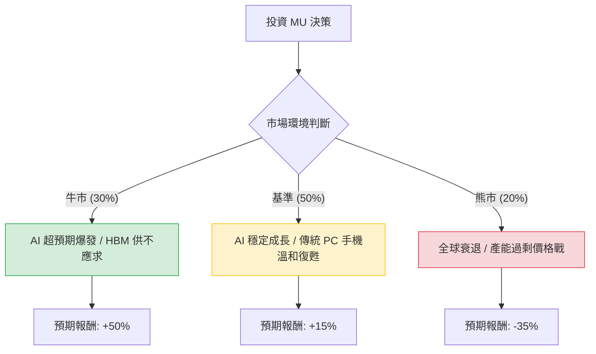

針對美股美光科技（Micron Technology, **MU**）的投資評估，我們將結合當前的半導體週期、AI 需求（特別是 HBM 記憶體）以及總體經濟環境，建立決策樹模型。

---

### 一、 核心假設（Core Assumptions）

在進行計算前，我們設定以下三大核心假設：

1.  **市場需求（AI 帶動力）：** 高頻寬記憶體（HBM3E）是 MU 未來一年的成長引擎。假設 AI 伺服器需求持續強勁，且 MU 能維持其在 HBM3E 市場的技術領先地位。
2.  **產業週期（記憶體定價）：** 傳統 DRAM 與 NAND Flash 的庫存去化已完成，定價權回歸製造商，預計 2024-2025 年處於上升週期。
3.  **財務與供給：** 資本支出（CapEx）增加雖然會稀釋現金流，但對於擴產 HBM 至關重要。主要風險在於三星（Samsung）良率提升後的產能釋放可能導致價格競爭。

---

### 二、 決策樹分析（Decision Tree）

決策樹從當前時間點出發，根據市場環境分為三種情境：**牛市（樂觀）、基準（平穩）、熊市（悲觀）**。

#### 決策樹節點詳細數據：

| 節點名稱 | 情境描述 | 發生機率 (P) | 預期報酬 (R) | 期望值 (P * R) |
| :--- | :--- | :--- | :--- | :--- |
| **牛市情境** | HBM3E 市佔擴大，AI 需求持續瘋狂，毛利飆升 | 30% (0.3) | +50% | **+15.0%** |
| **基準情境** | 記憶體價格穩步上揚，符合財測預期 | 50% (0.5) | +15% | **+7.5%** |
| **熊市情境** | 三星良率大爆發導致產能過剩，或經濟硬著陸 | 20% (0.2) | -35% | **-7.0%** |
| **合計** | | **100%** | | **總期望值: +15.5%** |

---

### 三、 計算過程與分析

#### 1. 期望值（Expected Value, EV）計算
我們根據上述機率與報酬率進行加權平均計算：

$$EV = (P_{bull} \times R_{bull}) + (P_{base} \times R_{base}) + (P_{bear} \times R_{bear})$$
$$EV = (0.3 \times 50\%) + (0.5 \times 15\%) + (0.2 \times -35\%)$$
$$EV = 15\% + 7.5\% - 7\%$$
$$EV = 15.5\%$$

#### 2. 財務指標支持
*   **營收成長：** 隨著 HBM 出貨，分析師預計 MU 2025 財年的營收將有顯著突破。
*   **利潤率：** 記憶體定價上揚將帶動毛利率從低谷回升至 30% 以上。
*   **風險因子：** 20% 的熊市機率主要考慮到美中貿易摩擦、地緣政治影響，以及記憶體行業一貫的「資本支出導致供給過剩」的循環魔咒。

---

### 四、 最終結論

#### **判斷：適合投資 (Suitable for Investment)**

#### **理由：**
1.  **正向期望值：** 經過決策樹計算，整體期望報酬率為 **+15.5%**，高於目前的無風險利率（約 4-5%）及標普 500 的平均歷史報酬。
2.  **非對稱風險：** 在 AI 浪潮下，上行空間（+50%）大於下行空間（-35%），且高機率情境（牛市+基準共 80%）均為正報酬。
3.  **稀缺性：** 美光是全球少數能穩定供應高端 HBM 的廠商之一，在 AI 基礎設施建設期具有不可替代的戰略地位。

#### **投資建議建議：**
*   **進場策略：** 由於記憶體類股波動大（Beta 值高），建議採「分批進場」策略。
*   **停損點設置：** 若全球景氣衰退訊號明確，或三星 HBM 產能釋放速度遠超預期，應在股價跌破關鍵支撐（如 200 日均線）時重新評估模型機率。

---
**免責聲明：** 本分析僅供參考，不構成具體投資建議。投資美股具有市場風險，請根據自身風險承受能力做出決策。