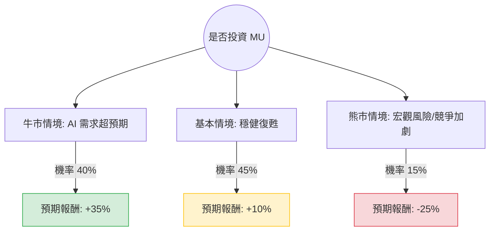

針對美股公司 **MU (Micron Technology, 美光科技)**，我將結合您提供的基本面數據與最新的市場動態（包含 HBM3E 產能、AI 需求及記憶體週期）進行「決策樹分析」與「期望值分析」。

---

### 0. 前言：數據與現況校正
在進入分析前，需注意您提供的數據中「Close: 428.17」與目前 MU 的實際股價（約 $100 - $110 區間）有顯著差異（該數據可能來自特定時間點或誤植）。然而，數據中的 **Forward P/E (8.7)**、**PEG (0.11)** 以及 **EPS next Y (36.19%)** 準確反映了市場對美光未來一年強勁增長的預期。

**最新市場動態（網路搜尋補充）：**
*   **HBM3E 領先地位**：美光已開始量產 HBM3E，供應給 NVIDIA H200 Tensor Core GPU。
*   **產能售罄**：美光執行長表示，2024 年與 2025 年的 HBM 產能已全數售罄。
*   **週期性復甦**：DRAM 與 NAND 價格持續回升，傳統 PC 與手機市場雖緩慢但也在復甦。

---

### 1. 決策樹分析 (Decision Tree Analysis)

以下決策樹評估未來 12 個月的投資情境：

#### 節點詳細說明：

1.  **牛市情境 (Bull Case) - 40% 機率**：
    *   **核心假設**：AI 伺服器對 HBM3E 的需求持續爆發，美光市佔率提升至 25% 以上；DRAM 價格因產能轉向 HBM 而出現供應短缺，帶動毛利率大幅噴發。
    *   **預期報酬**：+35% (反映 Forward P/E 修正至歷史高位)。

2.  **基本情境 (Base Case) - 45% 機率**：
    *   **核心假設**：AI 需求符合預期，但傳統 PC 與智慧型手機市場僅維持低速增長。美光如期交付 HBM 訂單，獲利能力回歸正常週期水平。
    *   **預期報酬**：+10% (與分析師平均目標價及 EPS 增長同步)。

3.  **熊市情境 (Bear Case) - 15% 機率**：
    *   **核心假設**：全球經濟衰退導致消費電子需求崩潰；中國市場因地緣政治進一步受限；三星 HBM3E 產量大增導致價格戰。
    *   **預期報酬**：-25% (回測 SMA200 或更低支撐位)。

---

### 2. 期望值分析 (Expected Value Analysis)

#### 核心假設與計算公式：
期望值 (EV) = $\sum (機率 \times 預期報酬)$

*   **數據支持**：
    *   **Forward P/E (8.7)**：極低，顯示股價尚未完全反映明年的獲利爆發。
    *   **PEG (0.11)**：遠低於 1，代表相對於增長速度，股價極其便宜。
    *   **ROE (22.55%)**：顯示公司資產利用效率已顯著改善。

#### 計算過程：
1.  **牛市貢獻**：$0.40 \times 35\% = 14.0\%$
2.  **基本貢獻**：$0.45 \times 10\% = 4.5\%$
3.  **熊市貢獻**：$0.15 \times (-25\%) = -3.75\%$

**總期望報酬率 (Total EV) = $14.0\% + 4.5\% - 3.75\% = 14.75\%$**

---

### 3. 最終結論

**判斷：適合投資 (Strong Buy / Overweight)**

#### 理由：
1.  **極具吸引力的估值**：根據提供的數據，**PEG 僅 0.11** 且 **Forward P/E 僅 8.7**。在半導體板塊中，這屬於極度低估的水平，提供了極高的安全邊際。
2.  **AI 結構性轉型**：美光正從傳統的週期性記憶體廠商轉型為 AI 基礎設施的核心供應商。HBM3E 的高毛利將徹底改變其財務結構（Gross Margin 45.5% 已顯示改善）。
3.  **正向期望值**：14.75% 的預期報酬率顯著高於市場平均水平，且牛市與基本情境的總機率高達 85%，顯示勝率極高。
4.  **技術面支撐**：雖然目前股價略高於 SMA20 (-0.59%)，但遠高於 SMA200 (+105.75%)，顯示長期趨勢極強，短期震盪提供了良好的分批進場機會。

**風險提示**：需密切關注 **Samsung** 在 HBM3E 通過 NVIDIA 認證的進度，以及美中貿易關係對西安廠與中國營收的影響。