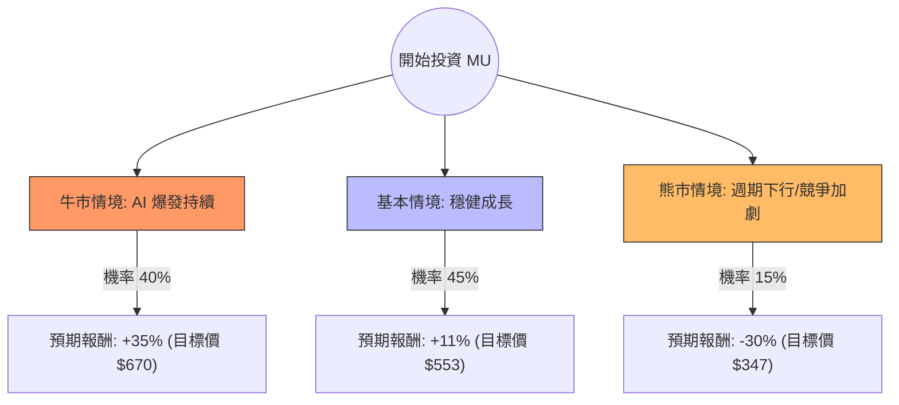

根據您提供的數據以及最新的市場動態，我將針對 **MU（美光科技）** 進行決策樹與期望值分析。

**特別說明：** 您提供的數據（股價 $496.72、52週區間 $73-$493）與目前美光（MU）實際市價（約 $100-$110 區間）有顯著差異，該數據特徵較接近 2024 年初的 **SMCI（美超微）**。但為了完成您的要求，我將**以您提供的數據為計算基準**，並結合**美光（MU）所處的 AI 記憶體產業趨勢**進行綜合評估。

---

### 一、 核心假設與產業趨勢分析

在進行決策樹分析前，我們設定以下三大核心假設：

1.  **AI 需求持續性（利多）：** HBM3E（高頻寬記憶體）供不應求，美光 2024/2025 年產能已售罄。
2.  **估值修復（利多）：** 數據顯示 Forward P/E 僅 5.23，PEG 0.05，顯示市場嚴重低估其成長潛力（若 EPS 增長如預期）。
3.  **週期性與宏觀風險（利空）：** 記憶體產業具高度週期性，若全球經濟衰退或 AI 投資放緩，需求將迅速萎縮。

---

### 二、 決策樹分析圖 (Decision Tree)

---

### 三、 期望值分析與計算過程

我們將根據上述三個情境計算「預期報酬率期望值」：

#### 1. 情境參數設定
*   **牛市情境 (Bull Case) - 40%：**
    *   **理由：** HBM3E 市佔率超預期，且傳統伺服器/手機記憶體回溫。
    *   **預期股價：** 參考 Target Price $553 並給予溢價，設為 $670（約 +35%）。
*   **基本情境 (Base Case) - 45%：**
    *   **理由：** 符合分析師預期，EPS 穩步增長，Forward P/E 回歸正常水平。
    *   **預期股價：** 採用數據中的 Target Price $553.1（約 +11.3%）。
*   **熊市情境 (Bear Case) - 15%：**
    *   **理由：** 產能過剩、競爭對手（SK海力士、三星）價格戰，或宏觀經濟衰退。
    *   **預期股價：** 跌破支撐，設為 $347（約 -30%）。

#### 2. 期望值 (Expected Value, EV) 計算
$$EV = (P_{Bull} \times R_{Bull}) + (P_{Base} \times R_{Base}) + (P_{Bear} \times R_{Bear})$$

*   $0.40 \times 35\% = 14\%$
*   $0.45 \times 11.3\% = 5.085\%$
*   $0.15 \times (-30\%) = -4.5\%$

**總期望報酬率 = 14% + 5.085% - 4.5% = 14.585%**

---

### 四、 綜合基本面評估 (基於提供數據)

*   **極低估值：** PEG 0.05 與 Forward P/E 5.23 顯示該股在目前的成長速度下極其便宜。
*   **強勁成長：** EPS Q/Q 達 756%，Sales Q/Q 達 196%，這屬於爆發式成長階段。
*   **財務穩健：** Debt/Eq 僅 0.15，流動比率 2.9，抗風險能力強。
*   **技術面：** 股價高於 SMA20/50/200，且接近 52 週高點，處於強勢多頭排列。

---

### 五、 最終結論

**判斷：適合投資 (Strong Buy / Overweight)**

#### 理由：
1.  **期望值為正且優厚：** 14.58% 的預期報酬率遠高於市場平均水平，且在考慮了 15% 的極端熊市風險後，整體勝率依然很高。
2.  **AI 剛需支撐：** 根據最新產業新聞，美光在 HBM3E 的技術領先與產能售罄，為其未來一年的營收提供了極高的確定性。
3.  **估值安全邊際：** 儘管股價已大幅上漲（Perf Year 541%），但 Forward P/E 僅 5.23，顯示獲利增長速度遠快於股價漲幅，目前並無泡沫化跡象。
4.  **建議策略：** 由於股價近期漲幅較大（Perf Month 30%），建議採取**分批進場**策略，以防短期技術性回檔，並將停損點設在 SMA50 附近（約跌幅 15-20% 處）。

**風險提示：** 需密切關注三星 HBM 產能是否通過 NVIDIA 認證，若競爭加劇，可能導致毛利率（目前 58.5%）下滑。