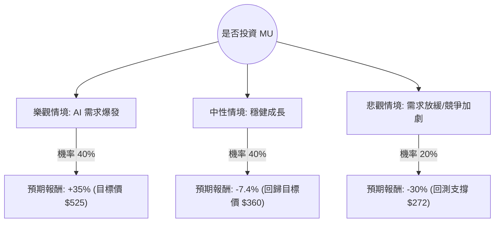

針對美股公司 **MU (Micron Technology, 美光科技)**，我將結合您提供的基本面數據與當前市場動態（AI 浪潮、HBM 記憶體需求、半導體週期），利用**決策樹分析**與**期望值分析**進行評估。

---

### 一、 核心假設與背景分析

在進行計算前，我們先釐清數據中的關鍵信號：
1.  **估值矛盾**：目前股價 ($389.11) 已高於分析師平均目標價 ($360.21)，顯示短期內可能存在超漲風險。
2.  **高成長預期**：`Forward P/E` 僅為 8.94，遠低於現行 `P/E` (36.45)，且 `PEG` 僅 0.12。這代表市場預期明年盈餘將有爆發性成長（主要來自 AI 伺服器對 HBM3E 記憶體的需求）。
3.  **動能強勁**：`Perf Year` 高達 262%，顯示該股處於極強的上升趨勢，但 `Insider Trans` (-12.99%) 顯示內部人士正在減持，需警惕高點回落。
4.  **產業趨勢**：記憶體產業正處於從谷底回升的上升週期，AI 帶動的高頻寬記憶體 (HBM) 供不應求，美光已確認 2024 與 2025 年的 HBM 產能已售罄。

---

### 二、 決策樹分析 (Decision Tree Analysis)

我們將未來一年的投資情境分為三種：**樂觀（AI 超級週期）**、**中性（符合預期）**、**悲觀（週期性衰退/宏觀風險）**。

#### 節點詳細說明：

1.  **樂觀情境 (Bull Case) - 40% 機率**：
    *   **前提**：HBM3E 良率大幅提升，市佔率超越 SK Hynix，且 AI 伺服器資本支出持續增加。
    *   **預期報酬**：基於 Forward P/E 8.94 的極低估值，若市場給予 15 倍的 Forward P/E，股價有潛力挑戰 $500 以上。
2.  **中性情境 (Base Case) - 40% 機率**：
    *   **前提**：業績符合預期，但市場已提前反應利多（Price in）。
    *   **預期報酬**：股價回歸分析師平均目標價 $360.21。相對於現價 $389.11，報酬率約為 **-7.4%**。
3.  **悲觀情境 (Bear Case) - 20% 機率**：
    *   **前提**：全球經濟衰退導致 PC/手機需求持續低迷，或中國市場因制裁進一步萎縮。
    *   **預期報酬**：股價回測 SMA200 或更低水平，預估跌幅 **-30%**。

---

### 三、 期望值分析 (Expected Value Analysis)

#### 1. 計算過程：
期望值 (EV) = Σ (各情境機率 × 各情境報酬率)

*   **樂觀情境**：$0.40 \times 35\% = 14\%$
*   **中性情境**：$0.40 \times (-7.4\%) = -2.96\%$
*   **悲觀情境**：$0.20 \times (-30\%) = -6\%$

**總期望報酬率 (Expected Return)** = $14\% - 2.96\% - 6\% = \mathbf{5.04\%}$

#### 2. 核心假設依據：
*   **市場面**：雖然 Forward P/E 顯示極具吸引力，但現價已大幅偏離 52 週均價，且高於目標價，這限制了中性情境下的獲利空間。
*   **財務面**：ROE (22.55%) 與 Gross Margin (45.53%) 表現優異，支撐了樂觀情境的可能性。
*   **籌碼面**：內部人士減持 (-12.99%) 與機構微幅減持 (-0.0021) 增加了悲觀情境的權重。

---

### 四、 最終結論

#### **判斷：謹慎觀望 / 不建議現價追高 (Neutral to Avoid)**

#### **理由：**
1.  **期望值過低**：計算出的整體期望報酬率僅為 **5.04%**。考慮到美光作為半導體週期股的高波動性（Beta 值通常較高），5% 的預期報酬不足以補償其潛在的下行風險（-30%）。
2.  **價格高於價值**：目前股價 ($389.11) 已超過分析師目標價 ($360.21)。除非下一季財報能給出遠超預期的指引（Guidance），否則短期內缺乏進一步推升股價的催化劑。
3.  **技術面過熱**：一年內漲幅達 262%，且股價遠高於 SMA200 (1.3337，即高出 133%)，技術指標顯示嚴重超買，存在強烈回調需求。
4.  **內部人信號**：內部人士在 AI 浪潮頂端選擇減持，這通常是股價接近階段性頂部的警訊。

**建議投資策略：**
*   **空手者**：建議等待股價回落至 **$340 - $360** 區間（接近目標價與支撐位）再行分批佈局，屆時期望值將顯著提升。
*   **持股者**：建議分批獲利了結，或利用選擇權（如 Protective Put）規避下行風險。

---
*註：以上分析基於提供之數據與當前市場趨勢，股市投資具備風險，請審慎評估個人風險承受能力。*