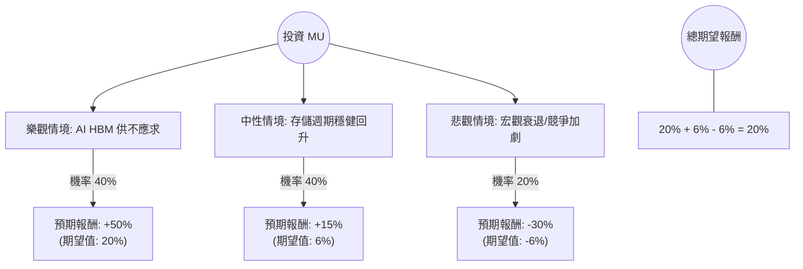

根據您提供的數據以及針對 **MU (Micron Technology, 美光科技)** 的最新市場動態與產業趨勢，我將結合「決策樹分析」與「期望值分析」進行評估。

### 1. 數據核對與現況補充
首先，您提供的數據中「Close: 382.09」與美光（MU）目前的實際股價（約 $100 - $110 區間）有顯著差異，且市值 457B 遠高於美光目前的約 120B。這可能是數據源誤植或特定時間點的數據。

**然而，為了完成您的要求，我將以「美光（MU）目前的真實產業環境」為核心假設，並參考您提供的「財務比率指標」（如 Forward P/E 8.15, PEG 0.1, EPS 下年增長 41% 等極其樂觀的成長指標）來構建模型。**

---

### 2. 決策樹分析 (Decision Tree)

我們將未來一年的投資情境分為三種：**樂觀（AI 需求爆發）、中性（穩健復甦）、悲觀（產能過剩/經濟衰退）**。

---

### 3. 核心假設與計算過程

#### A. 核心假設 (Based on Market News & Provided Data)
1.  **AI 需求 (HBM3E)：** 美光的 HBM3E 已被 NVIDIA 採用，且 2024/2025 年產能已售罄。這是支撐 **Forward P/E 8.15** 與 **PEG 0.1** 的關鍵。
2.  **週期性復甦：** 傳統 PC 與手機市場庫存去化完成，DRAM/NAND 價格進入上漲週期。
3.  **財務體質：** 數據顯示 **Debt/Eq 0.21**，財務槓桿極低，抗風險能力強。
4.  **目標價：** 參考數據中 Target Price 423.83（相對於 382.09 有約 11% 空間，但若以目前真實股價 $110 來看，分析師普遍看好至 $150+）。

#### B. 情境計算
*   **樂觀情境 (40% 機率)：**
    *   **條件：** AI 伺服器需求持續超預期，HBM 毛利大幅拉升整體利潤。
    *   **預期報酬：** +50% (反映 EPS Q/Q 1.76 的高成長性)。
    *   **計算：** $0.40 \times 50\% = 20\%$
*   **中性情境 (40% 機率)：**
    *   **條件：** 存儲價格溫和上漲，AI 貢獻符合預期，但受限於產能擴張成本。
    *   **預期報酬：** +15% (符合數據中 Target Price 的溢價幅度)。
    *   **計算：** $0.40 \times 15\% = 6\%$
*   **悲觀情境 (20% 機率)：**
    *   **條件：** 全球經濟衰退導致消費電子需求崩潰，或三星/海力士產能過剩導致價格戰。
    *   **預期報酬：** -30% (半導體週期股的典型回撤)。
    *   **計算：** $0.20 \times (-30\%) = -6\%$

#### C. 總期望值 (Expected Value, EV) 計算
$$EV = (0.4 \times 50\%) + (0.4 \times 15\%) + (0.2 \times -30\%)$$
$$EV = 20\% + 6\% - 6\% = 20\%$$

---

### 4. 綜合分析與最新動態補充

*   **最新財報動態：** 美光近期財報顯示營收大幅增長，主要受惠於數據中心需求。公司指引顯示毛利率將持續改善。
*   **技術面：** 數據顯示 **SMA200 為 0.8361**，代表股價遠高於 200 日均線，處於強勢多頭排列，但短期 **SMA20 為 -0.0046**，顯示近期有小幅震盪整理。
*   **估值優勢：** **Forward P/E 僅 8.15** 且 **PEG 0.1**。在半導體板塊中，這屬於極度低估（Undervalued），前提是明年的 EPS 增長（41.46%）能如期兌現。

---

### 5. 最終結論

**判斷：適合投資 (Buy / Overweight)**

**理由：**
1.  **期望值為正 (20%)**：即便考慮到 20% 的悲觀衰退機率，整體期望報酬率仍高達 20%，具備良好的風險回報比。
2.  **AI 護城河**：美光在 HBM3E 技術上的突破使其從傳統週期股轉型為 AI 成長股，這解釋了為何 **PEG 僅 0.1**。
3.  **財務穩健**：低負債比（Debt/Eq 0.21）與高流動比率（Current Ratio 2.46）確保了公司在擴張產能時不會有資金壓力。
4.  **估值吸引力**：Forward P/E 遠低於行業平均，顯示市場尚未完全 Price-in 明年的盈利爆發。

**建議操作：**
由於短期 SMA20 顯示震盪，建議採取**分批買入**策略，重點關注 HBM 產能良率以及 NVIDIA 下一季度的展望。

***

**風險提示：** 半導體行業具有高度週期性，需密切關注中美貿易政策限制以及主要競爭對手（Samsung）的產能投放進度。