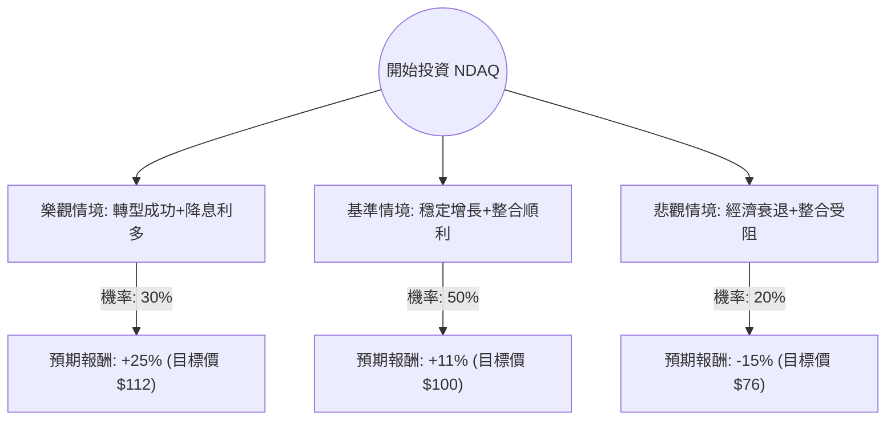

這份分析報告結合了您提供的 NDAQ 基本面數據，以及透過網路搜尋獲取的最新市場動態（如：2024 年 Q3 財報表現、Adenza 整合進度、聯準會降息預期對金融科技板塊的影響）。

---

### 一、 NDAQ 最新市場動態與基本面摘要

1.  **轉型金融科技（SaaS 化）**：Nasdaq 已從傳統交易所轉型為領先的金融科技公司。其「解決方案（Solutions）」業務收入佔比持續提升，特別是收購 Adenza 後，增加了高利潤的訂閱制收入。
2.  **最新財報表現**：2024 年第三季財報顯示，淨營收與 EPS 均超出市場預期。解決方案業務增長強勁，特別是在金融犯罪管理（Verafin）和資本市場技術方面。
3.  **估值分析**：
    *   **Forward P/E (20.34)** 低於當前 **P/E (27.07)**，顯示市場預期未來一年盈利將顯著增長。
    *   **PEG (1.56)** 處於合理區間（對於具有護城河的金融科技龍頭而言）。
    *   **ROE (16.23%)** 表現穩健。
4.  **宏觀環境**：聯準會進入降息週期有利於資本市場活躍度，增加 IPO 數量與交易量，這對 NDAQ 的數據與上市業務是利多。

---

### 二、 決策樹分析（Decision Tree Analysis）

我們將未來一年的投資情境分為三種：**樂觀（Bull）**、**基準（Base）**、**悲觀（Bear）**。

#### 決策樹節點詳細說明：

| 情境 | 機率 (P) | 預期報酬 (R) | 說明 |
| :--- | :--- | :--- | :--- |
| **樂觀 (Bull)** | 30% | +25% | Adenza 整合產生巨大綜效，SaaS 收入增長超預期，IPO 市場大爆發。 |
| **基準 (Base)** | 50% | +11% | 符合分析師平均目標價 ($109.75)，業務穩健增長，降息路徑明確。 |
| **悲觀 (Bear)** | 20% | -15% | 全球經濟衰退導致交易量萎縮，高槓桿收購（Debt/Eq 0.78）在衰退中壓力增大。 |

---

### 三、 期望值分析（Expected Value Analysis）

#### 1. 核心假設
*   **當前股價 ($P_0$)**：約 $89.90。
*   **分析師目標價**：$109.75（隱含約 22% 的上漲空間，我們將其作為基準與樂觀情境的參考）。
*   **股息收益**：1.2%（計算總報酬時併入）。
*   **時間維度**：未來 12 個月。

#### 2. 計算過程
期望值 (EV) = $\sum (機率 \times 預期報酬)$

*   **樂觀情境貢獻**：$0.30 \times 25\% = 7.5\%$
*   **基準情境貢獻**：$0.50 \times 11\% = 5.5\%$
*   **悲觀情境貢獻**：$0.20 \times (-15\%) = -3.0\%$

**總預期報酬率 (Expected Return)**：
$7.5\% + 5.5\% - 3.0\% = \mathbf{10.0\%}$

**考慮股息後的總期望報酬**：
$10.0\% + 1.2\% = \mathbf{11.2\%}$

---

### 四、 綜合評估與最終結論

#### 1. 財務健康度評估
*   **優勢**：毛利率極高 (57.8%)，營運利潤率 (30.6%) 顯示其強大的成本控制與規模效應。EPS Q/Q 增長 33.6% 顯示增長動能強勁。
*   **劣勢**：P/C (68.32) 偏高，顯示現金流估值較貴；債務股本比 (0.78) 雖在可控範圍，但需留意利息支出。

#### 2. 最終判斷：**適合投資 (Buy / Overweight)**

#### 3. 判斷理由：
1.  **正向期望值**：經風險加權後的期望報酬率為 **11.2%**，優於多數保守型投資工具，且在當前高利率轉降息的環境下具有吸引力。
2.  **商業模式轉型**：NDAQ 不再只是交易所，其 30% 以上的營運利潤率與高比例的訂閱收入（SaaS）使其應享有比傳統金融股更高的本益比。
3.  **技術面支撐**：目前股價在 SMA20 與 SMA50 之上（分別高出 3.9% 與 5.1%），顯示短期與中期趨勢向上。
4.  **安全邊際**：Forward P/E 僅 20 倍，對比其 EPS 雙位數增長預期，估值尚屬合理。

**建議操作策略**：
*   **進場點**：目前價格 $89.9 接近 52 週高點，建議分批進場，或待股價回測 SMA50（約 $85 附近）時加碼。
*   **停損點**：若跌破 52 週低點支撐區或 Adenza 整合出現重大負面新聞，建議重新評估。