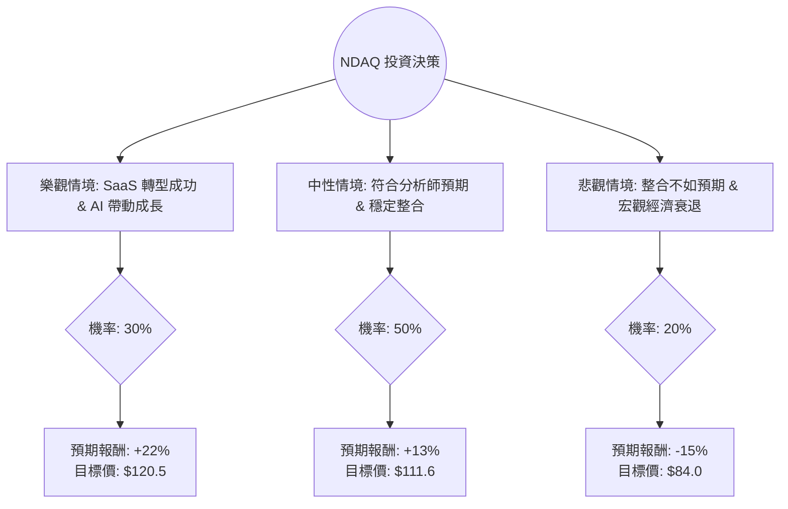

這份分析報告將結合您提供的財務數據與最新的市場動態（如 Adenza 併購整合、SaaS 轉型、AI 應用等），利用**決策樹（Decision Tree）**與**期望值分析（Expected Value Analysis）**評估 Nasdaq, Inc. (NDAQ) 的投資價值。

---

### 1. 市場動態與核心假設分析

在進行計算前，我們先整合最新的市場資訊：
*   **轉型 SaaS 服務商**：NDAQ 已從傳統交易所轉型為金融科技公司。併購 Adenza 後，其經常性收入（ARR）顯著增加，這有助於提升估值倍數（P/E Expansion）。
*   **財務表現**：Forward P/E (25.43) 遠低於 Trailing P/E (35.08)，顯示市場預期未來一年盈餘將大幅成長（數據顯示 EPS next Y 為 12.73%）。
*   **技術面**：股價目前接近 52 週高點（$98.78 vs $101.79），且位於 SMA50 與 SMA200 之上，趨勢偏多，但短期有過熱風險。
*   **宏觀環境**：聯準會降息預期有利於成長型金融科技股，但若經濟衰退導致交易量萎縮，則會衝擊其市場服務收入。

---

### 2. 決策樹分析圖 (Decision Tree)

我們預測未來 12 個月的投資回報，分為三種情境：**樂觀（Bull）**、**中性（Base）**、**悲觀（Bear）**。

---

### 3. 期望值計算過程

#### A. 情境參數設定
1.  **樂觀情境 (Bull Case) - 30% 機率**：
    *   **假設**：Adenza 整合產生協同效應，營收成長超預期，AI 監管工具（Verafin）市佔擴大。
    *   **目標價計算**：給予 Forward P/E 30 倍（考慮 SaaS 溢價）。$4.02 (預估 EPS) * 30 = $120.6。
    *   **報酬率**：($120.6 - $98.78) / $98.78 = **+22.1%**

2.  **中性情境 (Base Case) - 50% 機率**：
    *   **假設**：達到分析師平均目標價，EPS 成長如預期的 12.7%，市場情緒平穩。
    *   **目標價計算**：參考數據中的 Target Price = **$111.67**。
    *   **報酬率**：($111.67 - $98.78) / $98.78 = **+13.0%**

3.  **悲觀情境 (Bear Case) - 20% 機率**：
    *   **假設**：高利率環境持續壓抑交易量，併購債務壓力（Debt/Eq 0.8）導致信用評等疑慮，股價回測 SMA200 或支撐位。
    *   **目標價計算**：回測 $84 附近（約為 52W 區間中值）。
    *   **報酬率**：($84.0 - $98.78) / $98.78 = **-15.0%**

#### B. 期望值 (Expected Value, EV) 計算
$$EV = (P_{Bull} \times R_{Bull}) + (P_{Base} \times R_{Base}) + (P_{Bear} \times R_{Bear})$$
$$EV = (0.30 \times 22.1\%) + (0.50 \times 13.0\%) + (0.20 \times -15.0\%)$$
$$EV = 6.63\% + 6.5\% - 3.0\% = \mathbf{10.13\%}$$

加上 **股息收益率 (Dividend Yield)**：1.07%
**總預期年化報酬率 = 11.2%**

---

### 4. 綜合評估與最終結論

#### 核心數據解讀：
*   **優勢**：ROE (14.07%) 表現穩健，EPS Q/Q 成長 38.24% 非常強勁，顯示獲利能力正在爆發。Forward P/E 顯示估值將隨盈利增長而下降。
*   **風險**：P/C (80.59) 偏高，現金流相對股價較緊；Debt/Eq 0.8 雖在可控範圍，但需留意利息支出。目前股價距離 52W 高點僅 3.35%，短期追高風險存在。

#### 最終結論：適合投資 (Suitable for Investment)

**判斷理由：**
1.  **正向期望值**：經風險加權後的預期報酬率為 **11.2%**，優於長期美股平均報酬率，且在當前高估值市場中具有吸引力。
2.  **轉型溢價**：NDAQ 不再只是交易所，其 54.6% 的毛利率與 SaaS 化轉型將支撐其 P/E 維持在 25-30 倍的高位。
3.  **成長動能**：EPS Next Year 預期成長 12.73%，配合強勁的 Q/Q 表現，基本面支撐力道強。

**建議策略：**
*   由於目前股價接近 52 週高點且 SMA20 顯示短期微幅拉回 (-0.49%)，建議**分批買進**或等待股價回落至 **$94 - $96** 區間（靠近 SMA50）以獲取更高的安全邊際。
*   **止損位**：若股價跌破 **$88**（跌破主要均線支撐），需重新評估併購整合是否存在重大瑕疵。