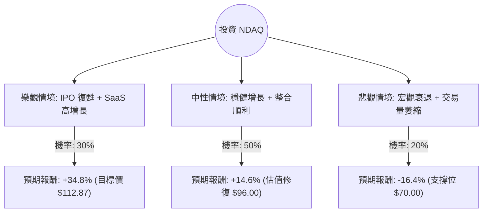

這份分析報告將結合您提供的 NDAQ（Nasdaq, Inc.）基本面數據，以及最新的市場動態（如 2024 年第三季財報表現、Adenza 整合進度及宏觀經濟環境），利用**決策樹（Decision Tree）**與**期望值分析（Expected Value Analysis）**進行評估。

---

### 1. 最新市場動態與背景分析 (Context)

在進入計算前，根據最新資訊補充以下關鍵點：
*   **轉型軟體服務商**：NDAQ 已從傳統交易所轉型為金融科技公司。收購 Adenza 後，其**解決方案業務（Solutions Business）**收入佔比持續提升，這類收入具備高經常性（SaaS 模式），有助於提升估值倍數。
*   **財報表現**：最新財報顯示營收增長強勁，特別是在金融科技與指數業務方面。
*   **宏觀環境**：聯準會（Fed）進入降息週期，通常有利於 IPO 市場復甦，這對 NDAQ 的上市業務（Capital Access Platforms）是利多。
*   **技術面**：目前股價（$83.74）低於 SMA20、50、200，顯示短期處於修正或弱勢整理階段，但距離分析師目標價（$112.87）有顯著空間。

---

### 2. 決策樹分析 (Decision Tree)

我們將未來一年的投資情境分為三種：**樂觀（Bull）**、**中性（Base）**、**悲觀（Bear）**。

---

### 3. 核心假設與計算過程

#### A. 核心假設
1.  **樂觀情境 (30%)**：降息帶動 IPO 熱潮，Adenza 協同效應超預期，EPS 增長超過 15%。股價達到分析師平均目標價 **$112.87**。
2.  **中性情境 (50%)**：業務穩健，EPS 達到預期的 12.59% 增長，Forward P/E 回升至歷史均值（約 22x）。預計股價約 **$96.00**。
3.  **悲觀情境 (20%)**：全球經濟衰退，交易量大減，高債務（Debt/Eq 0.78）在利息支出上造成壓力。股價回測 52 週低點附近的支撐位 **$70.00**。

#### B. 各情境報酬率計算 (以現價 $83.74 為基準)
*   **樂觀報酬率**：($112.87 - $83.74) / $83.74 = **+34.79%**
*   **中性報酬率**：($96.00 - $83.74) / $83.74 = **+14.64%**
*   **悲觀報酬率**：($70.00 - $83.74) / $83.74 = **-16.41%**

#### C. 期望值 (Expected Value, EV) 計算
$$EV = (P_{Bull} \times R_{Bull}) + (P_{Base} \times R_{Base}) + (P_{Bear} \times R_{Bear})$$
$$EV = (0.30 \times 34.79\%) + (0.50 \times 14.64\%) + (0.20 \times -16.41\%)$$
$$EV = 10.437\% + 7.32\% - 3.282\%$$
$$EV = 14.475\%$$

---

### 4. 綜合評估與數據解讀

*   **估值面**：Forward P/E 為 18.99，相較於過去五年的平均水平並不高，且 PEG 為 1.45，顯示股價相對於其盈餘增長尚屬合理區間。
*   **獲利能力**：ROE 15.28% 與 Profit Margin 21.77% 顯示其在交易所產業中具有極強的護城河與獲利效率。
*   **風險點**：
    *   **技術面偏弱**：SMA 指標全線為負，顯示短期內可能仍有下行壓力或需時間築底。
    *   **債務比**：Debt/Eq 0.78 雖在可控範圍，但在高利率環境尾聲仍需關注其利息覆蓋能力。

---

### 5. 最終結論

**判斷：適合投資 (建議分批佈局)**

#### 理由：
1.  **正向期望值**：計算出的年度預期報酬率約為 **14.48%**，遠高於無風險利率及一般市場平均回報。
2.  **轉型溢價**：NDAQ 成功轉型為高利潤的 SaaS 金融科技公司，這將使其未來能享有更高的估值倍數（Multiple Expansion）。
3.  **安全邊際**：目前股價（$83.74）距離分析師目標價有約 34% 的上漲空間，且 Forward P/E 顯示目前並未過熱。
4.  **IPO 市場復甦**：隨著降息預期，2025 年被視為 IPO 大年，NDAQ 作為主要交易所將直接受益。

**操作建議**：
由於目前技術指標（SMA20/50/200）呈現負值，顯示短期趨勢偏空。建議投資者**不要一次性投入**，而是採取**分批買進（Dollar Cost Averaging）**策略，在 $80 - $83 區間建立基本倉位，若股價回測 $75 附近則可加碼。

---
*免責聲明：本分析僅供參考，不構成具體投資建議。投資股票有風險，入市需謹慎。*