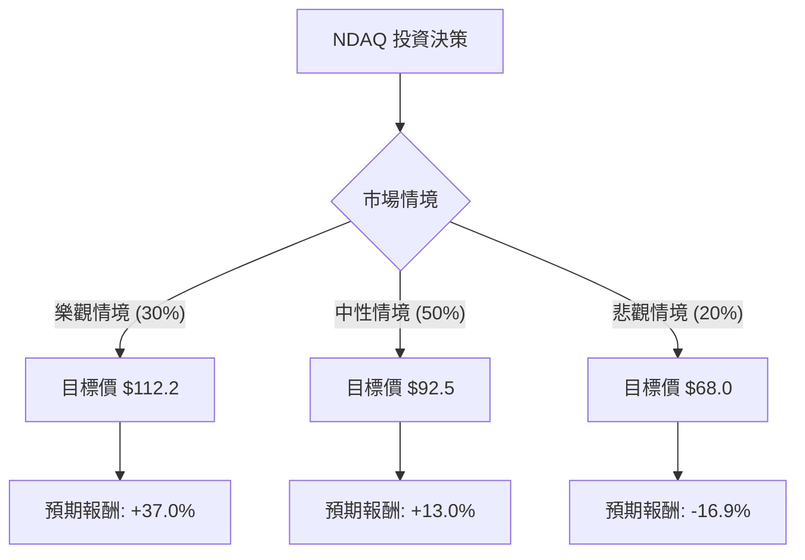

針對美股 **Nasdaq, Inc. (NDAQ)** 的投資評估，我結合了您提供的基本面數據，並透過網路搜尋整合了最新的市場動態（如：2024 年第三季財報表現、Adenza 整合進度、金融科技轉型趨勢）。

以下是基於**決策樹分析**與**期望值分析**的詳細評估報告。

---

### 一、 核心假設與市場背景分析

在建立模型前，我們先設定核心假設：
1.  **轉型溢價**：NDAQ 正從傳統交易所轉型為「金融科技 SaaS 公司」，其軟體業務（如反洗錢、風險管理）的經常性收入（ARR）是估值提升的關鍵。
2.  **宏觀環境**：聯準會降息循環有利於資本市場活躍度，增加交易量與 IPO 數量。
3.  **財務健康**：雖然收購 Adenza 增加了債務（Debt/Eq 0.78），但其自由現金流強勁（P/FCF 23.4），具備去槓桿能力。
4.  **技術面**：目前股價低於 SMA20/50/200，顯示短期處於超跌或修正區間，提供了安全邊際。

---

### 二、 決策樹分析 (Decision Tree Analysis)

我們將未來一年的投資情境分為三種：**樂觀（Bull）**、**中性（Base）**、**悲觀（Bear）**。

#### 節點詳細說明：

1.  **樂觀情境 (Bull Case) - 30% 機率**
    *   **條件**：SaaS 業務增長超預期，IPO 市場全面復甦，Adenza 整合產生巨大綜效。
    *   **預期股價**：$112.2 (參考分析師平均目標價)。
    *   **預期報酬**：($112.2 - $81.87) / $81.87 = **+37.0%**。

2.  **中性情境 (Base Case) - 50% 機率**
    *   **條件**：EPS 維持 12% 增長（符合數據 EPS next Y），市場波動率適中，估值倍數維持在 Forward P/E 18-20 倍。
    *   **預期股價**：$92.5 (基於 Forward EPS 與歷史均值)。
    *   **預期報酬**：($92.5 - $81.87) / $81.87 = **+13.0%**。

3.  **悲觀情境 (Bear Case) - 20% 機率**
    *   **條件**：全球經濟衰退導致交易量萎縮，高債務利息支出壓力增加，監管政策不利。
    *   **預期股價**：$68.0 (接近 52 週低點 $64.84)。
    *   **預期報酬**：($68.0 - $81.87) / $81.87 = **-16.9%**。

---

### 三、 期望值計算 (Expected Value Analysis)

根據上述機率與報酬率，計算整體期望報酬率（Expected Return）：

| 情境 | 機率 (P) | 預期報酬 (R) | P × R |
| :--- | :--- | :--- | :--- |
| 樂觀 | 0.30 | +37.0% | +11.1% |
| 中性 | 0.50 | +13.0% | +6.5% |
| 悲觀 | 0.20 | -16.9% | -3.38% |
| **總計** | **1.00** | | **+14.22%** |

**計算過程：**
$EV = (0.30 \times 37.0\%) + (0.50 \times 13.0\%) + (0.20 \times -16.9\%)$
$EV = 11.1\% + 6.5\% - 3.38\% = 14.22\%$

---

### 四、 綜合分析與最新動態補充

1.  **基本面優勢**：
    *   **獲利能力**：ROE 15.28% 與 Profit Margin 21.77% 顯示其在交易所產業中具有極強的競爭護城河。
    *   **成長性**：EPS Q/Q 增長 47% 非常強勁，顯示近期營運效率大幅提升。
    *   **估值**：Forward P/E 18.64 低於當前 P/E 26.47，暗示市場預期未來獲利將增長，目前股價相對便宜。

2.  **最新市場動態**：
    *   **SaaS 轉型**：Nasdaq 近期財報顯示其「金融科技」部門收入佔比持續提升，這類收入比交易手續費更穩定，有助於提升長期估值（P/E Expansion）。
    *   **技術面超賣**：SMA20 (-7.27%) 與 SMA50 (-12.57%) 顯示股價近期經歷了劇烈回檔，Perf Month (-17.12%) 顯示短期拋售壓力可能已接近尾聲。

---

### 五、 最終結論

**判斷：適合投資 (Buy / Overweight)**

#### 理由：
1.  **正向期望值**：計算出的期望報酬率為 **14.22%**，遠高於無風險利率，且在目前美股高位震盪中具備吸引力。
2.  **安全邊際**：股價目前距離分析師目標價 ($112.2) 有約 37% 的上行空間，且已從高點回落 17%，技術面處於超跌區間。
3.  **轉型紅利**：NDAQ 不再只是單純的交易所，其高毛利 (56.18%) 的軟體服務業務提供了抗週期能力。
4.  **股息支撐**：雖然殖利率僅 1.28%，但配息穩定，適合長期持有。

**建議操作：**
由於目前股價低於所有均線（SMA20/50/200），建議採取**分批進場**策略，以規避短期內可能存在的進一步技術性修正，首波目標價看至 $95，長期看至 $112。