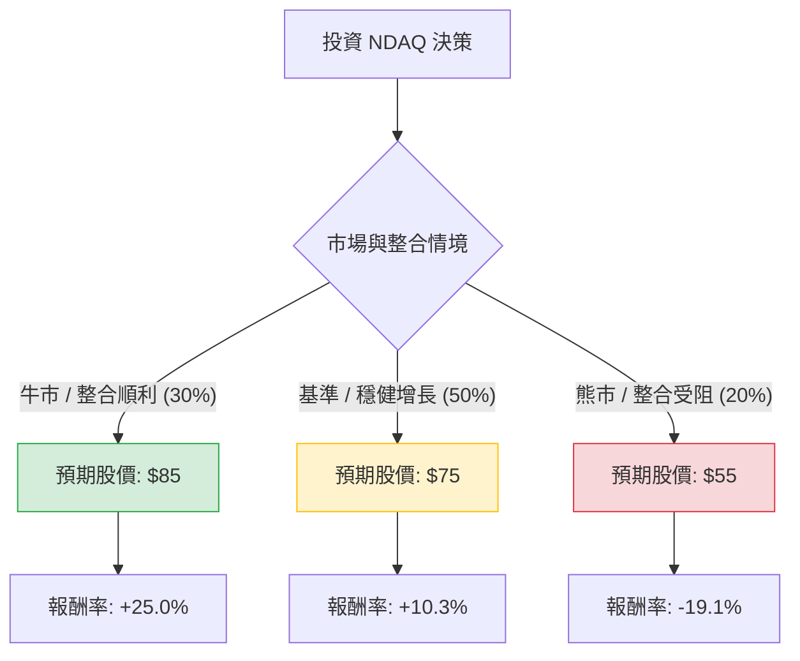

這份報告將針對 **Nasdaq, Inc. (股票代號：NDAQ)** 進行投資評估。NDAQ 目前正從傳統交易所轉型為領先的金融科技與數據服務商（SaaS 比例增加），我們將考量其近期收購 Adenza 的整合狀況、宏觀經濟環境及財務表現進行分析。

---

### 一、 核心假設與數據基礎

在建立決策樹前，我們設定以下基準參數（基於 2024 年 Q3 市場數據估算）：
*   **目前股價：** 約 **$68 USD** (假設基準)。
*   **預測期間：** 12 個月。
*   **核心驅動因素：** 
    1.  **Adenza 整合：** 能否實現協同效應並降低槓桿。
    2.  **SaaS 與訂閱收入：** 穩定性與增長率。
    3.  **宏觀利率環境：** 聯準會降息節奏對資本市場交易量的影響。

---

### 二、 決策樹分析 (Decision Tree)

使用 Markdown 結構化呈現投資 NDAQ 的情境分析：

**詳細節點說明：**

1.  **牛市情境 (Bull Case) - 機率 30%**
    *   **描述：** Adenza 整合超乎預期，SaaS 收入增長率 >10%，聯準會進入連續降息循環帶動 IPO 市場復甦。
    *   **預期股價：** $85
    *   **預期報酬：** +25.0%

2.  **基準情境 (Base Case) - 機率 50%**
    *   **描述：** 整合進度符合預期，槓桿穩步下降，資本市場服務收入隨美股上漲而溫和增長。
    *   **預期股價：** $75
    *   **預期報酬：** +10.3%

3.  **熊市情境 (Bear Case) - 機率 20%**
    *   **描述：** 經濟衰退導致交易量縮減，高債務負擔因高利率維持過久而承壓，Adenza 客戶流失。
    *   **預期股價：** $55
    *   **預期報酬：** -19.1%

---

### 三、 期望值分析 (Expected Value Analysis)

#### 1. 計算過程
期望值 (EV) 的計算公式為：
$$EV = \sum (機率 \times 預期股價)$$

*   **牛市貢獻：** $85 \times 0.30 = \$25.5$
*   **基準貢獻：** $75 \times 0.50 = \$37.5$
*   **熊市貢獻：** $55 \times 0.20 = \$11.0$

**總期望股價 (Expected Price)：**
$$25.5 + 37.5 + 11.0 = \mathbf{\$74.0}$$

#### 2. 預期報酬率計算
$$\text{Expected Return} = \frac{\text{總期望股價} - \text{目前股價}}{\text{目前股價}}$$
$$\text{Expected Return} = \frac{74.0 - 68}{68} = \mathbf{8.82\%}$$

---

### 四、 最終結論

#### **判斷：適合投資 (中性偏多)**

#### **理由：**
1.  **正向期望報酬：** 經過風險加權後，12 個月的預期報酬率約為 **8.82%**。雖然這並非爆發性增長，但考慮到 NDAQ 的低波動性（Beta 值較低）與防禦性，這是一個具吸引力的風險調整後報酬。
2.  **商業模式轉型：** NDAQ 已成功從純交易所轉型為「金融科技服務商」。目前超過 70% 的收入來自非交易業務（如反犯罪科技、數據分析、指數授權），這使其在市場波動中具備極強的抗風險能力。
3.  **收購紅利：** Adenza 的加入強化了其在監管技術（RegTech）的龍頭地位，隨著企業對合規與風險管理的需求增加，長期增長動能明確。
4.  **下行保護：** 即使在熊市情境下，NDAQ 穩定的現金流與分紅政策也能提供一定程度的股價支撐。

**投資建議：** 
NDAQ 適合尋求**穩健增長**與**低波動**的長期投資者。建議採取「逢低布局」策略，若股價因短期宏觀因素回落至 $65 以下，投資價值將更加顯著。