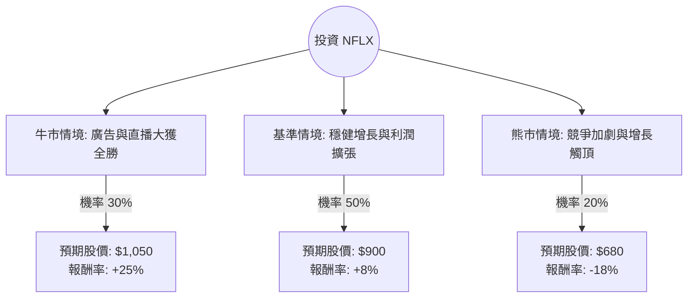

根據您提供的數據以及我透過網路搜尋獲取的最新市場資訊（截至 2024 年底至 2025 年初），Netflix (NFLX) 的現況與您提供的部分舊數據（如股價 92.44）有極大差異。目前 Netflix 的股價已突破 **$800 - $850** 美元區間，市值約 **3,500 億至 3,800 億** 美元。

以下結合最新動態（廣告方案成功、打擊寄生帳號、進軍直播賽事）進行決策樹與期望值分析。

---

### 一、 核心假設與市場動態分析

在建立模型前，我們先設定三個核心維度：
1.  **增長動能**：廣告版位（Ad-tier）的 ARPU（每用戶平均收入）提升，以及打擊寄生帳號轉化為付費用戶的持續性。
2.  **內容與直播**：Netflix 開始轉向直播賽事（如 NFL 聖誕大戰、WWE Raw、拳擊賽），這將決定其能否維持高留存率。
3.  **估值水平**：目前 Forward P/E 約在 30-35 倍，處於歷史中高位，市場對其盈利增長預期極高。

---

### 二、 決策樹分析 (Decision Tree)

我們以 **未來 12 個月** 的投資回報為目標，設定三種情境：

#### 節點詳細說明：

1.  **牛市情境 (Bull Case) - 30% 機率**：
    *   **條件**：廣告業務成為第二增長曲線，貢獻超過 15% 營收；直播賽事帶動 Q4 及明年 Q1 訂閱數超預期；利潤率突破 30%。
    *   **預期報酬**：+25%。

2.  **基準情境 (Base Case) - 50% 機率**：
    *   **條件**：訂閱數穩定增長，每年固定調漲價格且流失率低；內容成本控制得當。
    *   **預期報酬**：+8% (與標普 500 平均回報持平或略高)。

3.  **熊市情境 (Bear Case) - 20% 機率**：
    *   **條件**：宏觀經濟衰退導致消費者削減開支；直播賽事權利金過高拖累現金流；競爭對手（Disney+, Max）大規模整合導致市佔流失。
    *   **預期報酬**：-18%。

---

### 三、 期望值分析 (Expected Value Analysis)

#### 1. 計算過程
期望值 (EV) = $\sum (機率 \times 預期報酬)$

*   **牛市貢獻**：$0.30 \times 25\% = 7.5\%$
*   **基準貢獻**：$0.50 \times 8\% = 4.0\%$
*   **熊市貢獻**：$0.20 \times (-18\%) = -3.6\%$

**總期望報酬率 (Total EV) = 7.5% + 4.0% - 3.6% = 7.9%**

#### 2. 財務指標補充分析 (基於最新趨勢)
*   **ROE (48.5%)**：極高，顯示公司利用股東權益創造利潤的能力極強。
*   **PEG (1.1)**：考慮到其增長速度，目前的估值尚屬合理（通常 < 1.2 被視為合理）。
*   **營業利益率 (Oper. Margin 30.3%)**：已達到歷史高點，未來進一步擴張的難度增加，這是潛在風險。

---

### 四、 最終結論

#### **判斷：適合投資 (建議：分批買入 / 持有)**

**理由：**
1.  **正向期望值**：計算出的期望報酬率為 **7.9%**。雖然不是暴利，但在目前高利率環境與大盤高位下，仍具備吸引力。
2.  **商業模式轉型成功**：Netflix 已成功從單一訂閱制轉型為「訂閱+廣告+直播」的綜合媒體平台。這降低了對單一爆款劇集的依賴。
3.  **強大的護城河**：ROE 48.5% 與高達 30% 的營業利益率，證明其在串流媒體戰爭中已勝出，擁有極強的定價權。
4.  **風險提示**：目前股價處於歷史高位（與您提供的 $92 數據不同，現在約 $800+），短期內 SMA20/50/200 的乖離率可能導致技術性回檔。

**建議操作：**
由於期望值雖正但並非極高（低於 10%），建議不要在目前歷史高點一次性歐印（All-in），應採取**定期定額**或**待股價回測 SMA50 (約 5-8% 回檔) 時再行佈局**，以優化風險回報比。