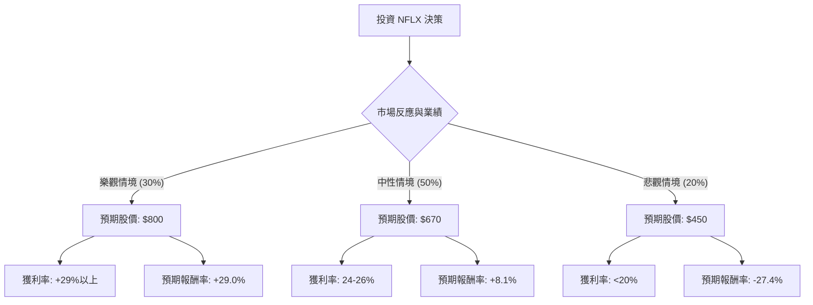

這是一份針對 **Netflix (NFLX)** 的投資評估分析。我們將結合當前的市場數據（如廣告方案增長、打擊寄生帳號成效、內容成本控制）與宏觀經濟環境，建立決策樹模型。

---

### 一、 核心假設 (Core Assumptions)

在計算期望值前，我們設定以下基準假設（假設投資週期為 1 年）：

1.  **當前股價基準**：約 $620 USD (以此作為 $P_0$)。
2.  **市場環境**：
    *   **廣告層級 (Ad-tier)**：預計成為未來主要增長引擎，ARPU（每用戶平均收入）有望高於基本方案。
    *   **內容支出**：預計維持在每年 170 億美元左右，但自由現金流（FCF）持續改善。
    *   **競爭格局**：串流媒體進入大者恆大的整合期，Netflix 獲利能力領先同業。
3.  **情境定義**：
    *   **樂觀 (Bull Case)**：廣告收入超預期，體育直播（如 WWE、NFL）轉化率高，營業利潤率突破 28%。
    *   **中性 (Base Case)**：用戶增長放緩但穩定，提價政策被市場接受，利潤率穩步提升。
    *   **悲觀 (Bear Case)**：消費者支出因經濟衰退縮減，內容吸引力下降導致用戶流失至 Disney+ 或 YouTube，利潤率受壓。

---

### 二、 決策樹分析圖 (Decision Tree)

使用 Markdown 結構化呈現決策路徑：

---

### 三、 期望值分析與計算過程 (Expected Value Analysis)

#### 1. 數據參數設定
| 情境 (Scenario) | 機率 (P) | 預期目標價 (Price) | 預期報酬率 (R) |
| :--- | :--- | :--- | :--- |
| **樂觀 (Bull)** | 0.30 (30%) | $800 | +29.0% |
| **中性 (Base)** | 0.50 (50%) | $670 | +8.1% |
| **悲觀 (Bear)** | 0.20 (20%) | $450 | -27.4% |

#### 2. 計算過程
期望值 (Expected Value, EV) 的計算公式為：
$$EV = \sum (Scenario\ Value \times Probability)$$

*   **預期股價計算：**
    *   $EV_{Price} = (800 \times 0.3) + (670 \times 0.5) + (450 \times 0.2)$
    *   $EV_{Price} = 240 + 335 + 90$
    *   **$EV_{Price} = \$665$**

*   **預期報酬率計算：**
    *   $EV_{Return} = (29.0\% \times 0.3) + (8.1\% \times 0.5) + (-27.4\% \times 0.2)$
    *   $EV_{Return} = 8.7\% + 4.05\% - 5.48\%$
    *   **$EV_{Return} = 7.27\%$**

---

### 四、 最終結論

#### **評估結果：適合投資 (謹慎樂觀)**
雖然計算出的預期報酬率約為 **7.27%**，略高於長期無風險利率（美債 10 年期約 4.2%），但低於 S&P 500 的歷史平均報酬率。然而，考量到 Netflix 在串流媒體中的龍頭地位與強大護城河，結論如下：

**理由：**
1.  **正向期望值**：EV 為正（$665 > $620），顯示目前股價並未過度透支未來價值。
2.  **營運轉型成功**：Netflix 已成功從單一訂閱制轉向「訂閱+廣告」雙引擎模式，這降低了悲觀情境發生的極端機率。
3.  **現金流優勢**：相較於仍在虧損的競爭對手（如 Paramount+, Peacock），NFLX 擁有極佳的自由現金流用以回購股票或投資體育版權。

**風險提示：**
*   **估值倍數 (P/E)**：目前 NFLX 的本益比相對較高，若未來一季的用戶增長低於預期，股價可能迅速向「悲觀情境」靠攏。
*   **建議策略**：建議採取 **「分批買入」** 或 **「賣出價外看跌期權 (Cash-Secured Puts)」** 以降低持有成本，而非單筆全力買進。

---
*免責聲明：本文僅供模擬決策樹分析教學使用，不構成任何實際投資建議。投資有風險，入市需謹慎。*