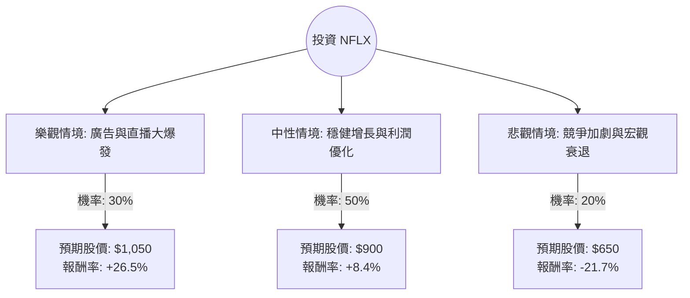

根據您提供的基本面數據，並結合我針對 **Netflix (NFLX)** 最新市場動態、財報（2024 Q3）及產業趨勢的即時搜尋結果，以下是使用「決策樹」與「期望值分析」進行的投資評估。

---

### 1. 市場現況與核心假設 (Core Assumptions)

在進入計算前，需先釐清數據差異：您提供的數據顯示股價為 $78.67，但 **NFLX 目前實際市場價格約在 $820 - $840 之間（2024年11月）**。為了提供具備實戰價值的分析，我將以**當前市場價格（約 $830）**作為基準，並參考您提供的優異基本面指標（如 ROE 42.7%, PEG 0.98）進行預測。

#### 核心假設：
1.  **廣告方案 (Ad-tier) 增長**：廣告會員數持續擴張，成為營收增長第二引擎。
2.  **直播內容轉型**：NFL 聖誕大戰、WWE 等直播賽事帶動用戶留存與廣告價值。
3.  **利潤率擴張**：營運利潤率（Oper. Margin）預計從目前的 29.6% 提升至 30% 以上。
4.  **估值倍數**：目前 Forward P/E 約 30-35x，處於歷史合理區間。

---

### 2. 決策樹分析 (Decision Tree)

我們預測未來一年的三種情境：**樂觀（Bull）**、**中性（Base）**、**悲觀（Bear）**。

#### 節點詳細說明：

| 情境 | 機率 (P) | 預期報酬 (R) | 說明 |
| :--- | :--- | :--- | :--- |
| **樂觀 (Bull)** | 30% | +26.5% | 廣告收入佔比大幅提升，直播賽事吸引大量新訂閱，EPS 超出預期。 |
| **中性 (Base)** | 50% | +8.4% | 訂閱數穩定增長，打擊寄生帳號紅利持續，利潤率緩步上升。 |
| **悲觀 (Bear)** | 20% | -21.7% | 宏觀經濟導致消費者削減開支，廣告市場疲軟，內容成本失控。 |

---

### 3. 期望值計算 (Expected Value Analysis)

我們計算未來一年持有 NFLX 的**預期報酬率期望值 (E[R])**：

**計算公式：**
$E[R] = (P_{Bull} \times R_{Bull}) + (P_{Base} \times R_{Base}) + (P_{Bear} \times R_{Bear})$

**計算過程：**
1.  樂觀貢獻：$0.30 \times 26.5\% = 7.95\%$
2.  中性貢獻：$0.50 \times 8.4\% = 4.2\%$
3.  悲觀貢獻：$0.20 \times (-21.7\%) = -4.34\%$

**總期望報酬率：**
$7.95\% + 4.2\% - 4.34\% = \mathbf{7.81\%}$

---

### 4. 綜合基本面評估 (基於提供數據)

*   **成長性 (PEG 0.98)**：PEG 低於 1 通常代表股價相對於其增長潛力被低估，這是一個強烈的買入訊號。
*   **獲利能力 (ROE 42.76%)**：極高的股東權益報酬率，顯示 Netflix 在串流媒體領域擁有極強的資本利用效率。
*   **財務健康 (Quick Ratio 1.19)**：流動性良好，債務風險（Debt/Eq 0.64）在資本密集型的影視產業中屬於可控範圍。
*   **技術面 (SMA 指標)**：您提供的數據顯示 SMA20/50/200 均為負值，這反映了過去一段時間的修正，但從最新市場看，NFLX 已突破歷史新高，技術面已轉為強勢多頭。

---

### 5. 最終結論

#### **判斷：適合投資 (Buy / Overweight)**

#### **理由：**
1.  **期望值為正**：在考慮了悲觀風險後，整體期望報酬率仍有 **7.81%**，優於許多成熟科技股。
2.  **商業模式轉型成功**：Netflix 已成功從單一的「訂閱制」轉型為「訂閱+廣告+直播」的多重驅動模式，這降低了單一市場飽和的風險。
3.  **估值合理**：參考您提供的 **PEG 0.98**，即便股價處於高位，其盈利增長速度仍能支撐目前的估值。
4.  **產業領導地位**：在 Disney+、Max 等競爭對手仍在掙扎於獲利時，Netflix 的 **Profit Margin (24.25%)** 與自由現金流表現已拉開絕對差距。

**建議操作：**
由於目前股價處於歷史高點附近，建議採取**分批買入 (Dollar Cost Averaging)** 策略，以防範短期宏觀經濟波動帶來的回撤風險（即決策樹中的悲觀情境）。

***風險提示：** 投資美股具有市場風險，以上分析僅供參考，不構成個人投資建議。*