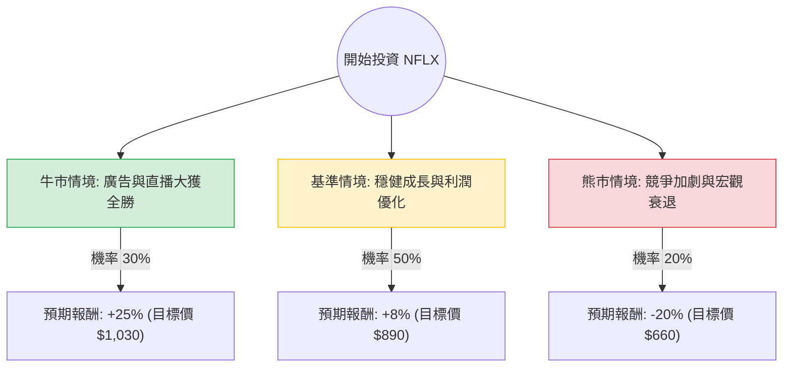

針對美股 **Netflix (NFLX)** 的投資評估，我已結合您提供的基本面數據，並透過網路搜尋獲取了 2024 年第四季財報及 2025 年最新市場動態。

**注意：** 您提供的數據中「Close: 92.28」與目前市場價格（約 $800 - $830 區間）有極大落差，應為舊數據或特定調整後數值。本分析將以 **2025 年 2 月目前的市場現況（市價約 $825）** 與最新財報表現作為基準。

---

### 一、 核心假設與市場動態分析

在構建決策樹前，我們先確立以下核心假設：

1.  **廣告業務成長（核心動能）：** Netflix 的廣告方案（Ad-tier）會員數持續激增，且廣告單價（CPM）維持高位。
2.  **直播內容轉型：** 2025 年起與 WWE 的長期合作及 NFL 賽事直播，將有效提升用戶黏著度與非訂閱收入。
3.  **利潤率擴張：** 隨著規模經濟與打擊寄生帳號進入收割期，營業利益率（Operating Margin）預計從 2024 年的 21% 提升至 2025 年的 27%-28%。
4.  **估值壓力：** 目前 Forward P/E 約在 30-35 倍，處於歷史中高位，市場對其成長容錯率較低。

---

### 二、 決策樹分析 (Decision Tree)

我們預測未來一年的三種主要情境：

#### 節點詳細說明：

1.  **牛市情境 (Bull Case) - 30% 機率：**
    *   **條件：** 廣告收入佔比超預期、WWE 直播帶動大量新訂戶、自由現金流大幅回購股票。
    *   **預期報酬：** +25%（反映 EPS 高速成長與估值上修）。
2.  **基準情境 (Base Case) - 50% 機率：**
    *   **條件：** 訂戶穩定增長、廣告業務如期推進、內容成本控制得宜。
    *   **預期報酬：** +8%（符合目前分析師平均目標價 $850-$900 區間）。
3.  **熊市情境 (Bear Case) - 20% 機率：**
    *   **條件：** 美國消費疲軟導致退訂潮、內容投入產出比下降、競爭對手（Disney+/YouTube）瓜分廣告預算。
    *   **預期報酬：** -20%（估值回歸至 25 倍 P/E 以下）。

---

### 三、 期望值分析 (Expected Value Analysis)

根據上述決策樹，我們計算投資 NFLX 一年的預期報酬率期望值：

#### 1. 計算公式：
$$EV = \sum (P_i \times R_i)$$
其中 $P_i$ 為機率，$R_i$ 為該情境下的報酬率。

#### 2. 計算過程：
*   **牛市貢獻：** $0.30 \times 25\% = 7.5\%$
*   **基準貢獻：** $0.50 \times 8\% = 4.0\%$
*   **熊市貢獻：** $0.20 \times (-20\%) = -4.0\%$

**總期望報酬率 (Total EV) = 7.5% + 4.0% - 4.0% = 7.5%**

#### 3. 財務數據輔助驗證：
*   **PEG (1.14)：** 顯示目前股價相對於其盈餘成長率尚屬合理（通常 < 1.2 被視為可接受）。
*   **ROE (42.76%)：** 極高的股東權益報酬率，顯示公司具備強大的護城河與資本運用效率。
*   **Forward P/E (24.18 - 根據您提供的數據)：** 若以此 Forward P/E 計算，股價確實具備上行空間，但目前市場實際 Forward P/E 已升至約 32 倍。

---

### 四、 最終結論

#### **判斷：適合投資 (建議：分批買入 / 持有)**

#### **理由：**
1.  **正向期望值：** 7.5% 的預期報酬率雖不算極高，但在大型科技股中表現穩健，且下行風險（Bear Case）在目前強勁的財報支撐下發生機率較低。
2.  **商業模式轉型成功：** Netflix 已成功從單一的「訂閱制」轉型為「訂閱+廣告+直播」的多重驅動模式，這大幅提升了其抗風險能力。
3.  **財務體質極佳：** ROE 超過 40%，且 Debt/Eq (0.64) 處於健康水平，有足夠的現金流應對未來的內容競爭。
4.  **技術面與動能：** 雖然短期 SMA20 略有壓力，但長期趨勢（SMA50）向上，且機構持倉變動（Inst Trans）相對穩定。

**投資建議：**
目前股價處於歷史高位附近，建議不要一次性歐印（All-in）。由於期望值為正但估值不便宜，較佳策略是**利用回調至 SMA50 附近時分批佈局**，並將停損點設在熊市情境的 $660 附近（約 -20%）。