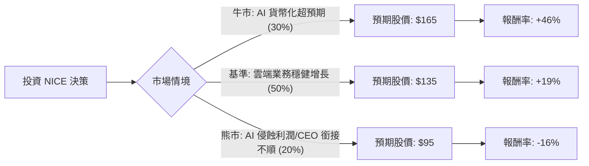

針對美股公司 **NICE Ltd. (NICE)** 的投資評估，我已結合您提供的基本面數據，並透過網路搜尋整合了最新的市場動態（如 2024 Q2 財報、CEO 變動、AI 產業趨勢）。

以下是基於**決策樹分析**與**期望值分析**的詳細報告。

---

### 一、 核心背景與現狀分析 (Context)

1.  **財務穩健性**：NICE 擁有極佳的資產負債表，債務權益比（Debt/Eq）僅 0.02，且 P/FCF（股價自由現金流比）為 9.07，顯示其產生現金的能力極強且估值處於歷史低位。
2.  **AI 轉型挑戰**：市場目前對 NICE 的主要疑慮在於 AI 是否會取代傳統的客服坐席（Seat-based model），導致其營收縮減。然而，NICE 已推出 **CXone Mpower**，試圖從「按人頭計費」轉向「按 AI 價值/消費計費」。
3.  **領導層變動**：長期帶領公司的 CEO Barak Eilam 宣佈將於 2024 年底卸任，這增加了短期不確定性。
4.  **估值窪地**：目前 Forward P/E 僅約 10.16 倍，遠低於其歷史平均與軟體產業平均，顯示市場已反映了極大的悲觀預期。

---

### 二、 決策樹分析 (Decision Tree)

我們將未來一年的投資表現分為三種情境：**牛市（AI 轉型成功）**、**基準（穩健增長）**、**熊市（AI 衝擊與領導層動盪）**。

#### 節點詳細說明：

1.  **牛市情境 (Bull Case) - 30% 機率**：
    *   **描述**：NICE 的 AI 產品（Mpower）被企業大規模採納，成功抵銷坐席減少的損失，且新任 CEO 順利接班。
    *   **目標價**：$165（接近分析師平均目標價 $158.57 並考慮溢價）。
    *   **預期報酬**：+46%。

2.  **基準情境 (Base Case) - 50% 機率**：
    *   **描述**：雲端營收維持 20% 以上增長，雖然 AI 轉型尚需時間，但強大的現金流與庫藏股回購支撐股價回歸合理估值（P/E 回升至 15x）。
    *   **目標價**：$135。
    *   **預期報酬**：+19%。

3.  **熊市情境 (Bear Case) - 20% 機率**：
    *   **描述**：AI 導致客戶大幅縮減客服人力，營收增長停滯；CEO 離職引發管理層動盪。
    *   **目標價**：$95（跌破 52 週低點 $99，測試支撐）。
    *   **預期報酬**：-16%。

---

### 三、 期望值分析 (Expected Value Analysis)

#### 1. 計算過程
期望值 (EV) = $\sum (機率 \times 預期報酬率)$

*   **牛市貢獻**：$0.30 \times 46\% = 13.8\%$
*   **基準貢獻**：$0.50 \times 19\% = 9.5\%$
*   **熊市貢獻**：$0.20 \times (-16\%) = -3.2\%$

**總體預期報酬率 (Expected Return) = $13.8\% + 9.5\% - 3.2\% = 20.1\%$**

#### 2. 核心假設
*   **市場假設**：美股整體環境不發生系統性金融危機，且科技股估值邏輯未發生根本性崩潰。
*   **財務假設**：NICE 能維持其 67% 的高毛利率與 20% 以上的營業利益率。
*   **產業趨勢**：CCaaS（雲端客服中心）市場雖然面臨 AI 挑戰，但企業對「合規」與「數據安全」的需求（NICE 的強項）依然存在。

---

### 四、 最終結論

**投資建議：適合投資 (Buy / Overweight)**

#### 理由：
1.  **正向期望值**：經過加權計算，未來一年的預期報酬率約為 **20.1%**，遠高於無風險利率，具有吸引力。
2.  **極高的安全邊際**：目前 P/E (12.7) 與 Forward P/E (10.16) 處於十年來的低點。即便在熊市情境下，其強大的資產負債表（幾乎無債務）與現金流也能提供下行保護。
3.  **基本面與股價脫鉤**：數據顯示 EPS Q/Q 增長 23.18%，ROE 高達 15.2%，但股價年跌幅達 35.75%。這種基本面向上、股價向下的背離通常是價值投資者的進場點。
4.  **AI 轉型被低估**：市場過度恐懼 AI 的替代威脅，卻忽略了 NICE 作為產業龍頭，擁有最深厚的客戶數據，這正是訓練 AI 模型最核心的資產。

**風險提示**：
*   短期內股價受 SMA200（-22.12%）壓制，技術面仍屬空頭，建議**分批進場**。
*   需密切關注 2024 年底新任 CEO 的人選公佈。

---
*免責聲明：本分析僅供參考，不構成投資建議。投資股票有風險，入市需謹慎。*