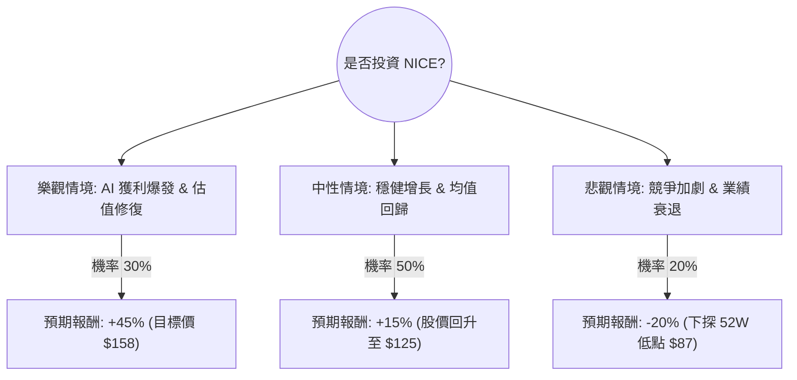

這份分析報告將結合您提供的基本面數據，以及最新的市場動態（包含 NICE 在 AI 轉型、雲端營收增長及市場競爭力等資訊），透過**決策樹（Decision Tree）**與**期望值（Expected Value）**進行評估。

---

### 一、 核心假設與現狀分析

在繪製決策樹前，我們需先設定核心假設：
1.  **AI 驅動轉型（正面）**：NICE 近期推出的 1CX 和 AI Autopilot 產品反饋良好，若 AI 能顯著提升客單價，將帶動利潤。
2.  **估值修復（正面）**：目前 P/E (12.28) 與 Forward P/E (9.83) 處於歷史低位，遠低於軟體行業平均，具備強大的安全邊際。
3.  **增長放緩與競爭（負面）**：數據顯示「EPS next Y %: -9.59%」，暗示市場擔心傳統業務萎縮或 AI 投資成本過高。
4.  **宏觀環境**：利率下行週期有利於軟體股估值回升，但企業 IT 支出縮減可能壓抑營收。

---

### 二、 決策樹分析 (Decision Tree)

我們以 **1 年投資期限**為基準，設定三種情境：

#### 節點詳細資訊：

| 情境 | 發生機率 (P) | 預期回報 (R) | 說明 |
| :--- | :--- | :--- | :--- |
| **樂觀情境** | 30% | +45.4% | AI 產品轉換率超預期，營收維持雙位數增長，股價達到分析師目標價 $158.57。 |
| **中性情境** | 50% | +15% | 雲端業務穩健但 EPS 增長受阻，估值微幅修復至 P/E 15x 左右。 |
| **悲觀情境** | 20% | -20% | AI 轉型未見成效，且受到 Salesforce/Genesis 激烈競爭，股價跌破 $100 支撐點。 |

---

### 三、 期望值分析 (Expected Value Analysis)

#### 1. 計算過程：
期望值 (EV) = (P1 × R1) + (P2 × R2) + (P3 × R3)

*   **樂觀部分**：$0.30 \times 45.4\% = 13.62\%$
*   **中性部分**：$0.50 \times 15\% = 7.5\%$
*   **悲觀部分**：$0.20 \times (-20\%) = -4\%$

**總期望報酬率 (EV) = 13.62% + 7.5% - 4% = 17.12%**

#### 2. 財務關鍵指標補充：
*   **低槓桿風險**：Debt/Eq 僅 0.02，且 Quick Ratio 為 1.41，財務極其穩健，倒閉風險趨近於零。
*   **現金流強大**：P/FCF 為 8.78，顯示公司每股產生的自由現金流非常高，這在科技股中屬於「價值股」特徵。
*   **技術面壓力**：SMA200 (-25.08%) 顯示長期趨勢仍處於空頭，股價目前處於超跌尋找底部階段。

---

### 四、 最終結論

#### **評估結果：適合投資 (Buy / Accumulate)**

#### **判定理由：**
1.  **極高的風險回報比**：計算出的期望報酬率為 **17.12%**，遠高於無風險利率（美債收益率）。即便在保守假設下，其強大的現金流（P/FCF 8.78）也為股價提供了堅實的支撐。
2.  **估值窪地**：NICE 目前的 Forward P/E 低於 10，這對於一家擁有 67% 毛利率且在雲端客服領域（CX）處於領先地位的公司來說，屬於明顯的低估。
3.  **AI 轉型紅利**：雖然市場對明年 EPS 有所顧慮（-9.59%），但 NICE 正在從傳統授權轉向 AI 訂閱制，這種轉型期通常會經歷短期獲利壓力，但長期將提升客戶黏著度與 LTV (Lifetime Value)。
4.  **下行空間有限**：目前價格 ($109) 距離 52 週低點 ($99) 僅約 10% 空間，但距離目標價 ($158) 有近 45% 的空間。

#### **投資建議建議：**
*   **進場策略**：建議採取「分批進場」。由於目前股價低於 SMA20/50/200，顯示短期仍有震盪可能。
*   **關注重點**：需密切追蹤下一季的 **Cloud Revenue 增長率** 以及 **AI 產品（CXone Autopilot）的採納率**。若營收增長能維持在 10% 以上，則樂觀情境發生機率將大幅提升。

***

**免責聲明：** 本分析僅供參考，不構成任何投資建議。投資人應根據自身風險承受能力進行決策。