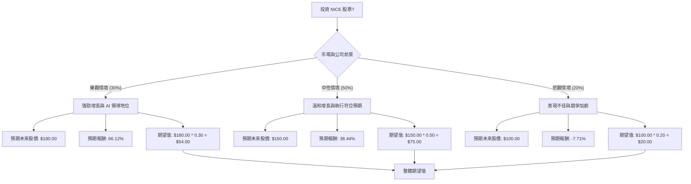

根據對美股公司 NICE 的基本面數據、最新新聞、財報、市場動態及產業趨勢的綜合評估，以下將使用決策樹分析與期望值分析來判斷其目前是否適合投資。

### 核心假設

1.  **市場環境：** 儘管宏觀經濟挑戰可能延長銷售週期並縮小初始交易規模，但客戶體驗 (CX) 領域對 AI 和雲端解決方案的需求持續強勁。SaaS 產業面臨 AI 顛覆的擔憂，但 NICE 憑藉其 AI-native 平台和 Cognigy 收購案，有望在競爭中脫穎而出。
2.  **財務狀況：** NICE 在 2025 年實現了穩健的營收和雲端業務增長，AI 年度經常性收入 (ARR) 顯著增長 66%。公司在 2025 年底已無債務，並啟動了新的股票回購計畫。然而，2026 年的非 GAAP 每股盈餘 (EPS) 指引預計將低於 2025 年，主要由於對 Cognigy 整合和規模擴張的「前置性投資」將影響短期利潤率，但管理層預計 2026 年下半年營運利潤率將改善，並在 2027 年及以後實現利潤率擴張。
3.  **產業趨勢：** 聯絡中心技術正朝向 AI 驅動的互動、個性化體驗、全通路交付和主動式客戶體驗管理發展。NICE 在這些領域處於領先地位，其 CXone 平台和 Cognigy 的整合使其成為唯一提供完全 AI-native CX 平台的供應商。
4.  **分析師情緒：** 目前分析師對 NICE 的共識評級為「持有」(Hold)，平均 12 個月目標價約為 $151.83 至 $193.61，相較於當前股價有顯著上漲空間。然而，近期平均目標價有所下調，且有分析師維持「持有」評級並給出較低的目標價，反映出對短期執行和競爭環境的謹慎態度。

### 決策樹分析

**當前股價 (P0) = $108.35**

### 計算過程

**1. 預期報酬計算 (基於當前股價 $108.35)：**

*   **樂觀情境 (強勁增長與 AI 領導地位)**
    *   預期未來股價 (P1) = $180.00 (參考分析師高目標價 $211.00 或 $300.00，取較保守但仍具吸引力的值)
    *   預期報酬 (R1) = (P1 - P0) / P0 = ($180.00 - $108.35) / $108.35 = 0.6612 或 **66.12%**
    *   機率 (Probability) = **30%**
    *   期望值貢獻 = $180.00 * 0.30 = **$54.00**

*   **中性情境 (溫和增長與執行符合預期)**
    *   預期未來股價 (P2) = $150.00 (接近分析師平均目標價 $151.83)
    *   預期報酬 (R2) = (P2 - P0) / P0 = ($150.00 - $108.35) / $108.35 = 0.3844 或 **38.44%**
    *   機率 (Probability) = **50%**
    *   期望值貢獻 = $150.00 * 0.50 = **$75.00**

*   **悲觀情境 (表現不佳與競爭加劇)**
    *   預期未來股價 (P3) = $100.00 (低於當前股價，但高於 52 週低點 $94.65，並考慮分析師最低目標價 $120.00 若情況惡化可能跌破)
    *   預期報酬 (R3) = (P3 - P0) / P0 = ($100.00 - $108.35) / $108.35 = -0.0771 或 **-7.71%**
    *   機率 (Probability) = **20%**
    *   期望值貢獻 = $100.00 * 0.20 = **$20.00**

**2. 整體期望值計算：**

整體期望值 = (樂觀情境期望值貢獻) + (中性情境期望值貢獻) + (悲觀情境期望值貢獻)
整體期望值 = $54.00 + $75.00 + $20.00 = **$149.00**

### 最終結論

根據決策樹分析和期望值計算，NICE 股票的整體期望值為 **$149.00**。

由於計算出的整體期望值 ($149.00) 顯著高於當前股價 ($108.35)，這表明從期望值角度來看，**NICE 目前適合投資**。

**簡短理由：**
NICE 在客戶體驗 AI 和雲端聯絡中心市場中佔據領先地位，其雲端和 AI 業務增長強勁，且 Cognigy 的收購進一步鞏固了其市場地位。儘管 2026 年的 EPS 指引因戰略投資而預計短期下降，但這被視為長期增長和利潤率擴張的必要投入。分析師的共識目標價也顯示出可觀的上漲潛力。綜合考量，NICE 的長期增長潛力及其在關鍵技術趨勢中的領導地位，使其成為一個具有吸引力的投資標的。