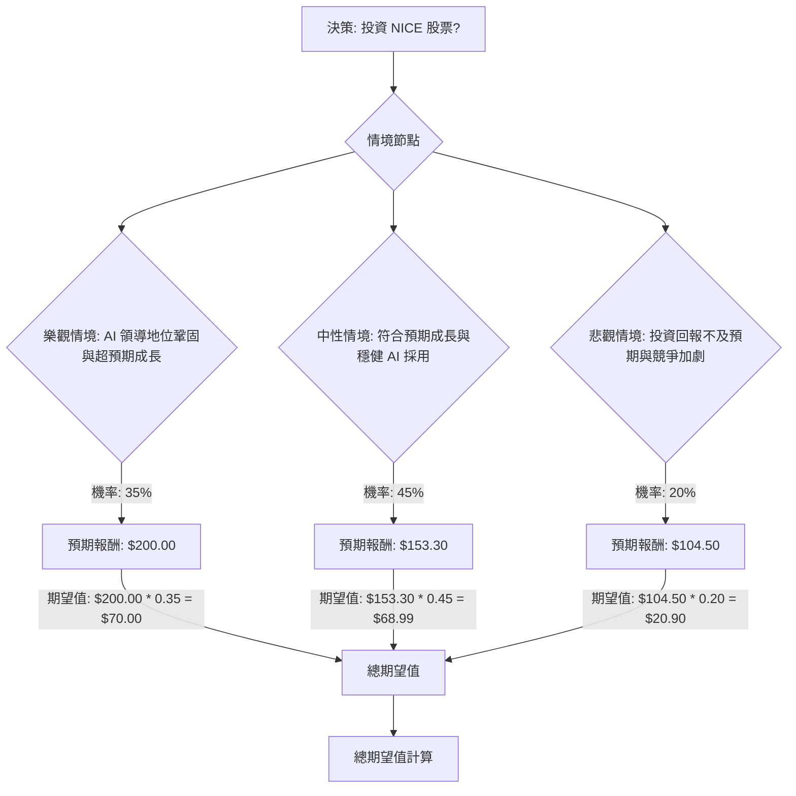

根據對美股公司 NICE 的基本面數據、最新新聞、財報、市場動態及產業趨勢的綜合評估，以下將使用決策樹分析與期望值分析來判斷其目前是否適合投資。

### 核心假設

在進行決策樹分析前，我們建立以下核心假設：

*   **市場趨勢：** 客戶體驗 (CX) 產業正經歷由人工智慧 (AI) 驅動的重大轉型，AI 代理人、對話式 AI 和統一 CX 平台是主要成長動力。企業對 AI 解決方案的需求持續強勁，以提升效率和客戶滿意度。
*   **財務表現：** NICE 在 2025 年表現強勁，雲端收入和 AI 年度經常性收入 (AI ARR) 均實現顯著成長。公司預計 2026 年雲端收入將持續成長，但由於對研發和銷售的「前置投資」，短期內非 GAAP 每股盈餘 (EPS) 將面臨壓力。
*   **產業競爭與定位：** NICE 透過收購 Cognigy 強化其 AI 領導地位，成為唯一提供完全 AI 原生 CX 平台的供應商。 然而，市場競爭依然激烈，包括 Genesys Cloud、Talkdesk、Five9 等主要競爭者。
*   **宏觀經濟：** 儘管全球經濟面臨不確定性，但預計 2026 年美國經濟將保持穩定成長，科技和 AI 投資將持續推動市場。

### 決策樹分析 (Decision Tree Analysis)

**決策點：** 投資 NICE 股票

**情境節點：**

1.  **樂觀情境 (Optimistic Scenario)**
    *   **情境名稱：** AI 領導地位鞏固與超預期成長
    *   **情境描述：** NICE 成功整合 Cognigy，其 AI 原生 CX 平台獲得市場廣泛採用，雲端收入成長超出預期 (例如達到 15% 以上)，AI 投資迅速轉化為利潤擴張。市場對 AI 替代人工服務的擔憂減輕，公司有效平衡 AI 與人際互動。國際市場擴張持續強勁。
    *   **機率 (Probability)：** 35%
    *   **預期報酬 / 期望值 (Expected Value)：**
        *   假設 2026/2027 年 EPS 達到 $12.50 (超出指引)。
        *   應用較高的本益比 (P/E) 倍數 16x (反映強勁成長和市場領導地位)。
        *   預期股價 = $12.50 * 16 = $200.00
        *   潛在報酬率 = ($200.00 - $119.39) / $119.39 ≈ 67.5%

2.  **中性情境 (Moderate Scenario)**
    *   **情境名稱：** 符合預期成長與穩健 AI 採用
    *   **情境描述：** NICE 達成其 2026 年收入和 EPS 指引。AI 解決方案的採用穩步推進，但初期投資如預期般對利潤造成壓力。公司維持其在 CX AI 市場的競爭地位，但未出現顯著的超預期表現。
    *   **機率 (Probability)：** 45%
    *   **預期報酬 / 期望值 (Expected Value)：**
        *   假設 2026 年非 GAAP EPS 為 $10.95 (指引中點)。
        *   應用中等本益比 (P/E) 倍數 14x (略高於當前預期 P/E 10.9，反映穩健表現和 AI 整合)。
        *   預期股價 = $10.95 * 14 = $153.30
        *   潛在報酬率 = ($153.30 - $119.39) / $119.39 ≈ 28.4%

3.  **悲觀情境 (Pessimistic Scenario)**
    *   **情境名稱：** 投資回報不及預期與競爭加劇
    *   **情境描述：** NICE 的 AI 投資未能如期產生回報，或因競爭加劇、客戶對 AI 整合的複雜性或對人工服務流失的擔憂而導致採用速度放緩。全球經濟放緩對企業支出造成負面影響，公司未能達到其 EPS 指引。
    *   **機率 (Probability)：** 20%
    *   **預期報酬 / 期望值 (Expected Value)：**
        *   假設 2026 年 EPS 降至 $9.50 (低於指引)。
        *   應用較低的本益比 (P/E) 倍數 11x (反映表現不佳和市場擔憂)。
        *   預期股價 = $9.50 * 11 = $104.50
        *   潛在報酬率 = ($104.50 - $119.39) / $119.39 ≈ -12.5% (虧損)

---

### 決策樹圖 (使用 Markdown)

### 計算過程

**節點期望值計算：**

*   **樂觀情境期望值：** $200.00 (預期股價) * 0.35 (機率) = $70.00
*   **中性情境期望值：** $153.30 (預期股價) * 0.45 (機率) = $68.99
*   **悲觀情境期望值：** $104.50 (預期股價) * 0.20 (機率) = $20.90

**整體期望值 (Expected Value Analysis)：**

將所有情境的期望值加總，得出投資 NICE 股票的整體期望值：

整體期望值 = $70.00 + $68.99 + $20.90 = $159.89

### 最終結論

根據決策樹分析和期望值分析，投資 NICE 股票的整體期望值為 **$159.89**。

*   **當前股價：** $119.39
*   **整體期望值：** $159.89

由於整體期望值 ($159.89) 高於當前股價 ($119.39)，這表示根據我們的假設和情境分析，**NICE 目前適合投資**。

**簡短理由：**

NICE 在 AI 驅動的客戶體驗市場中展現出強勁的成長潛力，特別是在雲端服務和 AI 解決方案方面。儘管 2026 年的 EPS 指引顯示短期內因投資而面臨壓力，但公司在 2025 年的穩健表現、無債務的強勁資產負債表、積極的股票回購計劃以及對 Cognigy 的戰略性收購，都為其長期成長奠定了堅實基礎。 市場對其 AI 領導地位的認可和分析師的平均目標價也支持其股價有上漲空間。 雖然存在競爭和 AI 採用速度的風險，但綜合來看，NICE 的上行潛力大於下行風險。