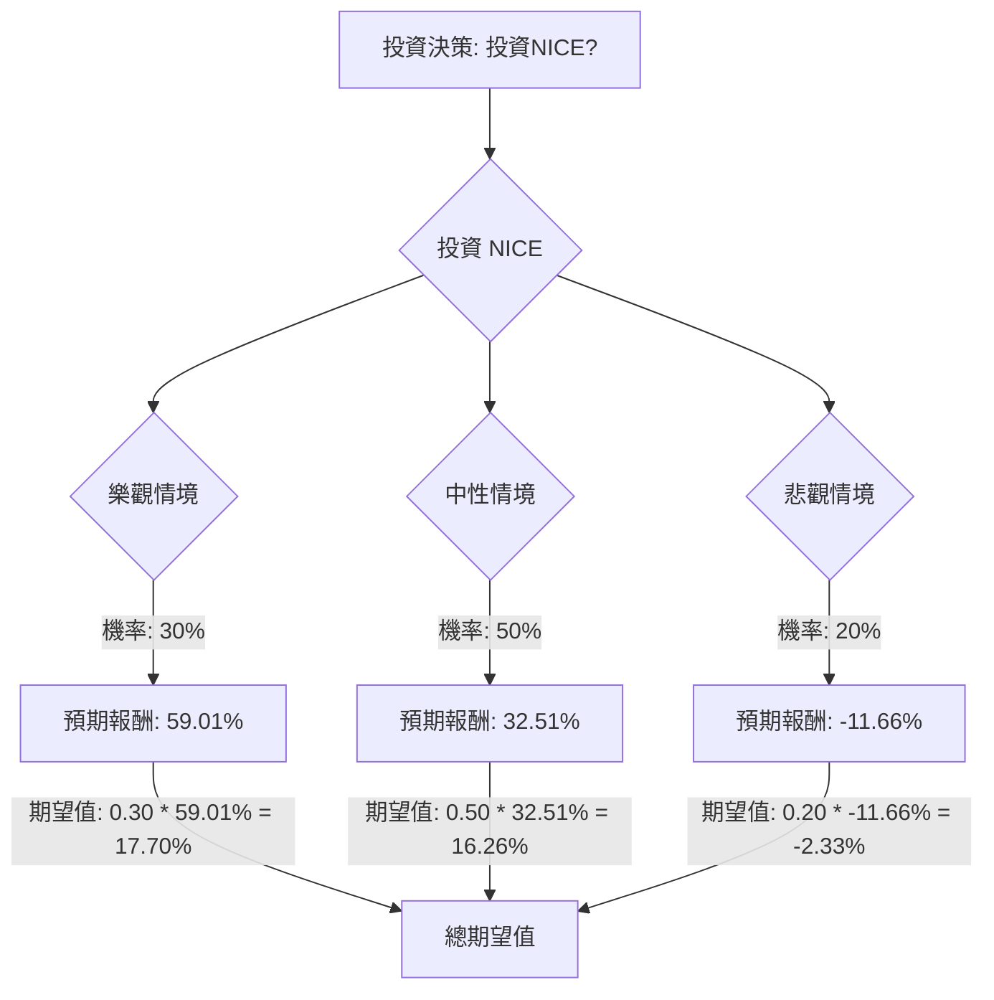

根據對美股公司 NICE 的基本面數據、最新新聞、財報、市場動態及產業趨勢的綜合評估，以下將使用決策樹分析與期望值分析來判斷其目前是否適合投資。

### 核心假設

在進行決策樹分析之前，我們首先建立以下核心假設：

*   **市場趨勢假設**：客戶體驗 (CX) 領域對 AI 驅動解決方案的需求持續強勁，NICE 作為該領域的領導者，將受益於此趨勢。然而，全球經濟狀況和企業軟體支出可能存在不確定性。
*   **財務表現假設**：NICE 將繼續執行其雲端和 AI 轉型策略，推動雲端收入增長。儘管短期內可能因投資 AI 和雲端基礎設施而面臨毛利率和營運利潤率的壓力，但長期來看，其盈利能力有望提升。公司強勁的資產負債表和現金流提供了一定的財務彈性。
*   **產業競爭假設**：AI 驅動的 CX 市場競爭激烈，NICE 需持續創新（如 Agentic AI）以維持其市場領導地位和競爭優勢。

### 決策樹分析與期望值計算

我們將評估「投資 NICE」這一決策，並設定三種可能的情境：樂觀、中性、悲觀。

**當前股價 (Close Price):** $113.20

**1. 預測情境與報酬率估計**

*   **樂觀情境 (Optimistic Scenario)**
    *   **情境描述**：NICE 在 AI 驅動的 CX 市場中表現卓越，AI 解決方案被廣泛採用，市場份額顯著增長，且宏觀經濟環境有利。公司超預期達成甚至超越分析師的高端目標價。
    *   **預期股價**：$180.00 (接近52週高點 $180.61 及部分分析師高目標價)
    *   **預期報酬率**：($180.00 - $113.20) / $113.20 = 59.01%
    *   **機率 (Probability)**：30% (基於公司在 AI 領域的創新和領導地位，但仍需考慮執行風險)

*   **中性情境 (Neutral Scenario)**
    *   **情境描述**：NICE 按照其 2026 年財測穩健增長，雲端和 AI 業務持續擴張，市場對其估值維持在分析師的平均目標價附近。
    *   **預期股價**：$150.00 (接近分析師平均目標價 $146.45 - $153.14)
    *   **預期報酬率**：($150.00 - $113.20) / $113.20 = 32.51%
    *   **機率 (Probability)**：50% (基於分析師普遍的「持有」或「溫和買入」評級 及公司穩健的財測)

*   **悲觀情境 (Pessimistic Scenario)**
    *   **情境描述**：NICE 未能達到其財測，面臨激烈的市場競爭、宏觀經濟下行導致企業支出減少，或因 AI 投資導致的毛利率壓力持續惡化。地緣政治風險也可能對其以色列業務造成負面影響。股價可能跌至分析師低目標價或更低。
    *   **預期股價**：$100.00 (低於當前股價，但高於 52 週低點 $94.65，反映顯著的負面影響)
    *   **預期報酬率**：($100.00 - $113.20) / $113.20 = -11.66%
    *   **機率 (Probability)**：20% (考慮到轉型風險、競爭加劇和潛在的宏觀經濟逆風)

**2. 決策樹繪製 (Markdown)**

**3. 期望值計算過程**

*   **樂觀情境期望值** = 0.30 (機率) * 59.01% (報酬率) = 17.70%
*   **中性情境期望值** = 0.50 (機率) * 32.51% (報酬率) = 16.26%
*   **悲觀情境期望值** = 0.20 (機率) * -11.66% (報酬率) = -2.33%

**整體期望值 (Overall Expected Value)** = 17.70% + 16.26% + (-2.33%) = **31.63%**

### 最終結論

根據上述決策樹分析和期望值計算，投資 NICE 的**整體期望值為 31.63%**。

**判斷：適合投資**

**理由：**
NICE 是一家在 AI 驅動的客戶體驗解決方案領域具有領導地位的公司。儘管其 2026 年的 EPS 預期可能因對 AI 和雲端基礎設施的投資而面臨短期壓力，但公司在雲端收入方面表現強勁，並持續加速 AI 解決方案的採用。分析師普遍給予「持有」或「溫和買入」評級，且平均目標價顯示出可觀的潛在漲幅（約 30%-37%）。

此外，NICE 的估值指標，如 P/E (11.61)、P/B (1.76) 和 P/S (2.31)，相對於其行業和歷史水平而言較低，顯示其可能被低估。公司擁有健康的資產負債表，低負債權益比 (0.02) 和良好的流動性 (Quick Ratio 1.55, Current Ratio 1.55)，這為其未來的增長和創新提供了堅實的基礎。

綜合來看，儘管存在轉型和競爭風險，但 NICE 在高增長 AI CX 市場中的戰略定位、穩健的財務狀況以及分析師普遍看好的潛在漲幅，使得其投資的整體期望值為正且顯著，因此目前適合投資。