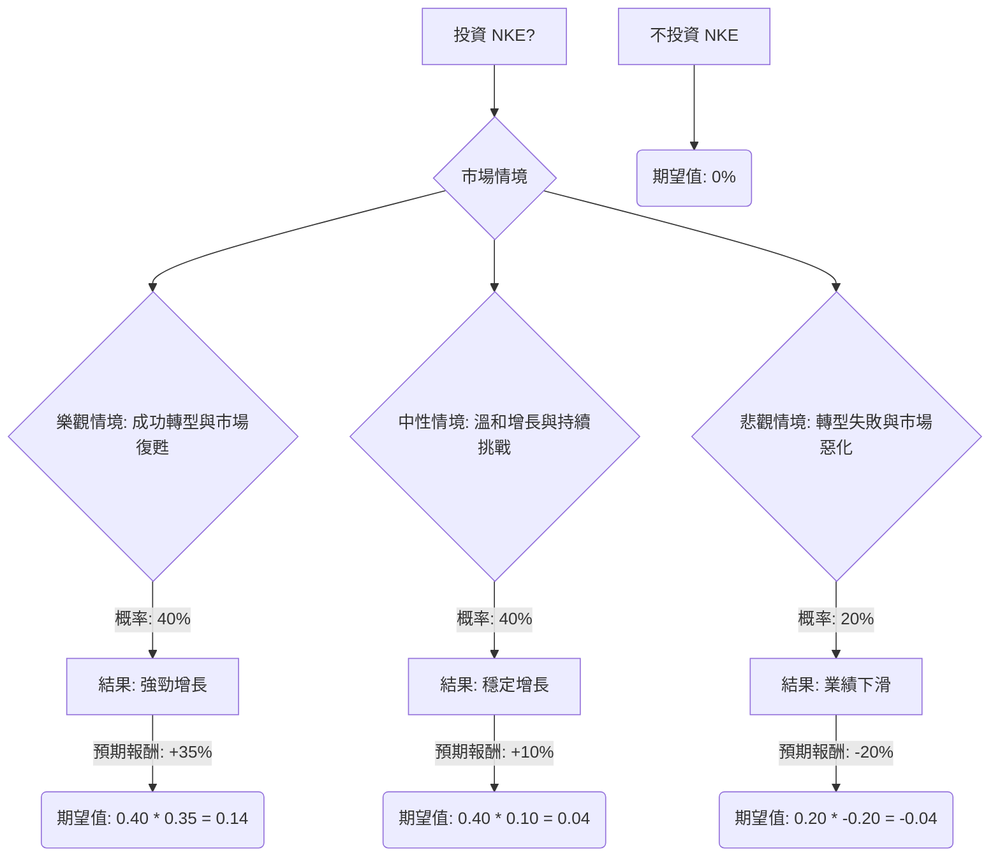

為了評估美股公司 NKE (Nike) 目前是否適合投資，我們將結合其提供的基本面數據，並透過網路搜尋獲取最新資訊，然後運用決策樹分析和期望值分析進行評估。

首先，我們將進行網路搜尋以獲取最新的市場動態、財報、新聞和產業趨勢。

## NKE (Nike) 投資評估：決策樹分析與期望值分析

### 核心假設

根據提供的基本面數據和網路搜尋結果，我們將建立以下核心假設：

**市場趨勢：**
*   全球運動鞋服市場預計在 2024 年達到 1325 億美元，並以 4.2% 的複合年增長率增長至 2033 年的 1912 億美元。美國市場預計在 2024 年達到 333 億美元，複合年增長率為 3.9%。
*   運動鞋服市場的增長受到健康意識提升、可支配收入增加、時尚影響、技術進步以及直銷模式擴展的推動。然而，品牌間的激烈競爭和通脹壓力可能影響消費者支出和利潤率，假冒產品也構成挑戰。
*   2024 年全球服裝和鞋類銷售額預計將溫和增長約 2%，預計在 2025 年底/2026 年初恢復到疫情前水平。通脹持續存在，將導致可支配支出謹慎。
*   運動服飾和童裝類別預計將跑贏整個行業。運動服飾的需求預計將受益於 2024 年巴黎奧運會，長期則受亞太地區日益增長的健康關注和運動美學吸引力驅動。

**公司財務與營運：**
*   Nike 在 2024 財年（截至 2024 年 5 月 31 日）的營收為 514 億美元，同比增長 1%（按固定匯率計算）。第四季度營收為 126 億美元，同比下降 2%（按報告基準），按固定匯率計算持平。毛利率增長 110 個基點至 44.7%。
*   Nike 在 2024 財年第三季度（截至 2024 年 2 月 29 日）營收為 124 億美元，略有增長。毛利率增長 150 個基點至 44.8%，但受到重組費用 50 個基點的負面影響。稀釋後每股收益為 0.77 美元，同比下降 3%。
*   Nike 正在進行轉型，包括重組費用（約 3 億美元的稅前費用），這引發了對利潤率的擔憂。公司正在從直接面向消費者 (DTC) 模式轉向重新與批發商合作，並將重點轉回跑步、籃球和足球等性能類別。
*   北美市場表現出復甦跡象，2026 財年第二季度批發收入增長 24%，跑步類別連續第二個季度增長超過 20%。
*   大中華區市場仍是關鍵變數，2026 財年第二季度收入下降 16%，息稅前利潤 (EBIT) 下降 49%。
*   分析師對 NKE 的平均目標價為 74.90 美元，最高為 110.00 美元，最低為 35.00 美元，意味著較當前價格有 38.72% 的上漲空間。
*   Barclays 將 Nike 評級上調至「增持」，目標價從 64 美元上調至 73 美元，理由是北美市場復甦、批發訂單強勁以及產品線更新。
*   Simply Wall St 的 DCF 分析顯示，Nike 的內在價值約為每股 40.24 美元，暗示當前股價 53.98 美元可能被高估 34.1%。
*   Nike 的市盈率 (P/E) 為 31.65，遠期市盈率 (Forward P/E) 為 23.55，PEG 為 2.66。
*   Nike 的股價在過去一年下跌約 25%，過去三年下跌 52.5%，過去五年下跌 57.6%。
*   Nike 的全球市場份額（運動鞋和服裝）從 2022 年的 17.1% 下降到 2024 年的 16.4%。
*   競爭加劇，On Running 和 Hoka 等挑戰者品牌在跑步市場取得成功，Lululemon 在女性運動服飾領域也正在縮小與 Nike 的差距。

### 決策樹分析 (Decision Tree Analysis)

我們將構建一個決策樹來評估投資 NKE 的潛在結果。我們將考慮三種主要情境：樂觀情境、中性情境和悲觀情境。

**決策：投資 NKE**

**節點說明與計算過程：**

*   **A (投資 NKE?)**: 初始決策點。
*   **B (市場情境)**: 根據市場和公司動態，我們將面臨不同的情境。
*   **C (樂觀情境: 成功轉型與市場復甦)**
    *   **預測情境名稱**: 成功轉型與市場復甦。
    *   **對應的機率 (Probability)**: 40%。
        *   **核心假設**: Nike 的轉型策略（回歸批發、專注性能產品）取得顯著成功。北美市場持續強勁復甦，大中華區市場企穩回升。新產品創新（如 Pegasus 42、Air Max Dn8）獲得市場熱烈反響。全球運動鞋服市場增長超出預期。分析師的平均目標價 74.90 美元（較當前 53.98 美元有 38.72% 上漲空間）或 Barclays 的 73 美元目標價提供參考。
        *   **預期報酬 (Expected Return)**: +35%。
            *   **計算方式**: 參考分析師平均目標價的上漲空間 (38.72%)，考慮到樂觀情境下可能略高於平均預期。
    *   **C2 (期望值)**: 0.40 * 0.35 = 0.14 (或 14%)。

*   **D (中性情境: 溫和增長與持續挑戰)**
    *   **預測情境名稱**: 溫和增長與持續挑戰。
    *   **對應的機率 (Probability)**: 40%。
        *   **核心假設**: Nike 的轉型進展緩慢，部分市場（如大中華區）仍面臨挑戰。競爭壓力持續存在，新興品牌繼續蠶食市場份額。全球經濟溫和增長，通脹壓力持續影響消費者可支配支出。公司營收和 EPS 增長符合分析師預期（未來幾年營收增長 3%，EPS 增長 10%）。
        *   **預期報酬 (Expected Return)**: +10%。
            *   **計算方式**: 考慮到公司預期 EPS 增長和股息收益 (0.03)，但受制於競爭和宏觀經濟逆風。
    *   **D2 (期望值)**: 0.40 * 0.10 = 0.04 (或 4%)。

*   **E (悲觀情境: 轉型失敗與市場惡化)**
    *   **預測情境名稱**: 轉型失敗與市場惡化。
    *   **對應的機率 (Probability)**: 20%。
        *   **核心假設**: Nike 的轉型策略未能奏效，DTC 模式和批發渠道均表現不佳。大中華區市場持續惡化，全球經濟陷入衰退，消費者支出大幅減少。競爭對手進一步擴大市場份額，Nike 品牌吸引力下降。公司利潤率因重組費用、關稅和促銷活動而持續承壓。Simply Wall St 的 DCF 估值（40.24 美元）或分析師最低目標價（35.00 美元）提供參考。
        *   **預期報酬 (Expected Return)**: -20%。
            *   **計算方式**: 參考 Simply Wall St 的 DCF 估值與當前股價的差異，以及分析師最低目標價的潛在跌幅。
    *   **E2 (期望值)**: 0.20 * -0.20 = -0.04 (或 -4%)。

*   **F (不投資 NKE)**
    *   **期望值**: 0%。
        *   **計算方式**: 假設不投資的機會成本為 0，即資金保持不動或投資於無風險資產。

### 期望值分析 (Expected Value Analysis)

現在我們將計算投資 NKE 的總體期望值：

**總體期望值 = (樂觀情境期望值) + (中性情境期望值) + (悲觀情境期望值)**
總體期望值 = 0.14 + 0.04 + (-0.04)
總體期望值 = 0.14 (或 14%)

### 最終結論

根據我們的決策樹分析和期望值計算，投資 NKE 的總體期望值為 **14%**。

**判斷：適合投資**

**簡短理由：**
儘管 Nike 目前面臨轉型挑戰、競爭加劇以及部分市場（如大中華區）的逆風，但其積極的轉型策略（回歸批發、專注性能產品）、北美市場的復甦跡象以及持續的產品創新為其帶來了潛在的增長動力。分析師的平均目標價也顯示出顯著的上漲空間。雖然 Simply Wall St 的 DCF 估值顯示當前股價可能被高估，但考慮到 Nike 作為全球領先運動品牌的強大品牌影響力、市場份額和長期增長潛力，以及其在重組後可能帶來的效率提升和利潤率改善，14% 的正向期望值表明，在承擔一定風險的前提下，NKE 股票目前具有投資價值。投資者應密切關注其轉型進度、大中華區市場表現以及宏觀經濟變化。