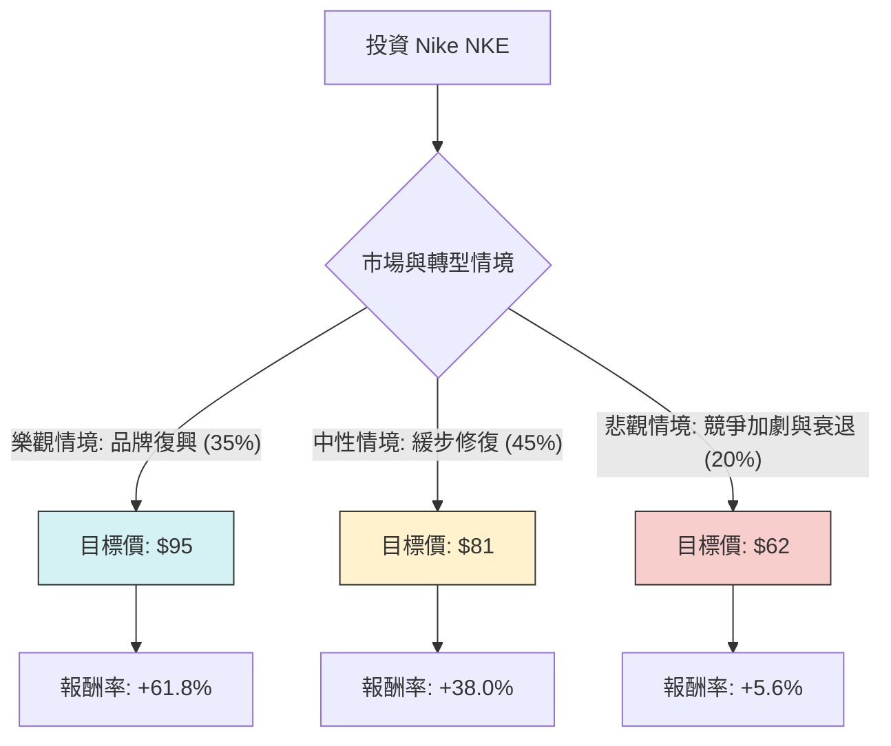

針對美股公司 **Nike (NKE)** 的投資評估，我將結合您提供的基本面數據以及最新的市場動態（包含新任 CEO 上任、近期財報表現及產業趨勢）進行「決策樹」與「期望值」分析。

---

### 0. 外部即時資訊補充 (最新市場動態)

在進行計算前，必須納入以下關鍵變數：
*   **管理層更迭**：Nike 已宣佈由老將 **Elliott Hill** 接替 John Donahoe 擔任 CEO。市場對此反應積極，認為 Hill 能修復與經銷商的關係並找回 Nike 的「創新魂」。
*   **撤回全年指引**：Nike 近期撤回了 2025 財年的全年業績指引，並推遲了投資者日。這顯示短期內業務仍面臨高度不確定性。
*   **競爭壓力**：在跑步鞋領域面臨 Hoka、On (昂跑) 的蠶食；在生活休閒領域面臨強大競爭。
*   **中國市場**：大中華區需求疲軟仍是主要拖累因素。

---

### 1. 決策樹分析 (Decision Tree)

以下決策樹基於未來一年的持有期限進行預測：

#### 節點詳細說明：

1.  **樂觀情境 (Bull Case) - 35% 機率**：
    *   **描述**：新 CEO 迅速扭轉產品策略，創新產品線大獲成功，成功奪回被 Hoka/On 佔領的市佔率。中國經濟刺激政策見效，帶動消費回升。
    *   **預期價格**：$95 (回到 2024 年初水平並反映轉型溢價)。
2.  **中性情境 (Base Case) - 45% 機率**：
    *   **描述**：轉型需要時間（1-2年），短期內業績平平，但因估值已低（P/E 處於歷史低位區域），股價隨大盤震盪向上，緩慢回補缺口。
    *   **預期價格**：$81 (接近分析師平均目標價 $83.08)。
3.  **悲觀情境 (Bear Case) - 20% 機率**：
    *   **描述**：全球經濟衰退，消費者削減非必要開支。Nike 庫存問題重燃，且新產品未能打動消費者。股價回撤至先前低點。
    *   **預期價格**：$62 (接近 52 週低點)。

---

### 2. 期望值分析 (Expected Value Analysis)

#### A. 核心假設
*   **當前股價 (P0)**：$58.71 (根據您提供的數據)。
*   **估值倍數**：目前的 Forward P/E (26.76x) 雖高於標普 500，但低於其自身五年均值，顯示市場已部分反映利空。
*   **股息回報**：Dividend % 為 2.4%，在分析中視為額外的緩衝，不直接計入目標價但增強下行保護。

#### B. 計算過程
期望值 (EV) 計算公式：
$EV = \sum (機率_i \times 預期價格_i)$

1.  **樂觀期望值**：$35\% \times 95 = 33.25$
2.  **中性期望值**：$45\% \times 81 = 36.45$
3.  **悲觀期望值**：$20\% \times 62 = 12.40$

**總期望目標價 (Expected Target Price)**：
$33.25 + 36.45 + 12.40 = \$82.10$

**預期報酬率 (Expected Return)**：
$\frac{82.10 - 58.71}{58.71} \approx 39.8\%$

---

### 3. 最終結論

#### **判斷：適合投資 (中長期持有)**

#### **理由：**
1.  **極具吸引力的勝率/賠率 (Risk/Reward Ratio)**：
    根據數據顯示的 $58.71 價格，對比分析師目標價 $83.08 以及我們計算的期望值 $82.10，**潛在漲幅接近 40%**。即便在最悲觀的情境下（$62），虧損風險也非常有限（甚至仍略高於現價），這表示目前股價具備極強的安全邊際。
2.  **管理層紅利**：
    Elliott Hill 的回歸是極大的利多。Nike 的問題在於「戰略失誤（過度依賴 DTC 而忽略批發渠道）」而非「品牌破產」。Hill 作為內部資深人士，能以最快速度修復與通路商的關係。
3.  **財務體質依舊穩健**：
    ROE (21.1%) 與 Current Ratio (2.19) 顯示公司財務狀況健康，有足夠的現金流應對轉型期的陣痛。
4.  **技術面與情緒面**：
    股價已在 52 週低點附近築底，且 SMA20/SMA50 已開始轉正（0.037, 0.026），顯示短期動能正在修復。

**建議建議：**
由於 Nike 目前正處於「撤回指引」的真空期，股價短期波動可能較大。建議採取 **「分批建倉」** 策略，利用未來幾個月可能出現的財報利空測試低點時加碼，以捕捉 CEO 效應帶來的長期估值修復。

***

*註：以上分析基於您提供的數據（現價 $58.71）進行。若實時股價已回升至 $80 以上，預期報酬率將顯著下降，投資者應重新評估進入點。*