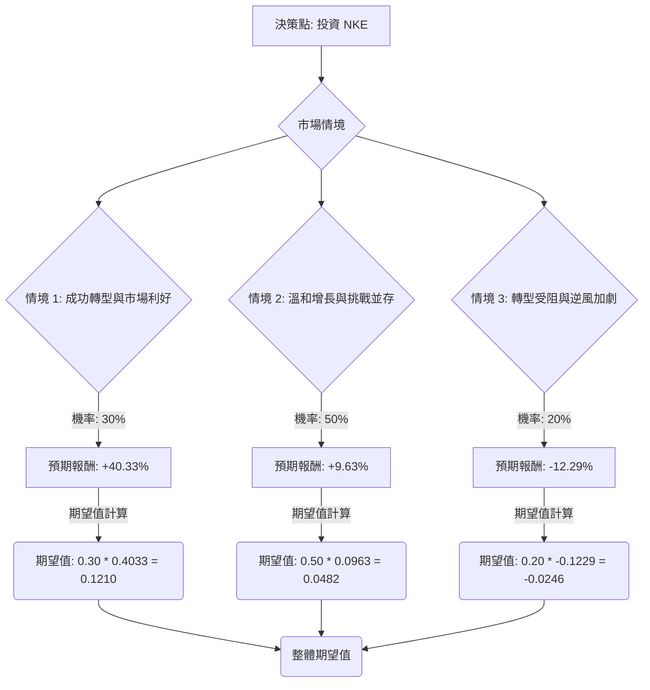

為了評估美股公司 NKE 目前是否適合投資，我們將結合其基本面數據與最新的市場資訊，運用決策樹分析和期望值分析。

### 核心假設

1.  **時間範圍**：本次分析著重於未來一年的投資評估。
2.  **當前股價**：NKE 目前收盤價為 $57.01。
3.  **分析師目標價**：提供的目標價為 $75.92。
4.  **市場環境**：預計全球經濟將保持穩定至溫和增長，但消費者支出可能因通膨和利率而趨於謹慎。運動服飾市場競爭激烈，新興品牌持續挑戰傳統巨頭。
5.  **NKE 轉型策略**：NKE 正處於「Win Now」轉型策略的執行中期，該策略旨在重新聚焦運動核心、修復批發通路並加速創新。此策略的成效將是影響未來表現的關鍵。
6.  **毛利率壓力**：關稅和折扣促銷活動預計將持續對 NKE 的毛利率構成壓力。

### 最新資訊與市場動態補充

根據最新的網路搜尋結果，NKE 的狀況如下：

*   **近期財報表現**：NKE 在 2026 財年第二季度（截至 2025 年 11 月 30 日）的營收增長 1% 至 124 億美元，但淨收入和稀釋後每股盈餘（EPS）均大幅下降 32% 至 0.53 美元，主要受較高折扣、關稅和中國市場庫存減記的影響。批發業務有所增長，但 Nike Direct 收入下降。
*   **即將發布的財報**：NKE 預計將於 2026 年 3 月 31 日發布 2026 財年第三季度財報，分析師預計 EPS 約為 0.30-0.32 美元，較去年同期顯著下降。
*   **「Win Now」策略**：新任 CEO Elliott Hill 推動的「Win Now」策略旨在重振品牌，重點包括回歸運動根源、強化批發合作夥伴關係、加速產品創新（如「NIKE Mind」平台）和優化產品組合。該策略在批發業務和跑步品類方面已顯示出初步的復甦跡象。
*   **增長前景**：分析師預計 NKE 在 2025 至 2028 財年期間的營收複合年增長率（CAGR）為 3%，EPS CAGR 為 10%。部分分析師認為，若轉型成功，股價有望達到 77.5 美元甚至 90 美元。
*   **挑戰與風險**：
    *   **競爭激烈**：來自 Adidas、On Holding、Hoka 和 New Balance 等競爭對手的挑戰日益加劇，尤其是在性能跑鞋領域。
    *   **Nike Direct 策略失誤**：過去對直營通路的過度投入導致批發關係受損，消費者回歸批發商。
    *   **中國市場表現不佳**：大中華區市場銷售額在 2026 財年第二季度下降 16%。
    *   **關稅影響**：預計 2026 年將額外產生約 15 億美元的關稅成本，持續壓低毛利率。
    *   **估值**：目前的預期本益比（Forward P/E）和 PEG 比率高於行業平均水平，顯示估值偏高。
    *   **股價表現**：過去三年股價下跌 50%，表現不及標普 500 指數。
*   **優勢**：
    *   **強大品牌力**：NKE 仍是全球運動服飾市場的領導者，擁有強大的品牌影響力、全球知名度和定價權。
    *   **研發與行銷資源**：擁有比競爭對手更多的資源投入研發和行銷。
    *   **股息**：連續 24 年增加股息。
    *   **庫存優化**：通過庫存清理和供應鏈優化，庫存已有所下降。
    *   **AI 應用**：計劃利用 AI 加速新產品開發，如 2026 年 1 月推出的「NIKE Mind」平台。
    *   **大型賽事機會**：FIFA 世界杯等大型體育賽事有望帶來額外的行銷曝光。

### 決策樹分析 (Decision Tree Analysis)

我們將構建一個決策樹來評估投資 NKE 的潛在結果。

**決策點：投資 NKE**

*   **情境 1：成功轉型與市場利好 (Optimistic Scenario)**
    *   **情境描述**：NKE 的「Win Now」策略執行順利，批發通路顯著復甦，新產品（如 Nike Mind）受到市場熱烈迴響。儘管競爭激烈，NKE 仍能維持或小幅提升市場份額。全球運動服飾市場持續增長，宏觀經濟環境穩定。公司營收和 EPS 增長超出預期。
    *   **機率 (Probability)**：30%
    *   **預期報酬 (Expected Return)**：股價上漲至 $80.00 (約 +40.33%)。
        *   計算：($80.00 - $57.01) / $57.01 = 0.4033
*   **情境 2：溫和增長與挑戰並存 (Moderate Scenario)**
    *   **情境描述**：NKE 的轉型策略取得部分進展，但執行速度和成效不如預期。競爭壓力持續，尤其是在 DTC 渠道和新興品牌方面。關稅和折扣活動繼續壓縮毛利率。公司營收和 EPS 增長符合分析師的較低預期，或僅有小幅增長。
    *   **機率 (Probability)**：50%
    *   **預期報酬 (Expected Return)**：股價小幅上漲至 $62.50 (約 +9.63%)。
        *   計算：($62.50 - $57.01) / $57.01 = 0.0963
*   **情境 3：轉型受阻與逆風加劇 (Pessimistic Scenario)**
    *   **情境描述**：NKE 的轉型策略未能有效實施，市場份額進一步被競爭對手侵蝕。大中華區等關鍵市場持續疲軟。宏觀經濟惡化，消費者信心下降，導致銷售額和利潤大幅下滑。關稅影響超出預期，毛利率持續承壓。公司營收和 EPS 遠低於預期。
    *   **機率 (Probability)**：20%
    *   **預期報酬 (Expected Return)**：股價下跌至 $50.00 (約 -12.29%)。
        *   計算：($50.00 - $57.01) / $57.01 = -0.1229

### 期望值分析 (Expected Value Analysis)

現在我們計算投資 NKE 的整體期望值：

**計算過程：**

*   **情境 1 期望值** = 機率 (0.30) \* 預期報酬 (0.4033) = 0.1210
*   **情境 2 期望值** = 機率 (0.50) \* 預期報酬 (0.0963) = 0.0482
*   **情境 3 期望值** = 機率 (0.20) \* 預期報酬 (-0.1229) = -0.0246

**整體期望值** = 情境 1 期望值 + 情境 2 期望值 + 情境 3 期望值
整體期望值 = 0.1210 + 0.0482 + (-0.0246) = **0.1446**

這表示投資 NKE 在未來一年內，預期平均報酬率約為 **14.46%**。

### 最終結論

根據決策樹分析和期望值計算，NKE 的整體期望值為 **0.1446 (即 14.46%)**。

**判斷：適合投資**

**理由：**

儘管 NKE 面臨激烈的市場競爭、毛利率壓力以及中國市場的挑戰，但其強大的品牌影響力、持續的產品創新投入（如 AI 應用和 Nike Mind 平台）以及「Win Now」轉型策略在批發通路和特定品類（如跑步）中已顯示出初步的積極成效。分析師普遍對其未來幾年的營收和 EPS 增長持樂觀態度，且多數給予「買入」評級。

雖然 NKE 的股價在過去三年表現不佳，且目前估值相對較高，但 14.46% 的正向期望報酬率表明，在考慮了各種潛在情境及其機率後，投資 NKE 仍具有吸引力。這反映了市場對其轉型成功和長期增長潛力的信心。然而，投資者應密切關注其即將發布的財報、轉型策略的執行進度以及宏觀經濟和競爭格局的變化，並考慮分批投入以分散風險。