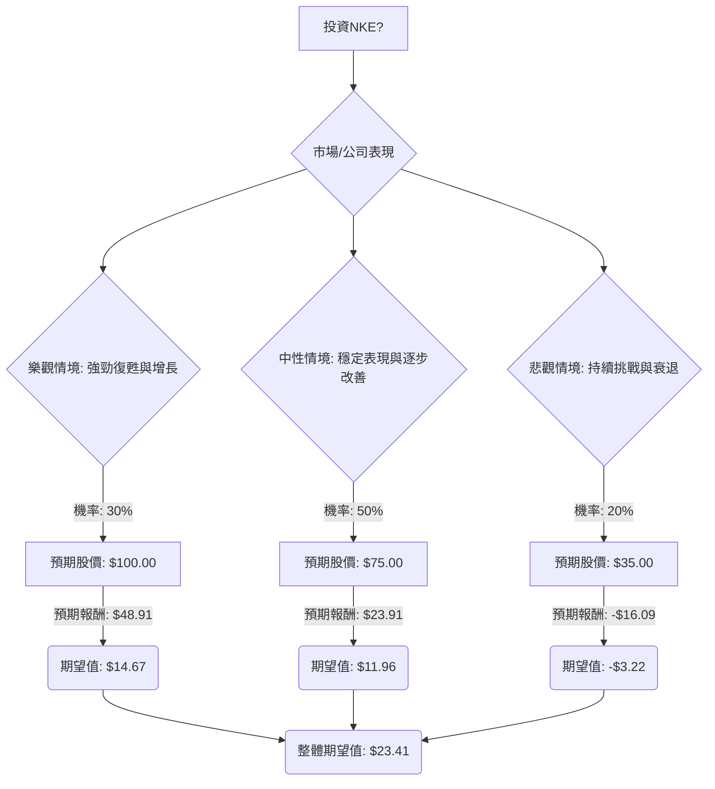

根據您提供的NKE（Nike）基本面數據以及透過網路搜尋獲得的最新資訊，我將使用決策樹分析和期望值分析來評估NKE目前是否適合投資。

### 核心假設

在進行決策樹分析之前，我們需要建立以下核心假設：

*   **市場趨勢：** 運動服飾與鞋類市場預計將持續增長，主要受健康意識提升、活躍生活方式以及「運動休閒風」（athleisure）趨勢的推動。全球服飾與鞋類市場規模預計在2025年至2034年間將以18.1%的複合年增長率增長。北美運動服飾市場預計在2025年至2030年間將以6.8%的複合年增長率增長。
*   **財務表現：** NKE在2024財年第三季度營收略有增長，毛利率有所改善，但淨利潤和稀釋後每股收益略有下降。 公司管理層正在進行「營運重置」（operational reset），旨在提升效率並恢復強勁增長。
*   **產業競爭：** NKE面臨來自Adidas、Puma、Under Armour、ASICS、New Balance以及新興品牌如On Running、HOKA、Alo Yoga等日益激烈的競爭。 儘管NKE仍是市場領導者，但其全球市場份額在2022年至2024年間略有下降。
*   **創新與品牌：** NKE擁有強大的品牌形象、創新能力和行銷專業知識，並持續投資於產品開發、數位轉型和直營銷售（DTC）渠道。 然而，數位銷售在2024財年第三季度有所下降。
*   **分析師預期：** 大多數分析師對NKE給予「中性買入」或「買入」評級，平均目標價較當前股價有約39%至48%的潛在上漲空間。

### 決策樹分析

我們將設定一個為期一年的投資期限，並考慮三種主要情境：樂觀、中性、悲觀。

**當前數據：**
*   當前股價 (Close): $52.71
*   年度股息率 (Dividend %): 3.07%
*   預計年度股息 (Dividend per share) = $52.71 * 0.0307 = $1.62

#### 1. 繪製完整的決策樹（使用 Markdown）

#### 2. 明確列出所有計算過程

**情境設定與預期報酬：**

*   **樂觀情境 (Strong Recovery & Growth)**
    *   **預測情境名稱：** NKE的「營運重置」策略取得顯著成功，新產品創新週期強勁，市場份額穩定或略有增長，且整體經濟環境有利於消費支出。分析師最高目標價為$110，但為保守起見，我們取$100作為預期股價。
    *   **對應機率 (Probability)：** 30% (基於NKE的品牌實力、創新潛力及管理層的積極調整)
    *   **預期股價 (Expected Stock Price, S1)：** $100.00
    *   **預期報酬 (Return, R1)：** (S1 - 當前股價) + 預計年度股息
        *   R1 = ($100.00 - $52.71) + $1.62 = $47.29 + $1.62 = $48.91
    *   **期望值 (Expected Value, EV1)：** 機率 * 預期報酬
        *   EV1 = 0.30 * $48.91 = $14.67

*   **中性情境 (Steady Performance & Gradual Improvement)**
    *   **預測情境名稱：** NKE的「營運重置」帶來逐步改善，市場份額侵蝕減緩，但激烈競爭限制了顯著的增長。經濟狀況保持穩定。分析師平均目標價約為$73.43至$77.60。
    *   **對應機率 (Probability)：** 50% (基於分析師的共識評級為「中性買入」或「買入」，以及公司面臨的挑戰與優勢並存的現狀)
    *   **預期股價 (Expected Stock Price, S2)：** $75.00 (取分析師平均目標價的中間值)
    *   **預期報酬 (Return, R2)：** (S2 - 當前股價) + 預計年度股息
        *   R2 = ($75.00 - $52.71) + $1.62 = $22.29 + $1.62 = $23.91
    *   **期望值 (Expected Value, EV2)：** 機率 * 預期報酬
        *   EV2 = 0.50 * $23.91 = $11.96

*   **悲觀情境 (Continued Challenges & Decline)**
    *   **預測情境名稱：** NKE的「營運重置」未能有效執行，競爭加劇導致市場份額持續下降，或宏觀經濟出現嚴重衰退，影響消費者支出。分析師最低目標價為$35.00，也有預測可能跌至$34.857。
    *   **對應機率 (Probability)：** 20% (考慮到市場競爭激烈、數位銷售下滑以及宏觀經濟不確定性帶來的風險)
    *   **預期股價 (Expected Stock Price, S3)：** $35.00 (取分析師最低目標價)
    *   **預期報酬 (Return, R3)：** (S3 - 當前股價) + 預計年度股息
        *   R3 = ($35.00 - $52.71) + $1.62 = -$17.71 + $1.62 = -$16.09
    *   **期望值 (Expected Value, EV3)：** 機率 * 預期報酬
        *   EV3 = 0.20 * (-$16.09) = -$3.22

**整體期望值 (Overall Expected Value)：**
*   整體期望值 = EV1 + EV2 + EV3
*   整體期望值 = $14.67 + $11.96 - $3.22 = $23.41

### 3. 最終結論

根據上述決策樹分析和期望值計算，NKE股票的**整體期望值為 $23.41**。

**判斷：適合投資**

**理由：**
儘管NKE面臨激烈的市場競爭和營運挑戰，導致近期股價表現不佳且市場份額略有下降，但其強大的品牌力、持續的創新投入以及管理層正在執行的「營運重置」策略，為未來的復甦和增長提供了潛力。 分析師普遍給予「買入」或「中性買入」評級，且平均目標價顯示出可觀的上漲空間。

計算出的正向整體期望值 $23.41 表明，在考慮了不同情境及其發生機率後，投資NKE預期能帶來正向的每股收益。這表示潛在的收益大於潛在的損失，因此目前NKE適合投資。投資者應密切關注公司「營運重置」的進展、新產品發布以及市場份額的變化。