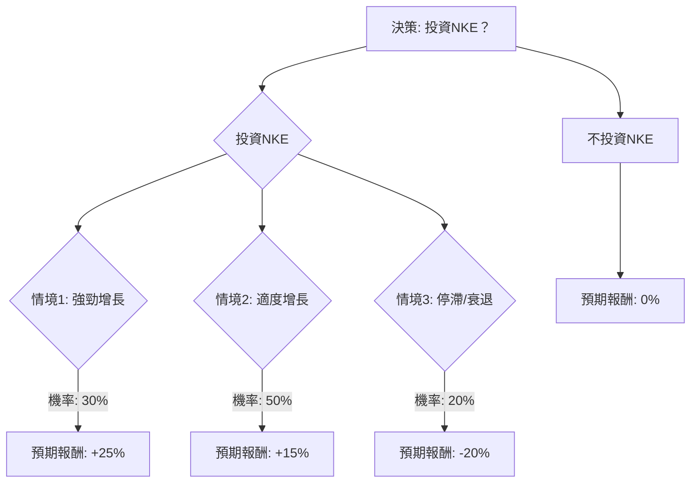

根據您提供的NKE基本面數據，並結合最新的市場資訊、財報、產業趨勢，我們將使用決策樹分析和期望值分析來評估NKE目前是否適合投資。

### 核心假設

1.  **當前股價 (Current Stock Price)**：$64.53 (基於您提供的數據)。
2.  **時間範圍 (Time Horizon)**：1年，以評估短期至中期的投資潛力。
3.  **市場環境 (Market Environment)**：全球經濟增長放緩，但運動休閒市場仍具韌性，競爭激烈。
4.  **公司策略 (Company Strategy)**：NKE正處於「Win Now」轉型策略中期，專注於運動表現產品創新、強化批發夥伴關係，並重新平衡其銷售渠道（從DTC轉向「批發+」模式）。
5.  **財務表現 (Financial Performance)**：
    *   FY26 Q1營收微增1%，但Nike Direct和大中華區銷售下滑，毛利率受關稅影響下降。
    *   FY26 Q2營收略超預期，但淨利潤和毛利率顯著下降，大中華區銷售持續疲軟。
    *   FY26分析師預期EPS將下降約28%，營收增長約0.7%。
    *   FY27分析師預期EPS將強勁反彈約56%，營收增長約4.6%。
    *   關稅成本預計在FY26每年約15億美元，對毛利率造成壓力。
6.  **產業趨勢 (Industry Trends)**：
    *   全球運動鞋市場預計在2026-2034年間以3.76%至7.14%的複合年增長率增長。
    *   健康意識提升、運動參與度增加、運動休閒風潮、技術創新、電商發展是主要驅動力。
    *   競爭激烈，新興品牌（如On Holding、Hoka）和傳統競爭對手（如Adidas）構成挑戰。大中華區面臨本土品牌（如Anta、Li-Ning）的強勁競爭和「國潮」趨勢。
7.  **分析師評級 (Analyst Ratings)**：共識為「適度買入 (Moderate Buy)」，平均目標價介於$75.84至$78.65之間。部分分析師持「中性 (Neutral)」或「持有 (Hold)」評級，並指出轉型可能需要更長時間。
8.  **估值 (Valuation)**：NKE目前的P/E和P/S倍數高於行業平均水平，估值偏高。
9.  **內部人交易 (Insider Transactions)**：CEO Elliott Hill和Apple CEO Tim Cook（Nike董事會成員）近期有大額股票買入行為，顯示對公司未來信心。

### 決策樹分析 (Decision Tree Analysis)

**決策點：投資NKE？**

#### 節點計算過程

**1. 投資NKE的期望值 (Expected Value of Investing in NKE)**

*   **情境1: 強勁增長 (Strong Growth)**
    *   **情境名稱**：NKE的「Win Now」策略成功執行，產品創新和批發渠道表現優異，大中華區市場開始復甦，FY27 EPS如預期強勁反彈。市場信心顯著提升。
    *   **機率 (Probability)**：30%
    *   **預期報酬 (Expected Return)**：+25%
    *   **預期股價 (Expected Stock Price)**：$64.53 * (1 + 0.25) = $80.66
    *   **節點期望值 (Node Expected Value)**：$80.66 * 0.30 = $24.198

*   **情境2: 適度增長 (Moderate Growth)**
    *   **情境名稱**：NKE的轉型策略取得部分進展，北美市場表現穩健，但大中華區挑戰持續，關稅壓力仍在。FY27 EPS增長符合預期下限或略高。股價向分析師平均目標價靠攏。
    *   **機率 (Probability)**：50%
    *   **預期報酬 (Expected Return)**：+15%
    *   **預期股價 (Expected Stock Price)**：$64.53 * (1 + 0.15) = $74.21
    *   **節點期望值 (Node Expected Value)**：$74.21 * 0.50 = $37.105

*   **情境3: 停滯/衰退 (Stagnation/Decline)**
    *   **情境名稱**：NKE的轉型策略未能有效實施，尤其在大中華區持續失利。競爭加劇，關稅持續侵蝕利潤，消費者需求疲軟。FY27 EPS未能如期反彈，甚至繼續下滑。
    *   **機率 (Probability)**：20%
    *   **預期報酬 (Expected Return)**：-20%
    *   **預期股價 (Expected Stock Price)**：$64.53 * (1 - 0.20) = $51.62
    *   **節點期望值 (Node Expected Value)**：$51.62 * 0.20 = $10.324

**投資NKE的總期望值 (Overall Expected Value of Investing in NKE)**：
$24.198 (情境1) + $37.105 (情境2) + $10.324 (情境3) = **$71.627**

**投資NKE的預期報酬率 (Expected Rate of Return for Investing in NKE)**：
($71.627 / $64.53) - 1 = 0.1100 = **11.00%**

**2. 不投資NKE的期望值 (Expected Value of Not Investing in NKE)**

*   **情境名稱**：不投資NKE，資金保持現金狀態或投資於無風險資產（為簡化比較，假設報酬率為0%）。
*   **機率 (Probability)**：100%
*   **預期報酬 (Expected Return)**：0%
*   **預期股價 (Expected Stock Price)**：$64.53 (保持不變)
*   **節點期望值 (Node Expected Value)**：$64.53 * 1.00 = **$64.53**

### 最終結論

根據上述決策樹分析和期望值計算：

*   **投資NKE的總期望值為 $71.627**，對應的**預期報酬率為 11.00%**。
*   **不投資NKE的期望值為 $64.53**，對應的**預期報酬率為 0%**。

由於投資NKE的預期報酬率（11.00%）高於不投資（0%），從純粹的期望值角度來看，**NKE目前適合投資**。

**簡短理由：**
儘管NKE面臨大中華區銷售下滑、毛利率受關稅壓力以及估值偏高等挑戰，但公司正積極進行轉型，並在北美市場和跑步產品線展現出增長勢頭。分析師普遍給予「適度買入」評級，且CEO及董事會成員近期的大額股票買入行為，顯示了對公司未來「中場休息」後復甦的信心。預期FY27的EPS將強勁反彈，這為長期投資提供了潛在的上漲空間。然而，投資者應意識到轉型過程可能比預期更長，且大中華區的復甦仍存在不確定性。