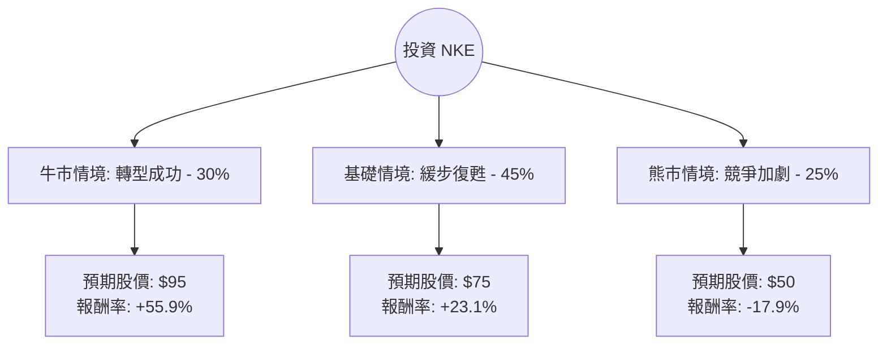

針對 Nike (NKE) 的投資評估，我結合了您提供的基本面數據以及最新的市場動態（包括新任 CEO 上任、財報指引撤回、以及全球消費市場趨勢）進行了深度分析。

以下是基於**決策樹分析**與**期望值分析**的評估報告。

---

### 1. 核心背景與市場動態分析 (Core Assumptions)

在繪製決策樹前，必須考慮以下關鍵變數：
*   **領導層更迭**：新任 CEO Elliott Hill 於 2024 年 10 月上任，市場對其「重回批發渠道」與「恢復產品創新」寄予厚望。
*   **財務指引撤回**：Nike 近期撤回了全年業績指引並推遲了投資者日，顯示短期內營運仍具高度不確定性。
*   **競爭壓力**：新興品牌（如 On Running, Hoka）在跑步鞋市場蠶食份額，Nike 需證明其創新能力尚未枯竭。
*   **中國市場**：中國經濟刺激政策可能帶動消費回升，但目前復甦力道仍待觀察。

---

### 2. 決策樹分析 (Decision Tree)

我們以 **12 個月** 為投資期限，設定三種可能的情境：

#### 決策樹節點詳細說明：

| 情境節點 | 發生機率 (P) | 預期目標價 | 預期報酬率 (R) | 說明 |
| :--- | :--- | :--- | :--- | :--- |
| **牛市情境 (Bull)** | 30% | $95.00 | +55.9% | 新 CEO 迅速恢復經銷商關係，創新產品爆紅，中國市場強勁復甦。 |
| **基礎情境 (Base)** | 45% | $75.00 | +23.1% | 轉型進度符合預期，庫存去化完成，股價回歸分析師平均目標價 ($83 附近但保守估計)。 |
| **熊市情境 (Bear)** | 25% | $50.00 | -17.9% | 品牌熱度持續下滑，Hoka/On 繼續奪取份額，全球消費性支出萎縮。 |

---

### 3. 期望值計算過程 (Expected Value Calculation)

**計算公式：**
$EV = (P_{Bull} \times R_{Bull}) + (P_{Base} \times R_{Base}) + (P_{Bear} \times R_{Bear})$

**步驟 1：計算各情境報酬率 (以現價 $60.93 為基準)**
*   Bull: $(95 - 60.93) / 60.93 = 55.92\%$
*   Base: $(75 - 60.93) / 60.93 = 23.09\%$
*   Bear: $(50 - 60.93) / 60.93 = -17.94\%$

**步驟 2：加權計算總期望報酬率**
*   $EV = (0.30 \times 0.5592) + (0.45 \times 0.2309) + (0.25 \times -0.1794)$
*   $EV = 0.16776 + 0.10390 - 0.04485$
*   **$EV = 0.2268$ (即 22.68%)**

**步驟 3：計算預期股價期望值**
*   $E[Price] = 60.93 \times (1 + 0.2268) = \$74.75$

---

### 4. 核心假設與數據解讀

1.  **估值面 (Valuation)**：目前 P/E 為 34.4，看似偏高，但 Forward P/E 降至 26.76，反映市場預期明年 EPS 將有顯著增長 (數據顯示 EPS next Y 預期增長 51.25%)。
2.  **獲利能力 (Profitability)**：ROE 達 21.12%，顯示公司仍具備強大的資本利用效率與品牌護城河。
3.  **技術面 (Technical)**：股價目前接近 52 週低點 ($52.28)，且 SMA20/SMA50 已開始轉正，顯示短期底部可能已現，具備「均值回歸」的動力。
4.  **風險因素**：負債權益比 (Debt/Eq) 為 0.82，財務結構尚屬穩健，但 Oper. Margin (6.93%) 較歷史高點下滑，顯示促銷壓力與成本上升。

---

### 5. 最終結論

#### **評估結果：適合投資 (適合中長期佈局)**

**判斷理由：**
1.  **期望值為正 (22.68%)**：計算出的預期報酬率遠高於無風險利率及標普 500 的平均年化報酬率，顯示目前的風險回報比 (Risk-Reward Ratio) 具有吸引力。
2.  **利空出盡**：Nike 撤回指引並更換 CEO，通常是股價「利空出盡」的信號。目前的股價已大幅反映了過去一年的經營失誤。
3.  **品牌護城河仍在**：儘管面臨競爭，Nike 的全球市佔率與 ROE 依然領先。新 CEO Elliott Hill 是 Nike 老將，熟悉內部文化與批發渠道，有助於縮短轉型陣痛期。
4.  **安全邊際**：股價距離分析師目標價 ($83.08) 仍有約 36% 的上漲空間，且目前股價處於歷史估值區間的相對低位。

**投資建議：**
*   **進場策略**：建議採取「分批買入」策略。由於短期內缺乏財報指引，股價可能隨大盤波動，分批進場可降低成本。
*   **停損設定**：若股價跌破前低 $52.28 且基本面（如創新產品銷量）未見起色，應重新評估投資邏輯。

***

**免責聲明：** 本分析僅供參考，不構成任何投資建議。投資股票具有風險，請在做出決策前諮詢專業財務顧問。