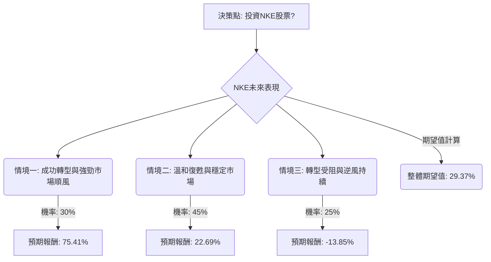

根據對美股公司NKE（Nike）的決策樹分析與期望值分析，並綜合其基本面數據及最新市場資訊，以下是詳細評估：

### 核心假設

1.  **市場趨勢：** 運動服飾市場整體呈現增長趨勢，主要受「運動休閒風」（Athleisure）、「健康與運動優先」的生活方式、永續環保產品需求以及智慧科技整合的推動。亞太地區是增長最快的市場。
2.  **公司策略執行：** Nike正處於轉型期，積極實施「Sport Offense」和「Win Now」策略，重點在於產品創新、多渠道分銷（重新加強與批發夥伴合作）以及改善庫存管理。
3.  **競爭環境：** 運動服飾市場競爭激烈，Nike面臨來自傳統競爭者和新興品牌的挑戰。
4.  **宏觀經濟：** 全球消費者可支配支出存在不確定性，特別是在大中華區市場，Nike面臨關稅和需求疲軟的挑戰。

### 決策樹分析

**決策點：投資NKE股票**

*   **當前股價 (Close):** $63.63

#### 節點說明與計算過程

**情境一：成功轉型與強勁市場順風 (Optimistic Scenario)**
*   **情境名稱：** 成功轉型與強勁市場順風
*   **情境描述：** Nike的創新產品（如Aero-FIT、Nike Mind、Project Amplify）獲得市場熱烈迴響。多渠道分銷策略（重新與批發夥伴合作，如Amazon、DSW、Macy's）顯著提升銷售額和市場份額。大中華區市場復甦超預期，關稅影響減輕。公司盈利能力因成本控制和折扣減少而大幅改善。Nike有望成為「股息貴族」，吸引更多機構投資。
*   **機率 (Probability)：** 30%
    *   理由：儘管Nike面臨挑戰，但其積極的轉型策略、創新投入以及Jefferies分析師給出的高目標價（$110）顯示出潛在的強勁上行空間。然而，考慮到當前轉型期的不確定性和市場競爭，此情境的機率設定為中等偏低。
*   **預期報酬 (Expected Return)：** 75.41%
    *   **目標股價：** $110 (參考Jefferies分析師的樂觀目標價)
    *   **股價漲幅：** ($110 - $63.63) / $63.63 = 72.87%
    *   **股息收益率：** 2.54% (來自基本面數據)
    *   **總報酬：** 72.87% + 2.54% = **75.41%**

**情境二：溫和復甦與穩定市場 (Base Case Scenario)**
*   **情境名稱：** 溫和復甦與穩定市場
*   **情境描述：** Nike的轉型努力取得逐步進展，但復甦並非一帆風順。創新產品帶來一定提振，但市場競爭依然激烈。批發渠道策略有助於穩定營收，但數位銷售增長仍具挑戰。大中華區市場保持穩定，但增長緩慢。利潤率緩慢恢復。
*   **機率 (Probability)：** 45%
    *   理由：這是最可能發生的情境，因為Nike在2026財年第一季度營收略有增長，但淨利潤和毛利率下降。公司正在積極調整策略，但市場逆風和轉型所需時間表明溫和復甦是較為現實的預期。分析師普遍目標價也支持此區間。
*   **預期報酬 (Expected Return)：** 22.69%
    *   **目標股價：** $76.45 (參考分析師共識目標價)
    *   **股價漲幅：** ($76.45 - $63.63) / $63.63 = 20.15%
    *   **股息收益率：** 2.54%
    *   **總報酬：** 20.15% + 2.54% = **22.69%**

**情境三：轉型受阻與逆風持續 (Pessimistic Scenario)**
*   **情境名稱：** 轉型受阻與逆風持續
*   **情境描述：** Nike的創新未能有效吸引消費者，或被競爭對手迅速模仿。DTC（直接面向消費者）策略持續掙扎，多渠道轉型未能帶來預期效果。大中華區市場持續低迷或惡化，關稅和盈利問題加劇。全球消費者需求進一步疲軟，影響可支配支出。分析師預計2026財年EPS將下降28%。
*   **機率 (Probability)：** 25%
    *   理由：Nike過去一年表現不佳，且面臨多重挑戰，包括中國市場疲軟、數位銷售下滑、利潤率壓力以及激烈的競爭。Simply Wall St的DCF模型也指出當前股價可能被高估。這些因素使得股價下跌的風險不容忽視。
*   **預期報酬 (Expected Return)：** -13.85%
    *   **目標股價：** $53.29 (參考Simply Wall St的DCF估值，認為當前股價被高估19.4%)
    *   **股價跌幅：** ($53.29 - $63.63) / $63.63 = -16.39%
    *   **股息收益率：** 2.54% (假設股息維持，但股價下跌將是主要影響)
    *   **總報酬：** -16.39% + 2.54% = **-13.85%**

### 期望值分析

**整體期望值 (Overall Expected Value) 計算：**

整體期望值 = (情境一機率 × 情境一預期報酬) + (情境二機率 × 情境二預期報酬) + (情境三機率 × 情境三預期報酬)
整體期望值 = (0.30 × 0.7541) + (0.45 × 0.2269) + (0.25 × -0.1385)
整體期望值 = 0.22623 + 0.102105 - 0.034625
整體期望值 = **0.29371**

這表示根據上述情境和機率分配，投資NKE股票的預期年化報酬率約為 **29.37%**。

### 最終結論

根據決策樹分析和期望值計算，NKE股票的整體期望值為 **29.37%**。

**判斷：適合投資**

**理由：**
儘管Nike目前正處於充滿挑戰的轉型期，面臨大中華區市場疲軟、數位銷售下滑和利潤率壓力等問題，但其積極的「Sport Offense」策略、對產品創新的持續投入、以及重新平衡多渠道分銷的努力 顯示出公司具備扭轉局面的潛力。最新的2026財年第一季度財報也顯示營收超出預期，尤其在北美批發業務表現良好。

雖然存在下行風險，但分析師共識目標價和部分樂觀預期（如Jefferies的$110目標價）提供了顯著的上行空間。綜合考量，29.37%的預期報酬率對於一項投資而言是相當吸引人的。這表明如果Nike能夠有效執行其轉型策略並抓住運動服飾市場的長期趨勢（如運動休閒、永續發展、智慧科技），投資者有望獲得可觀的回報。然而，投資者應意識到這項投資仍存在不確定性，並需密切關注公司後續的財報表現和策略執行情況。