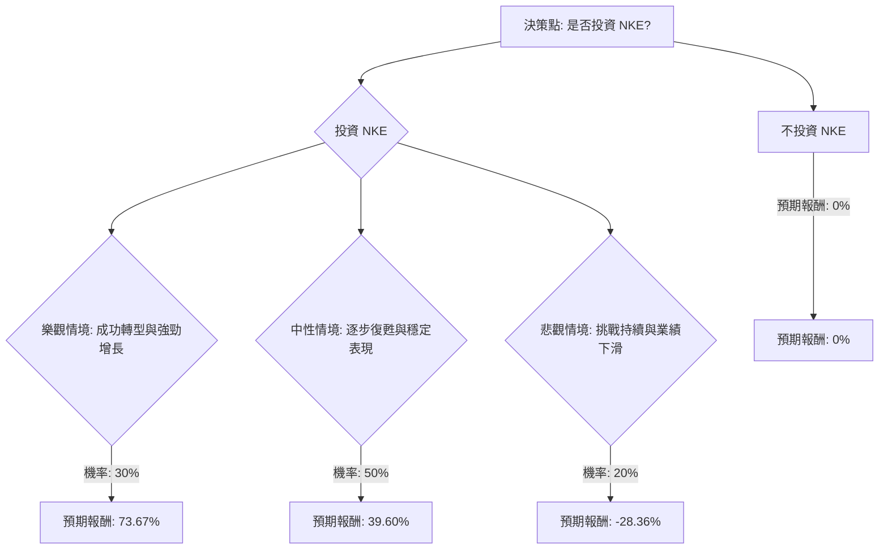

根據您提供的基本面數據以及最新的市場資訊，我們將使用決策樹分析和期望值分析來評估美股公司 NKE (Nike) 目前是否適合投資。

### 核心假設

在進行決策樹分析之前，我們需要建立以下核心假設：

*   **市場趨勢：** 全球運動服飾市場預計將持續增長，主要受健康意識提升和運動休閒（Athleisure）趨勢的推動。然而，來自小眾品牌和新興競爭者的競爭將會加劇。
*   **財務表現：** Nike 的重組計劃預計將帶來成本節約，並改善毛利率。 公司將維持其股息政策，因其已連續超過 22 年增加股息。
*   **產業趨勢與公司策略：** Nike 正從「直接面向消費者 (DTC)」的策略轉向更平衡的「混合式市場」策略，重新加強與批發夥伴的合作，以擴大市場覆蓋率。 產品創新和數位轉型仍是其核心增長動力。 大中華區和亞太拉丁美洲 (APLA) 被視為關鍵的增長區域。 新任 CEO Elliott Hill 的領導力將對公司轉型產生重要影響。

### 決策樹分析

**初始決策點：** 投資 NKE 股票

**情境設定與預期報酬計算：**
我們將設定三種未來情境，並估計其在一年內的預期報酬。當前股價為 $44.14。

1.  **樂觀情境 (Strong Growth & Turnaround)**
    *   **情境描述：** Nike 的新策略（混合式分銷、產品創新、成本節約）成功推動顯著增長，市場份額穩定或增加，盈利能力大幅提升。宏觀經濟環境有利。
    *   **股價預期：** 股價上漲至 $75 (高於分析師平均目標價，但低於最高目標價 $90)。
    *   **資本利得：** ($75 - $44.14) / $44.14 = 70%
    *   **股息收益：** 0.0367 (3.67%) (基於年化股息 $0.41 * 4 = $1.64 / $44.14)
    *   **總預期報酬：** 70% + 3.67% = 73.67%

2.  **中性情境 (Gradual Recovery & Stable Performance)**
    *   **情境描述：** Nike 的策略帶來溫和改善，但競爭依然激烈，宏觀經濟逆風持續存在。增長緩慢但穩定，盈利能力逐步恢復。
    *   **股價預期：** 股價達到分析師平均目標價 $60 (與您提供的目標價 $60.18 及分析師共識 $59.95 - $64.04 一致)。
    *   **資本利得：** ($60 - $44.14) / $44.14 = 35.93%
    *   **股息收益：** 3.67%
    *   **總預期報酬：** 35.93% + 3.67% = 39.60%

3.  **悲觀情境 (Continued Challenges & Decline)**
    *   **情境描述：** Nike 未能有效執行轉型策略，市場份額進一步被小眾競爭者侵蝕，重組成本超出預期，消費者需求疲軟。
    *   **股價預期：** 股價下跌至 $30 (高於分析師最低目標價 $23)。
    *   **資本損失：** ($30 - $44.14) / $44.14 = -32.03%
    *   **股息收益：** 3.67% (假設股息維持不變)
    *   **總預期報酬：** -32.03% + 3.67% = -28.36%

**情境機率分配：**
*   樂觀情境：30% (公司有強大品牌和新策略，但近期表現不佳)
*   中性情境：50% (最有可能的結果，逐步改善，符合分析師預期)
*   悲觀情境：20% (存在未能成功轉型的風險)

---

---

### 期望值計算

**投資 NKE 的整體期望值 (Expected Value of Investing in NKE)：**

期望值 = (樂觀情境報酬 \* 機率) + (中性情境報酬 \* 機率) + (悲觀情境報酬 \* 機率)
期望值 = (0.7367 \* 0.30) + (0.3960 \* 0.50) + (-0.2836 \* 0.20)
期望值 = 0.22101 + 0.19800 + (-0.05672)
期望值 = 0.36229

**整體期望值：36.23%**

### 最終結論

根據決策樹分析和期望值計算，投資 NKE 股票的整體期望值為 **36.23%**。

**判斷：適合投資**

**簡短理由：**
儘管 Nike 近期面臨營收增長放緩、數位銷售下滑以及來自小眾品牌的激烈競爭等挑戰，但公司正在積極採取措施應對，包括實施大規模的成本節約計劃、調整其分銷策略以重新平衡 DTC 和批發渠道、以及持續投入產品創新和數位轉型。

分析師普遍給予「買入」或「適度買入」評級，平均目標價顯示出顯著的潛在上漲空間（約 35-42%）。全球運動服飾市場的長期增長趨勢也為 Nike 提供了有利的外部環境。

綜合考量，雖然存在一定的執行風險，但 Nike 作為行業領導者的強大品牌力、積極的戰略調整以及市場的長期增長潛力，使得其在當前股價下具有吸引力的投資價值。36.23% 的正向期望值表明，在考慮了不同情境及其機率後，投資 NKE 有望獲得可觀的回報。