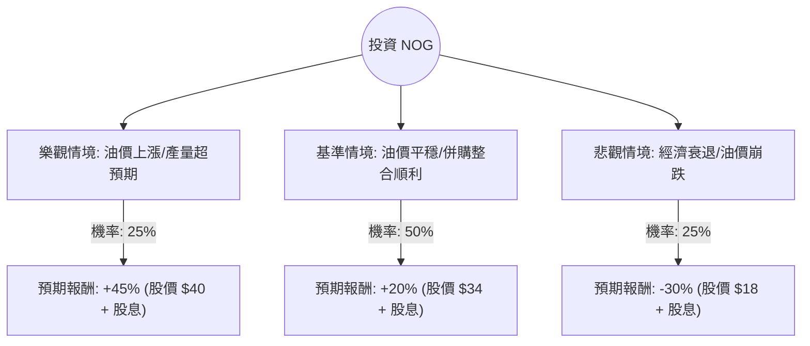

這份分析將針對 **Northern Oil and Gas, Inc. (NOG)** 進行評估。NOG 是一家獨特的「非營運商」勘探與生產（E&P）公司，主要投資於美國核心盆地（如 Bakken、Permian 和 Uinta）的多元化油氣資產。

以下結合您提供的數據與當前市場動態（油價波動、併購趨勢、資本配置策略）進行決策樹與期望值分析。

---

### 一、 核心假設與市場背景

在建立模型前，我們設定以下核心假設：
1.  **油價環境**：WTI 原油價格維持在 $70 - $85 區間為基準情境。
2.  **非營運商模式**：NOG 不直接鑽探，而是參與 Chevron、EOG 等大廠的項目。這降低了營運風險，但使其資本支出（CAPEX）受制於合作夥伴。
3.  **財務狀況**：Forward P/E 僅 9.49，遠低於當前 P/E (88.49)，顯示市場預期未來一年獲利將大幅反彈。
4.  **高股息與高空單**：6.08% 的股息率提供下行保護，但 18.64% 的高空單比例（Short Float）顯示市場存在顯著分歧。

---

### 二、 決策樹分析 (Decision Tree)

我們將未來一年的投資回報分為三種情境：**樂觀（Bull）**、**基準（Base）**、**悲觀（Bear）**。

#### 節點詳細說明：

1.  **樂觀情境 (Bull Case) - 25% 機率**
    *   **條件**：WTI 原油突破 $90；NOG 最近在 Uinta 盆地的收購產生高於預期的現金流；發生空頭擠壓（Short Squeeze）。
    *   **預期報酬**：股價回升至歷史高點附近（約 $40），加上 6% 股息，總回報約 45%。

2.  **基準情境 (Base Case) - 50% 機率**
    *   **條件**：油價維持在 $75 左右；公司維持資本紀律，自由現金流（FCF）持續增長以支撐股息。
    *   **預期報酬**：達到分析師平均目標價 $34，加上 6% 股息，總回報約 20%。

3.  **悲觀情境 (Bear Case) - 25% 機率**
    *   **條件**：全球經濟衰退導致油價跌破 $60；高負債比（Debt/Eq 1.13）在利率高企下產生壓力；產量因營運商縮減開支而下降。
    *   **預期報酬**：股價回測 52 週低點（約 $20 以下），扣除股息後總回報約 -30%。

---

### 三、 期望值分析 (Expected Value Analysis)

#### 1. 計算過程
期望值 (EV) = Σ (各情境機率 × 各情境報酬率)

*   **樂觀情境**：$0.25 \times 45\% = 11.25\%$
*   **基準情境**：$0.50 \times 20\% = 10.00\%$
*   **悲觀情境**：$0.25 \times (-30\%) = -7.50\%$

**總期望報酬率 (Total EV) = 11.25% + 10.00% - 7.50% = 13.75%**

#### 2. 數據解讀
*   **估值面**：Forward P/E 9.49 顯示目前股價相對便宜。P/FCF 為 11.39，在能源股中屬於合理偏低水平。
*   **風險面**：Short Float (18.64%) 極高，這是一把雙面刃。若利多出現，會引發強勁反彈；若利空出現，賣壓會極重。
*   **技術面**：股價目前在 SMA20, 50, 200 之上，顯示短期與中期趨勢偏多。

---

### 四、 最終結論

**判斷：適合投資 (Suitable for Investment)，但建議「分批買入」並「嚴格止損」。**

#### 理由：
1.  **正向期望值**：13.75% 的預期報酬率優於標普 500 指數的長期平均水平。
2.  **強大的現金回饋**：6.08% 的股息率在能源板塊中極具競爭力，且 Forward P/E 顯示獲利能力將改善，股息安全性高。
3.  **資產多元化**：NOG 的非營運商模式使其能參與多個盆地的最優質油井，分散了單一油田的風險。
4.  **目標價空間**：目前股價 $29.61 距離分析師目標價 $34.0 仍有約 15% 的上漲空間。

#### 風險提示：
*   **油價敏感度**：NOG 是純粹的油氣標的，若 WTI 跌破 $65，其財務槓桿（Debt/Eq 1.13）將成為隱憂。
*   **空頭壓力**：高空單比例意味著市場有一大部分資金在對賭其下跌，波動性會高於同業。

**建議操作策略**：
在 $28-$30 區間建立基本倉位，若股價跌破 $25（跌破主要支撐線）應重新評估基本面或執行止損。