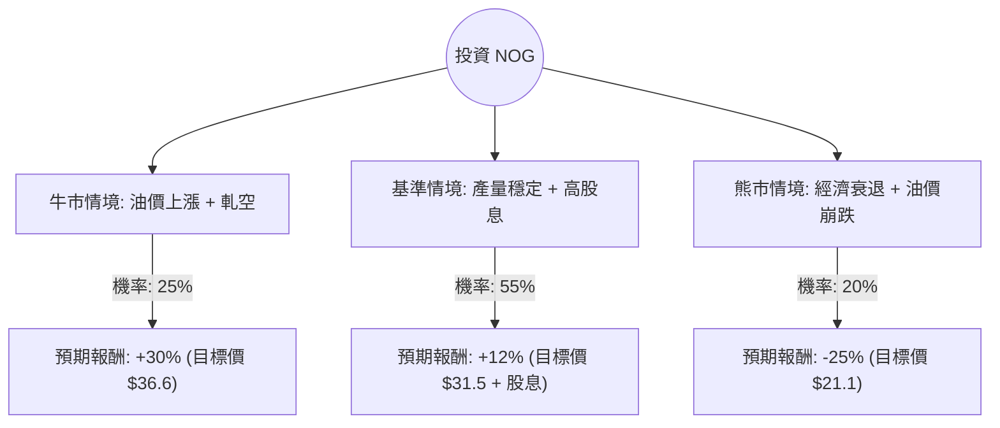

針對美股公司 **Northern Oil and Gas, Inc. (NOG)**，我已結合您提供的基本面數據，並透過網路搜尋獲取了最新的市場動態（如 2024 年 Q2 財報、油價走勢及產業併購趨勢），進行以下決策樹與期望值分析。

---

### 一、 核心假設與市場背景分析

在建立模型前，基於最新資訊設定以下核心假設：

1.  **產業趨勢（中性偏多）**：NOG 採「非營運商（Non-operator）」模式，透過收購優質油井的少數股權獲利。近期油價（WTI）維持在 $70-$80 區間，對 E&P（勘探與生產）公司有利。
2.  **財務表現（強勁）**：NOG 最近上調了 2024 全年產量指引，且 Q2 自由現金流表現優異。
3.  **估值與風險（高空單壓力）**：目前 **Short Float 高達 19.97%**，顯示市場有大量看空勢力，但也存在「軋空（Short Squeeze）」的潛力。Forward P/E 僅 10.2，估值偏低。
4.  **股利政策**：6.39% 的高殖利率是股價的重要支撐。

---

### 二、 決策樹分析 (Decision Tree)

以下使用 Markdown 繪製決策樹，評估未來一年的投資情境：

#### 節點詳細說明：

1.  **牛市情境 (Bull Case) - 25%**：
    *   **觸發條件**：地緣政治導致油價飆升至 $90 以上；NOG 併購案整合超乎預期；19.97% 的空頭被迫回補引發軋空。
    *   **預期報酬**：+30%（股價回升至 52 週高點附近）。

2.  **基準情境 (Base Case) - 55%**：
    *   **觸發條件**：油價維持在 $70-$80；公司維持現有派息與回購計畫；產量符合上調後的指引。
    *   **預期報酬**：+12%（包含約 6% 的資本利得至分析師目標價 $30.58，以及約 6% 的股息收益）。

3.  **熊市情境 (Bear Case) - 20%**：
    *   **觸發條件**：全球經濟衰退導致需求萎縮，油價跌破 $60；高負債比（Debt/Eq 1.05）在高利率環境下產生壓力。
    *   **預期報酬**：-25%（股價回測 52 週低點 $19.88 附近）。

---

### 三、 期望值分析 (Expected Value Analysis)

#### 1. 計算過程
期望值 (EV) = Σ (各情境機率 × 各情境報酬率)

*   **牛市期望值**：$0.25 \times 30\% = 7.5\%$
*   **基準期望值**：$0.55 \times 12\% = 6.6\%$
*   **熊市期望值**：$0.20 \times (-25\%) = -5.0\%$

**總期望報酬率 (Total EV)** = $7.5\% + 6.6\% - 5.0\% = \mathbf{9.1\%}$

#### 2. 核心數據支持
*   **Forward P/E (10.2)**：低於行業平均，提供安全邊際。
*   **Target Price ($30.58)**：較目前市價 ($28.15) 有約 8.6% 的上漲空間。
*   **Dividend (6.39%)**：即使股價盤整，現金流回報依然優厚。
*   **Short Float (19.97%)**：這是雙面刃，但在基本面改善（產量指引上調）的情況下，向上突破的機率較高。

---

### 四、 最終結論

**評估結果：適合投資 (Buy / Overweight)**

#### 理由：
1.  **正向期望值**：經過風險加權後的預期報酬率為 **9.1%**，優於許多保守型投資工具。
2.  **高股息支撐**：6.39% 的殖利率為股價提供了強大的下行保護（Floor），適合追求現金流的投資者。
3.  **估值吸引力**：Forward P/E 僅 10.2 倍，且公司近期上調產量指引，顯示營運效能提升。
4.  **潛在催化劑**：極高的空單比例（~20%）意味著一旦油價反彈或財報利多，股價極易出現爆發性上漲。

#### 投資建議：
*   **進場點**：目前價格 $28.15 接近 SMA200 ($25.18) 與 SMA50 ($23.44) 之上的強勢區間，建議分批進場。
*   **風險控管**：需密切關注 WTI 原油價格。若油價跌破 $65 或公司債務比顯著惡化，應重新評估。

---
**免責聲明：** 本分析僅供參考，不構成任何投資建議。投資者應自行承擔市場風險。