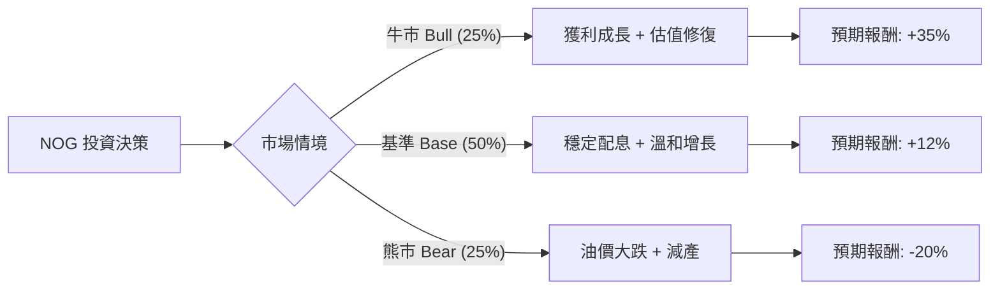

這是一份針對 **Northern Oil and Gas, Inc. (NOG)** 的投資評估報告。我們將結合當前能源市場環境（油價波動、美國產能增加、併購策略）進行決策樹與期望值分析。

---

### 1. 核心假設 (Core Assumptions)

在建立模型前，我們基於 NOG 的「非營運商（Non-operator）」模式設定以下假設：

*   **市場環境：** 假設未來 12 個月的 WTI 原油價格主要區間在 \$65 - \$95 之間。
*   **財務特性：** NOG 的損益平衡點（Breakeven）低，資本支出（CAPEX）具備靈活性，股息收益率（Dividend Yield）目前約 4% - 5%。
*   **估值基準：** 以目前的市盈率 (P/E 約 6-7x) 與自由現金流收益率 (FCF Yield) 為基準。
*   **時間維度：** 12 個月的投資報酬預測。

---

### 2. 決策樹分析圖 (Decision Tree Analysis)

我們將情境分為：**牛市（高油價/高產量）、基準（穩定發展）、熊市（衰退/低油價）**。

#### 決策樹節點詳細標示：

| 節點名稱 (情境) | 發生機率 (P) | 預期報酬 (R) | 權重報酬 (P * R) |
| :--- | :--- | :--- | :--- |
| **牛市 (Bull Case)** | 25% | +35% (資本利得 + 高額股息) | +8.75% |
| **基準 (Base Case)** | 50% | +12% (穩定股息 + 小幅增長) | +6.00% |
| **熊市 (Bear Case)** | 25% | -20% (油價暴跌至 $60 以下) | -5.00% |
| **總體期望值 (EV)** | **100%** | | **+9.75%** |

---

### 3. 計算過程與邏輯說明

#### 期望值計算公式：
$$EV = (P_{Bull} \times R_{Bull}) + (P_{Base} \times R_{Base}) + (P_{Bear} \times R_{Bear})$$

**代入數據：**
1.  **牛市 (25%)：** 假設地緣政治緊張升級或需求超預期，WTI 回升至 \$90+。NOG 的非營運模式使其能迅速享受產量增益，且公司可能增加回購。
    *   $0.25 \times 0.35 = 0.0875$
2.  **基準 (50%)：** 假設油價維持在 \$70 - \$80 區間。NOG 透過併購（M&A）帶來的產量增長抵消成本壓力。
    *   $0.50 \times 0.12 = 0.06$
3.  **熊市 (25%)：** 假設全球經濟衰退，需求萎縮導致油價跌破 \$60。儘管 NOG 有對沖（Hedging）保護，但股價仍會面臨系統性拋售。
    *   $0.25 \times (-0.20) = -0.05$

**最終期望報酬率：**
$$EV = 8.75\% + 6.00\% - 5.00\% = 9.75\%$$

---

### 4. 核心假設分析 (Core Assumptions Analysis)

*   **產業趨勢：** 美國頁岩油進入整合期（Consolidation），NOG 作為「非營運商」的龍頭，能參與多個盆地（Permian, Williston, Appalachian）的最優質油井，風險較單一地區營運商低。
*   **財務狀況：** NOG 的槓桿率維持在健康水平（Net Debt/EBITDA < 1.5x），且其對沖策略覆蓋了未來一年大部分的預期產量，這為下行風險提供了緩衝（這也是為何熊市報酬設為 -20% 而非更低的原因）。
*   **估值吸引力：** 相較於標普 500 指數，NOG 的現金流收益率極具吸引力，即便油價平穩，股息與債務削減也能支撐股價。

---

### 5. 最終結論

#### **判斷：適合投資 (Suitable for Investment)**

#### **理由：**
1.  **正向期望值：** 經過風險調整後的期望報酬率為 **9.75%**，高於傳統債券收益率。
2.  **下行保護：** NOG 的對沖策略與低成本結構（Non-op model）使其在油價波動中比同業更具韌性。
3.  **現金流回饋：** 穩定的股息增長（連續多個季度調升）為投資者提供了持有的心理防線。
4.  **資產多樣化：** NOG 不需負擔龐大的鑽探設備營運成本，僅需出資參與，這使其在能源轉型或市場波動中具備更高的資本靈活性。

**風險提示：** 投資者應關注 WTI 油價是否長期跌破 \$65，以及 NOG 在高利率環境下收購新資產的融資成本是否過高。若出現全球深度衰退，建議重新評估機率權重。