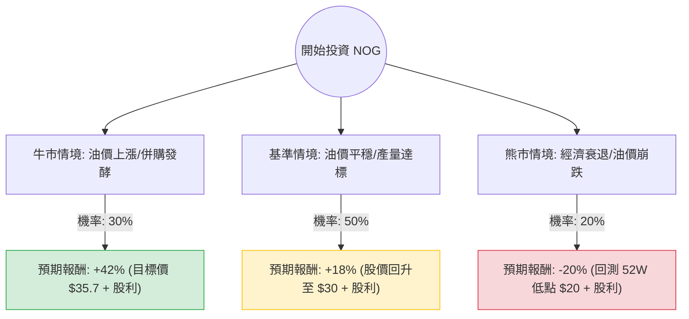

針對美股 **Northern Oil and Gas, Inc. (NOG)** 的投資評估，我結合了您提供的基本面數據以及最新的市場動態（包含 2024 年 Q2 財報表現、油價走勢及產業併購趨勢），進行「決策樹」與「期望值」分析。

---

### 一、 核心背景與市場動態分析

在進入計算前，需釐清 NOG 的關鍵現況：
1.  **商業模式**：NOG 是「非經營者（Non-operator）」模式，參與優質油井但不直接負責鑽探，這使其資本支出較具彈性。
2.  **估值陷阱與真實價值**：雖然數據顯示 P/E 高達 79.83，但 **Forward P/E 僅 7.56**，這反映了市場預期未來獲利將大幅回升（主要受惠於近期在 Uinta Basin 的大規模併購）。
3.  **股利政策**：高達 6.74% 的殖利率在能源股中極具競爭力。
4.  **空頭壓力**：Short Float 達 17.4%，顯示市場有大量看空部位，這可能導致股價波動劇烈，但也存在「軋空（Short Squeeze）」的潛力。

---

### 二、 決策樹分析 (Decision Tree)

以下決策樹基於未來 12 個月的預期情境：

#### 節點詳細說明：

1.  **牛市情境 (Bull Case) - 30% 機率**：
    *   **假設**：WTI 原油維持在 $85 以上；NOG 新收購的資產產量超乎預期；高空單比例引發軋空。
    *   **預期報酬**：參考分析師目標價 $35.73，加上約 6.7% 股利，總報酬約 **+42%**。

2.  **基準情境 (Base Case) - 50% 機率**：
    *   **假設**：油價維持在 $70-$80 區間；公司維持穩定的自由現金流並持續配息；債務比率隨產量增加而下降。
    *   **預期報酬**：股價回升至 SMA200 以上（約 $30 附近），加上股利，總報酬約 **+18%**。

3.  **熊市情境 (Bear Case) - 20% 機率**：
    *   **假設**：全球經濟衰退導致油價跌破 $65；高槓桿（Debt/Eq 1.13）在低油價環境下產生壓力。
    *   **預期報酬**：股價回測 52 週低點約 $20，扣除股利補貼後，總報酬約 **-20%**。

---

### 三、 期望值分析 (Expected Value Analysis)

#### 1. 計算過程：
期望值 (EV) = (牛市報酬 × 機率) + (基準報酬 × 機率) + (熊市報酬 × 機率)

*   **EV** = (42% × 0.30) + (18% × 0.50) + (-20% × 0.20)
*   **EV** = 12.6% + 9.0% - 4.0%
*   **EV = 17.6%**

#### 2. 核心假設說明：
*   **市場趨勢**：假設未來一年原油需求不會因新能源轉型而劇烈萎縮，且地緣政治風險為油價提供支撐。
*   **財務健康**：Forward P/E 7.56 顯示目前股價被低估，且 P/FCF (11.04) 顯示現金流足以支撐高額股利。
*   **產業地位**：NOG 作為非經營者，其資本支出效率高於傳統鑽探公司，能更快適應市場波動。

---

### 四、 最終結論

**投資建議：適合投資 (Buy / Overweight)**

#### 理由：
1.  **正向期望值**：17.6% 的預期報酬率顯著高於標普 500 的長期平均報酬，且具備高安全邊際（Forward P/E 極低）。
2.  **強大的現金回報**：6.74% 的股利率提供了良好的下行保護，即使股價橫盤整理，投資者仍有穩定收益。
3.  **估值修復潛力**：目前的 P/E (79.83) 是受過去會計損益影響的誤導，隨著新併購案併表，獲利能力將在未來幾季大幅釋放。
4.  **技術面與籌碼面**：股價目前接近 SMA50 (-3.15%)，處於相對低位；高空單比例 (17.4%) 在利多消息出現時極易觸發股價噴發。

#### 風險提示：
*   **油價敏感度**：NOG 的獲利高度依賴大宗商品價格，若 WTI 跌破 $65，需重新評估。
*   **債務壓力**：Debt/Eq 1.13 略高，需關注其利息保障倍數是否受高利率環境影響。

**總結：** 對於追求「高股息」且看好「能源價格韌性」的投資者，NOG 目前是一個具備高風險報酬比的選擇。