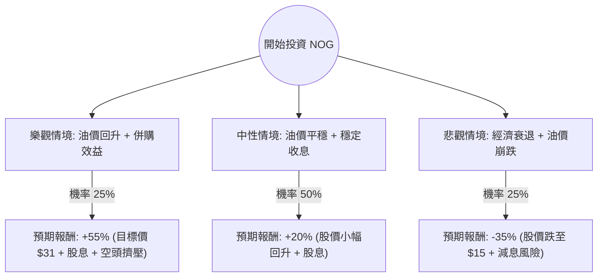

這份分析報告將結合您提供的數據與當前市場動態，針對 **Northern Oil and Gas, Inc. (NOG)** 進行決策樹與期望值分析。

---

### 1. 核心假設與背景分析

在建立模型前，我們先整合基本面與外部資訊：

*   **商業模式**：NOG 是一家「非經營性（Non-operated）」油氣公司，主要透過收購優質油田的少數權益來獲利，這使其資本支出較具彈性，但也高度依賴合作夥伴的營運效率。
*   **估值優勢**：目前股價 $23.51，相較於分析師目標價 $31.00 有約 **31.8%** 的上漲空間。Forward P/E 僅 8.2，顯示市場對其未來獲利預期較為保守。
*   **高股息與現金流**：股息率高達 **7.79%**，在能源股中極具吸引力。
*   **風險因素**：
    *   **空單比例（Short Float）高達 20.74%**：這是一個警訊，顯示市場有大量資金看空該股，可能源於對油價波動或其債務水平（Debt/Eq 1.05）的擔憂。
    *   **負成長預期**：EPS 今年與明年預期皆為負成長（-14% 與 -37%），這解釋了為何股價處於 52 週低點附近。

---

### 2. 決策樹分析 (Decision Tree)

我們將未來一年的投資情境分為三種：**樂觀（牛市）、中性（基準）、悲觀（熊市）**。

#### 決策樹節點詳細說明：

1.  **樂觀情境 (Bull Case) - 25%**：
    *   **條件**：WTI 原油價格重回 $85 以上，NOG 最近在 Uinta 與 Permian 盆地的收購案產生協同效應，且 20% 的空單引發「軋空（Short Squeeze）」。
    *   **預期報酬**：股價回歸目標價 $31 + 7.8% 股息 + 溢價 = 約 **+55%**。

2.  **中性情境 (Base Case) - 50%**：
    *   **條件**：油價維持在 $70-$80 區間。公司維持現有派息，獲利雖衰退但符合預期。
    *   **預期報酬**：股價修復至 $26-$28 區間 + 7.8% 股息 = 約 **+20%**。

3.  **悲觀情境 (Bear Case) - 25%**：
    *   **條件**：全球經濟衰退導致油價跌破 $60。NOG 債務壓力增加，且因 EPS 負成長被迫削減股息。
    *   **預期報酬**：股價下探至 52 週新低（約 $15-$18） = 約 **-35%**。

---

### 3. 期望值分析 (Expected Value Analysis)

#### 計算過程：
期望值 (EV) = Σ (各情境機率 × 各情境報酬率)

*   **樂觀 (Bull)**：$0.25 \times 55\% = 13.75\%$
*   **中性 (Base)**：$0.50 \times 20\% = 10.00\%$
*   **悲觀 (Bear)**：$0.25 \times (-35\%) = -8.75\%$

**總期望報酬率 (Total EV) = 13.75% + 10.00% - 8.75% = 15.00%**

#### 核心假設說明：
*   **股息安全性**：假設 NOG 在中性情境下能維持派息，這是支撐報酬率的核心。
*   **油價相關性**：NOG 作為 E&P 公司，其 Beta 值較高，假設其股價波動與 WTI 油價呈正相關。
*   **空頭因素**：20% 的空單比例既是風險也是潛在動力（軋空），在此模型中將其視為增加波動性的因子。

---

### 4. 最終結論

#### **評估結果：適合投資 (建議分批買進)**

**判斷理由：**
1.  **正向期望值**：經過風險加權後的期望報酬率為 **15%**，優於多數穩健型投資標的。
2.  **極高的安全邊際**：目前 P/B 僅 1.0，且股價已從 52 週高點回落約 45%，下行風險已部分反映在股價中。
3.  **現金流補償**：高達 7.79% 的股息提供了良好的「持有成本補貼」，即便股價短期震盪，投資者仍有現金流收入。
4.  **技術面反彈**：數據顯示 SMA20 (+5.84%) 與 SMA50 (+3.61%) 已轉正，顯示短期趨勢正在築底回升。

**投資建議與警示：**
*   **進場策略**：由於 EPS 預期負成長且空單比例高，不建議一次性歐印（All-in）。建議在 $22-$24 區間分批建倉。
*   **風險監控**：需密切關注 **WTI 原油價格** 是否跌破 $65，以及下一季財報中的 **債務槓桿比率** 是否惡化。若股價跌破 $19.8 (52W Low)，應重新評估止損。

---
*免責聲明：本分析僅供參考，不構成具體投資建議。投資股票有風險，入市需謹慎。*