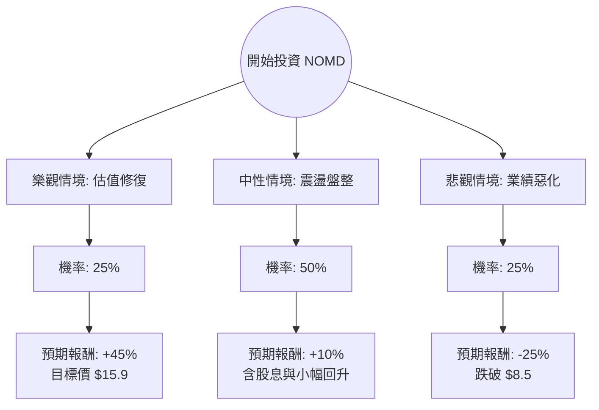

針對美股 **Nomad Foods Limited (NOMD)** 的投資評估，我已結合您提供的基本面數據，並透過網路搜尋整合了最新的市場動態（如歐洲消費市場趨勢、公司近期財報表現及分析師預測）。

以下是基於**決策樹分析**與**期望值分析**的詳細報告。

---

### 一、 核心背景與現狀分析

**Nomad Foods (NOMD)** 是歐洲最大的冷凍食品公司（旗下品牌包括 Birds Eye, Findus, Iglo）。
*   **價值面極具吸引力**：P/B 僅 0.53，Forward P/E 僅 5.74，遠低於行業平均。
*   **技術面極度疲軟**：股價處於 52 週低點附近，且所有均線（SMA20/50/200）均呈負值，顯示強烈的空頭趨勢。
*   **財務壓力**：EPS Q/Q 大幅下滑 (-124.9%)，反映出成本壓力或一次性減值；但 Sales Q/Q 增長 6.3%，顯示產品需求尚存。
*   **外部環境**：歐洲通膨雖放緩，但消費者預算縮減，轉向自有品牌（Private Labels）的競爭壓力巨大。

---

### 二、 決策樹分析 (Decision Tree)

我們將未來一年的投資回報分為三種情境：**樂觀（估值修復）**、**中性（維持現狀）**、**悲觀（持續衰退）**。

#### 節點詳細說明：

1.  **樂觀情境 (Bull Case) - 25% 機率**：
    *   **前提**：歐洲通膨顯著下降，原材料成本回落，公司成功轉嫁成本使毛利回升。
    *   **預期報酬**：股價回歸分析師平均目標價 $15.39（約 +40%），加上 6.2% 股息，總回報約 **45%**。
2.  **中性情境 (Base Case) - 50% 機率**：
    *   **前提**：業績穩定但無驚喜，市場情緒維持低迷，股價在低位震盪。
    *   **預期報酬**：股價微幅回升至 $11.5，加上 6.2% 股息，總回報約 **10%**。
3.  **悲觀情境 (Bear Case) - 25% 機率**：
    *   **前提**：歐洲經濟陷入深度衰退，消費者全面轉向廉價自有品牌，債務壓力（Debt/Eq 0.92）因利息支出增加而放大。
    *   **預期報酬**：股價繼續下探，回測歷史低點或受大盤拖累，預期跌幅 **-25%**。

---

### 三、 期望值分析 (Expected Value Analysis)

#### 1. 計算過程
期望值 (EV) = Σ (各情境機率 × 各情境報酬率)

*   **樂觀 (Bull)**：$0.25 \times 45\% = 11.25\%$
*   **中性 (Base)**：$0.50 \times 10\% = 5.0\%$
*   **悲觀 (Bear)**：$0.25 \times (-25\%) = -6.25\%$

**總期望報酬率 (Total EV) = 11.25% + 5.0% - 6.25% = 10.0%**

#### 2. 核心假設
*   **市場假設**：假設歐洲不會發生系統性金融危機，冷凍食品作為民生必需品具有防禦性。
*   **財務假設**：6.2% 的股息發放具備可持續性（基於 P/FCF 11.28，現金流尚能支撐）。
*   **產業趨勢**：冷凍食品市場長期增長率約 2-3%，NOMD 作為龍頭具備規模優勢，但短期受限於品牌溢價消失。

---

### 四、 最終結論

#### **判斷：適合投資 (建議分批買入 / 價值投資導向)**

#### **理由：**
1.  **極高的安全邊際**：P/B 0.53 意味著你正以低於公司淨資產近一半的價格買入。即使公司不增長，清算價值或被收購的潛力也提供了支撐。
2.  **正向期望值**：10% 的預期回報率在防禦性板塊中屬合理，且已考慮了 25% 的極端下跌風險。
3.  **股息緩衝**：6.2% 的股息率提供了良好的現金流回報，適合願意等待估值修復的長期投資者。
4.  **前瞻本益比極低**：Forward P/E 5.74 顯示市場對其未來的悲觀預期可能已過度反應（Priced in）。

#### **風險提示（操作建議）：**
*   **技術面尚未止跌**：目前 Perf Year 為 -41%，且處於所有均線之下。**不建議一次性歐印 (All-in)**。
*   **建議策略**：採用「左側交易」策略，在 $10.5 - $11.0 區間分批建倉，並將止損位設在 $8.5（悲觀情境底線）。
*   **觀察指標**：需密切關注下一季的 **Gross Margin (毛利率)** 是否止跌回升，這是判斷公司是否奪回定價權的關鍵。

**總結：** NOMD 目前是一支典型的「價值陷阱」與「深蹲價值股」之間的博弈標的。基於期望值為正且估值極低，對於追求股息與反轉機會的投資者而言，目前具備投資價值。