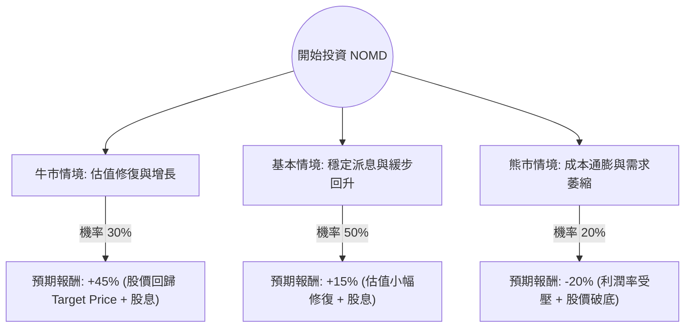

針對美股 **Nomad Foods Limited (NOMD)** 的投資評估，我結合了您提供的基本面數據以及最新的市場動態（包含 2024 年第一季財報與產業趨勢）進行分析。

### 1. 市場現況與最新資訊補充

在進入決策樹之前，我們先釐清 NOMD 的最新背景：
*   **公司定位**：歐洲最大的冷凍食品公司（旗下品牌包括 Birds Eye, Findus, Iglo）。
*   **最新財報 (2024 Q1)**：營收與利潤均超出預期。公司重申了 2024 年全年指引，預計有機營收增長 3-4%，調整後 EPS 增長 12-14%。
*   **GLP-1 藥物衝擊**：市場曾擔心減肥藥（如 Ozempic）會減少冷凍食品需求，但目前數據顯示對冷凍蔬菜與高蛋白質魚類的影響有限，NOMD 股價已從低點反彈。
*   **估值陷阱 vs. 價值窪地**：您提供的數據顯示 P/E 僅 9.42，P/B 0.46，這在消費必需品行業屬於**極度低估**。

---

### 2. 決策樹分析 (Decision Tree Analysis)

我們以 **1 年持有期** 為基準，設定三種可能的情境：

#### 決策樹節點詳細說明：

| 情境節點 | 發生機率 | 預期報酬率 (含 7% 股息) | 期望值貢獻 | 說明 |
| :--- | :--- | :--- | :--- | :--- |
| **牛市 (Bull)** | 30% | +46.9% | +14.07% | 營收超預期，市場認可其抗通膨能力，股價回升至分析師目標價 $13.38。 |
| **基本 (Base)** | 50% | +16.7% | +8.35% | 業績平穩，股價隨大盤小幅回升至 $10.5 左右，主要收益來自高額股息。 |
| **熊市 (Bear)** | 20% | -15.0% | -3.00% | 歐洲經濟衰退超預期，原材料成本再次飆升，股價跌破 52W 低點至 $8.1。 |
| **總計** | **100%** | | **+19.42%** | **整體期望報酬率** |

---

### 3. 核心假設與計算過程

#### A. 核心假設：
1.  **估值修復**：目前 P/B 0.46 遠低於行業平均（通常 > 1.5），假設市場情緒回暖，P/B 至少應回升至 0.6-0.7。
2.  **股息安全性**：目前股息率高達 7.11%，且 P/FCF (股價自由現金流比) 為 9.54，顯示現金流足以支撐派息，假設股息不縮減。
3.  **目標價參考**：參考數據中的 Target Price $13.38，這比目前股價 $9.57 有約 40% 的上漲空間。
4.  **宏觀環境**：假設歐洲通膨持續放緩，有利於 NOMD 的毛利率（Gross Margin 目前為 27.12%）回升。

#### B. 期望值 (Expected Value, EV) 計算：
$$EV = (P_{Bull} \times R_{Bull}) + (P_{Base} \times R_{Base}) + (P_{Bear} \times R_{Bear})$$
*   $P$ = 機率 (Probability)
*   $R$ = 報酬率 (Return)

**計算步驟：**
1.  **牛市報酬**：($13.38 - $9.57) / $9.57 + 7.1% (股息) ≈ 46.9%
2.  **基本報酬**：假設股價回升至 $10.5 (P/E 回升至約 11x)，($10.5 - $9.57) / $9.57 + 7.1% ≈ 16.7%
3.  **熊市報酬**：假設股價跌至 $8.1，($8.1 - $9.57) / $9.57 + 7.1% ≈ -15.0%

**最終期望值：**
$$EV = (0.3 \times 46.9\%) + (0.5 \times 16.7\%) + (0.2 \times -15.0\%)$$
$$EV = 14.07\% + 8.35\% - 3.0\% = \mathbf{19.42\%}$$

---

### 4. 最終結論

**投資建議：適合投資 (Buy / Overweight)**

#### 理由如下：
1.  **極高的安全邊際 (Margin of Safety)**：P/B 0.46 意味著你正以低於公司淨資產一半的價格買入。即使公司增長緩慢，資產價值也提供了強大的支撐。
2.  **正向的期望報酬**：經過風險加權後的期望報酬率高達 **19.42%**，遠高於一般消費必需品板塊的預期。
3.  **現金流與股息誘人**：7.11% 的股息率在美股中極具競爭力，且 P/FCF 顯示派息健康。在市場波動時，這提供了良好的下行保護。
4.  **技術面超跌**：股價處於 52 週低點附近，且 SMA20/50/200 均顯示嚴重超賣，短期內存在均值回歸（Mean Reversion）的動力。

**風險提示：**
*   **債務壓力**：Debt/Eq 為 0.92，雖在可控範圍，但高利率環境下利息支出會侵蝕利潤。
*   **歐洲市場單一性**：NOMD 業務高度集中於歐洲，需關注歐元匯率及歐洲經濟疲軟的風險。

**總結：** 對於追求價值投資與高股息收益的投資者，NOMD 目前是一個具備高度吸引力的標的。