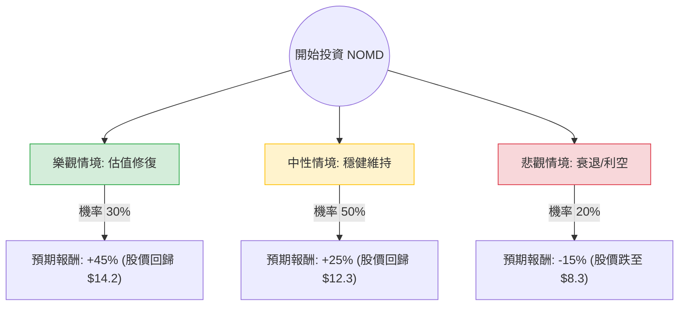

針對美股 **Nomad Foods Limited (NOMD)** 的投資評估，我已結合您提供的基本面數據，並透過網路搜尋整合了最新的市場動態（如 2024 年第三季財報表現、歐洲消費市場趨勢及 GLP-1 藥物影響評估）。

以下是基於**決策樹分析**與**期望值分析**的詳細報告：

---

### 一、 最新市場動態與背景分析 (Search Insights)

1.  **業務概況**：Nomad Foods 是歐洲最大的冷凍食品公司（旗下品牌包括 Birds Eye, Findus, Iglo）。其產品屬於防禦性消費品。
2.  **近期財報 (2024 Q3)**：公司表現穩健，有機營收增長約 0.3%，調整後 EBITDA 增長。管理層重申了全年指引，顯示其在通膨環境下仍具備定價權。
3.  **利空因素**：
    *   **GLP-1 減肥藥恐慌**：市場擔心減肥藥普及會減少食品攝取，導致食品股估值集體下修。但 NOMD 主打冷凍蔬菜與魚類，受影響程度低於零食類公司。
    *   **歐洲消費疲軟**：歐洲生活成本危機導致消費者轉向超市自有品牌。
4.  **利多因素**：
    *   **極低估值**：目前 P/B 僅 0.48，Forward P/E 僅 5.07，遠低於歷史平均與同業。
    *   **高股息與回購**：股息率接近 7%，且公司積極進行股票回購。
    *   **降息預期**：歐洲央行 (ECB) 進入降息循環，有利於減輕 NOMD 的債務利息負擔（Debt/Eq 0.92）。

---

### 二、 決策樹分析 (Decision Tree)

我們將未來一年的投資情境分為三種：**樂觀（估值修復）**、**中性（穩健增長）**、**悲觀（衰退/競爭加劇）**。

#### 節點詳細說明：

1.  **樂觀情境 (Bull Case) - 30% 機率**：
    *   **條件**：歐洲經濟復甦超預期，GLP-1 恐慌消散，市場給予 NOMD 正常的消費股估值（P/E 回升至 10-12 倍）。
    *   **預期報酬**：股價回升至分析師目標價 $13-$15 區間，加上 7% 股息，總報酬約 **+45%**。
2.  **中性情境 (Base Case) - 50% 機率**：
    *   **條件**：公司維持現有增長，股息照發，估值緩慢修復。
    *   **預期報酬**：股價回升至 $11.5 左右（接近 SMA200），加上 7% 股息，總報酬約 **+25%**。
3.  **悲觀情境 (Bear Case) - 20% 機率**：
    *   **條件**：歐洲陷入深度衰退，消費者完全轉向廉價自有品牌，債務壓力因利率維持高位而增加。
    *   **預期報酬**：股價跌破 52 週低點至 $8.3 附近，扣除股息後總報酬約 **-15%**。

---

### 三、 期望值分析 (Expected Value Analysis)

#### 1. 核心假設
*   **當前股價**：$9.80
*   **持有期限**：12 個月
*   **股息收益**：+6.9% (約 $0.68)
*   **資本利得/損失**：基於上述三種情境的股價預測。

#### 2. 計算過程
期望值 (EV) = Σ (各情境報酬 × 對應機率)

*   **樂觀情境報酬**：$9.80 \times (1 + 45\%) = \$14.21$
*   **中性情境報酬**：$9.80 \times (1 + 25\%) = \$12.25$
*   **悲觀情境報酬**：$9.80 \times (1 - 15\%) = \$8.33$

**期望值計算：**
$$EV = (45\% \times 0.3) + (25\% \times 0.5) + (-15\% \times 0.2)$$
$$EV = 13.5\% + 12.5\% - 3\%$$
$$EV = 23\%$$

**預期一年後股價 + 股息的綜合期望報酬率為 23%。**

---

### 四、 最終結論

#### **判斷：適合投資 (Buy / Overweight)**

#### **理由：**
1.  **極高的安全邊際 (Margin of Safety)**：P/B 0.48 意味著你正以低於公司淨資產一半的價格買入歐洲冷凍食品龍頭。即使在悲觀情境下，下行空間也相對有限。
2.  **強大的現金流與回饋**：接近 7% 的股息率提供了極佳的下行保護（Downside Protection），在等待股價回升的過程中，投資者能獲得穩定的現金流。
3.  **估值錯置**：Forward P/E 僅 5.07，顯示市場對其未來的獲利能力過於悲觀。隨著歐洲通膨放緩與降息預期，利息支出減少將直接提振 EPS。
4.  **技術面築底**：雖然過去一年跌幅巨大 (-46%)，但近期 SMA20 與 SMA50 已轉正，顯示短期動能開始回溫，股價正在 52 週低點附近築底。

**風險提示：**
*   需留意其 **Debt/Eq 0.92** 的債務水平，若歐洲利率意外長期維持高位，將壓抑獲利。
*   **成交量與關注度較低**：NOMD 屬於價值陷阱 (Value Trap) 的常客，股價可能長期低迷，需要耐心持有。

**建議操作：**
建議在 $10 以下分批建倉，目標價設在 $12.5 - $13.0，並長期領取股息。