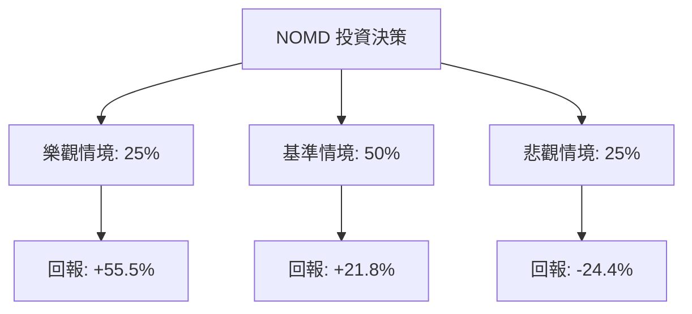

# Nomad Foods (NOMD) 投資價值定量分析報告

作為量化投資分析師，針對 Nomad Foods (NOMD) 的當前數據與市場環境，我將透過概率思考模型，評估其在未來 12 個月的期望值 (Expected Value, EV)。

---

### 1. 核心驅動因素與風險 (Drivers & Risks)

#### **關鍵催化劑 (Catalysts)**
1.  **銷量回升與市佔率修復**：隨著歐洲通膨放緩，消費者購買力回升，Nomad 旗下品牌（如 Birds Eye, Iglo）正透過促銷優化與新品研發，從自有品牌（Private Labels）手中奪回市佔率。
2.  **估值修復與低基期效應**：目前 Forward P/E 僅 6.53 倍，遠低於歷史均值（約 12-14 倍）及同業水平。若獲利如預期增長 6.36%，市場情緒轉向價值股將觸發強勁估值重估。
3.  **高股息與資本配置優化**：5.71% 的股息率提供了強大的下行保護，且公司持續透過自由現金流（P/FCF 11.43）償還債務或進行股份回購，有助於提升 EPS。

#### **主要風險點 (Risks)**
1.  **自有品牌競爭壓力**：若歐洲經濟陷入深度衰退，消費者可能長期轉向更廉價的超市自有品牌，壓制 Nomad 的定價權與毛利。
2.  **債務成本與利息支出**：Debt/Eq 達 0.92，在長期高利率環境下，再融資成本上升可能侵蝕淨利潤。
3.  **匯率與原材料波動**：作為歐洲最大的冷凍食品商，歐元/英鎊匯率波動及農產品原材料成本的不確定性是核心經營風險。

---

### 2. 情境設定與機率賦予 (Scenario Modeling)

基於當前股價 $11.90，設定未來 12 個月的三種情境：

#### **樂觀情境 (Bull Case)**
*   **發生條件**：銷量增長超預期，毛利率回升至 30% 以上，且市場給予 12x Forward P/E 的合理估值。
*   **預估機率**：25%
*   **目標價格與預期回報**：$18.50 (+55.5%)

#### **基準情境 (Base Case)**
*   **發生條件**：業務穩定增長，符合分析師預期的 $1.80+ EPS，估值修復至 8-9x Forward P/E。
*   **預估機率**：50%
*   **目標價格與預期回報**：$14.50 (+21.8%)

#### **悲觀情境 (Bear Case)**
*   **發生條件**：歐洲經濟衰退導致銷量大幅下滑，債務壓力增加，股價回測 52 週低點。
*   **預估機率**：25%
*   **目標價格與預期回報**：$9.00 (-24.4%)

---

### 3. 期望值計算與決策樹 (EV Calculation & Decision Tree)

#### **決策樹結構**

```mermaid
graph TD
    Start[NOMD 投資決策] --> Bull[樂觀情境: 25%]
    Start --> Base[基準情境: 50%]
    Start --> Bear[悲觀情境: 25%]
    Bull --> R1[回報: +55.5%]
    Base --> R2[回報: +21.8%]
    Bear --> R3[回報: -24.4%]
```

#### **總期望值計算**
*   **EV** = (0.25 * 55.5%) + (0.50 * 21.8%) + (0.25 * -24.4%)
*   **EV** = 13.875% + 10.9% - 6.1% = **18.675%**

#### **風險回報比分析**
*   **上行潛力 (Upside)**：平均約 +33% (Bull & Base 加權)
*   **下行空間 (Downside)**：-24.4%
*   **風險回報比**：1 : 1.35。考慮到 5.7% 的股息收益，實際總回報期望值更具吸引力。

---

### 4. 決策總結 (Decision Summary)

| 情境 | 發生機率 (%) | 預期報酬率 (%) | 關鍵驅動/觸發因素 |
| :--- | :--- | :--- | :--- |
| **樂觀 (Bull)** | 25% | +55.5% | 估值倍數回歸歷史均值，銷量強勁增長 |
| **基準 (Base)** | 50% | +21.8% | 達到分析師目標價，股息發放穩定 |
| **悲觀 (Bear)** | 25% | -24.4% | 歐洲深度衰退，市佔率持續流失 |
| **整體期望值** | **100%** | **+18.68%** | **具備不對稱風險回報的價值投資** |

**最終結論：**
1.  **投資建議**：**買入 (Buy)**
2.  **核心逻辑**：NOMD 目前處於極度低估區間（P/B 0.58, Forward P/E 6.53），市場已過度定價其負面風險。18.68% 的期望回報率顯著高於無風險利率，且 5.7% 的股息提供了良好的現金流緩衝，屬於典型的「低風險、高期望值」標的。
3.  **風控建議**：若股價跌破 $8.90（52W Low）且伴隨成交量放大，說明基本面發生結構性惡化（如債務違約風險），應果斷止損。若股價維持震盪，可領取股息等待估值修復。