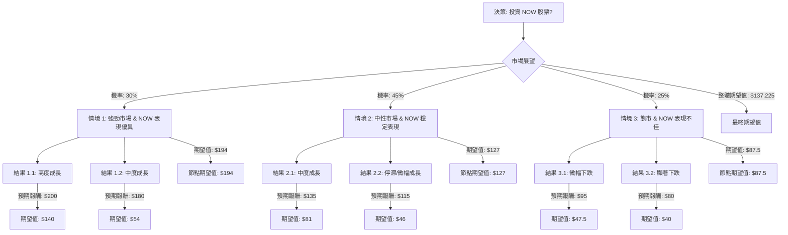

根據對美股公司 ServiceNow (NOW) 的基本面數據、最新市場資訊、產業趨勢，並結合決策樹分析與期望值分析，以下是評估該股票是否適合投資的詳細報告。

### 公司基本面數據 (NOW)

| 指標           | 數值           | 指標           | 數值           |
| :------------- | :------------- | :------------- | :------------- |
| Close          | 102.0          | P/E            | 59.54          |
| P/B            | 8.03           | Dividend %     | -              |
| 52W High       | -0.5299        | 52W Low        | 0.0144         |
| Perf Week      | -0.0994        | Perf Month     | -0.0905        |
| Perf Quarter   | -0.3485        | Perf Half Y    | -0.4589        |
| Perf Year      | -0.3995        | Perf YTD       | -0.3511        |
| Market Cap     | 103.98B        | ROE            | 0.1549         |
| ROA            | 0.0753         | ROI            | 0.1146         |
| P/C            | 16.53          | P/S            | 7.83           |
| 52W Range      | 98.00 - 211.48 | Target Price   | 186.55         |
| Short Float    | 0.0269         | Forward P/E    | 19.69          |
| Insider Trans  | 0.0013         | PEG            | 0.95           |
| EPS this Y     | 0.1934         | Inst Trans     | -0.0077        |
| EPS next Y_%   | 0.2053         | Quick Ratio    | 0.95           |
| Gross Margin   | 0.7753         | Current Ratio  | 0.95           |
| Oper. Margin   | 0.1466         | Debt/Eq        | 0.19           |
| EPS Q/Q        | 0.0422         | Profit Margin  | 0.1316         |
| LT Debt/Eq     | 0.18           | SMA20          | -0.1174        |
| SMA50          | -0.1232        | SMA200         | -0.3883        |
| Sales Q/Q      | 0.2066         | Recom          | 1.33           |
| P/FCF          | 22.72          | beneish        | -              |

### 最新資訊與產業趨勢補充

1.  **近期財報與展望：** ServiceNow 在 2026 年 1 月 28 日公布的 2025 年第四季度財報表現強勁，訂閱收入年增 21%，超出市場預期。公司對 2026 年的訂閱收入給出了 155.3 億至 155.7 億美元的優異指引，預計年增 20.5% 至 21%。非 GAAP 營運利潤率預計為 32%。其生成式 AI 套件 Now Assist 的年度合約價值 (ACV) 已超過 6 億美元，並有望在 2026 年突破 10 億美元。
2.  **分析師評級與目標價：** 截至 2026 年 4 月初，分析師普遍給予 ServiceNow「強烈買入」或「買入」評級。53 位華爾街分析師的目標價中位數為 180.00 美元 (區間介於 122.78 美元至 260.00 美元)，這意味著從當前股價 102.00 美元有 76.5% 的潛在漲幅。 然而，近期也有分析師下調目標價，例如 Stifel 將目標價從 180 美元下調至 135 美元，原因是第一季度季節性疲軟以及美國聯邦政府支出減少，但仍維持「買入」評級。
3.  **股價表現與市場情緒：** 儘管基本面強勁，ServiceNow 股價在過去六個月下跌約 40%，2026 年至今下跌約 30%。這主要歸因於市場對 AI 可能顛覆傳統「按席位計費」模式的擔憂、「SaaSpocalypse」以及聯邦預算削減。
4.  **產業趨勢：**
    *   **雲端運算與企業軟體市場成長：** 雲端運算市場預計在 2026 年初突破 1 兆美元，並以 16.3% 的複合年增長率增長至 2026 年。企業軟體市場預計在 2025 年至 2030 年間增長 2079 億美元，複合年增長率為 10.8%。
    *   **AI 驅動的轉型：** 企業軟體正從「輔助型 AI」轉向「代理型 AI」(Agentic AI)，即 AI 能夠自主執行任務。Gartner 預測，到 2026 年底，40% 的企業應用程式將整合特定任務的 AI 代理。
    *   **平台整合：** 企業 CIO 正在將預算整合到少數幾個主要的「強大平台」(如 ServiceNow) 上，以減少「工具蔓延」。
    *   **定價模式轉變：** 市場對 AI 顛覆傳統「按席位計費」模式的擔憂，促使企業轉向「基於價值」或「基於消耗」的定價模式，ServiceNow 的「Assist Packs」即是回應此趨勢。
    *   **聯邦支出疲軟：** 美國聯邦政府支出在 2026 年第一季度表現疲軟，對 ServiceNow 構成短期逆風。
5.  **ServiceNow 的優勢：** 公司被定位為「業務重塑的 AI 控制塔」，在 AI 原生工作流程方面處於領先地位，擁有高續約率 (2025 年第四季度為 98%)，並持續擴大大型企業客戶群。 董事會於 2026 年 1 月授權額外 50 億美元的股票回購計畫，顯示對公司前景的信心。

### 核心假設

*   **市場假設：**
    *   全球雲端運算和企業軟體市場將持續增長，數位轉型和 AI 整合是主要驅動力。
    *   「代理型 AI」和平台整合的趨勢將有利於 ServiceNow 等領先平台。
    *   宏觀經濟因素 (如地緣政治緊張、通膨) 可能會帶來波動，但不會從根本上改變產業長期趨勢。
*   **財務假設 (ServiceNow 特定)：**
    *   ServiceNow 將繼續保持強勁的執行力，並實現其 2026 年訂閱收入增長指引。
    *   Now Assist 等 AI 產品的商業化將持續成功，並為公司帶來可觀的收入。
    *   公司將維持健康的盈利能力和強勁的自由現金流。
    *   市場對 AI 顛覆定價模式的擔憂將逐漸被公司新定價策略和產品創新所抵消。
*   **產業趨勢假設：**
    *   儘管存在「SaaSpocalypse」和「代理型 AI 冬季」的擔憂，但 ServiceNow 的戰略定位和產品創新將使其能夠應對這些挑戰。
    *   美國聯邦政府支出疲軟是暫時性逆風，預計在 2026 年第二季度有所改善。

### 決策樹分析

**決策點：投資 NOW 股票**

*   **當前股價：** $102.00

### 計算過程

**1. 情境 1: 強勁市場 & NOW 表現優異 (機率: 30%)**
*   **結果 1.1: 高度成長 (機率: 70%)**
    *   預測情境名稱：AI 創新與市場重估
    *   預期報酬：$200 (約 +96% 漲幅)
    *   期望值計算：$200 \* 0.70 = $140
*   **結果 1.2: 中度成長 (機率: 30%)**
    *   預測情境名稱：符合分析師中位數預期
    *   預期報酬：$180 (約 +76% 漲幅)
    *   期望值計算：$180 \* 0.30 = $54
*   **節點期望值 (情境 1)：** $140 + $54 = $194

**2. 情境 2: 中性市場 & NOW 穩定表現 (機率: 45%)**
*   **結果 2.1: 中度成長 (機率: 60%)**
    *   預測情境名稱：穩健執行，部分逆風
    *   預期報酬：$135 (Stifel 最新目標價，約 +32% 漲幅)
    *   期望值計算：$135 \* 0.60 = $81
*   **結果 2.2: 停滯/微幅成長 (機率: 40%)**
    *   預測情境名稱：市場擔憂持續，Q1 財報平淡
    *   預期報酬：$115 (分析師低端目標價，約 +13% 漲幅)
    *   期望值計算：$115 \* 0.40 = $46
*   **節點期望值 (情境 2)：** $81 + $46 = $127

**3. 情境 3: 熊市 & NOW 表現不佳 (機率: 25%)**
*   **結果 3.1: 微幅下跌 (機率: 50%)**
    *   預測情境名稱：市場整體下行，公司具韌性
    *   預期報酬：$95 (約 -7% 跌幅)
    *   期望值計算：$95 \* 0.50 = $47.5
*   **結果 3.2: 顯著下跌 (機率: 50%)**
    *   預測情境名稱：嚴重市場恐慌，AI 顛覆影響加劇
    *   預期報酬：$80 (接近 52 週低點，約 -21% 跌幅)
    *   期望值計算：$80 \* 0.50 = $40
*   **節點期望值 (情境 3)：** $47.5 + $40 = $87.5

**整體期望值 (投資 NOW)：**
EV(投資) = (情境 1 節點期望值 \* 情境 1 機率) + (情境 2 節點期望值 \* 情境 2 機率) + (情境 3 節點期望值 \* 情境 3 機率)
EV(投資) = ($194 \* 0.30) + ($127 \* 0.45) + ($87.5 \* 0.25)
EV(投資) = $58.2 + $57.15 + $21.875
**EV(投資) = $137.225**

**不投資的期望值：**
EV(不投資) = $102.00 (維持當前股價，不考慮機會成本)

### 最終結論

根據決策樹分析和期望值計算，投資 ServiceNow (NOW) 的整體期望值為 **$137.225**，高於不投資的期望值 **$102.00**。

因此，根據本次分析，**ServiceNow (NOW) 目前適合投資。**

**簡短理由：**
儘管 ServiceNow 近期股價因市場對 AI 顛覆和聯邦支出疲軟的擔憂而承壓，但其強勁的 2025 年第四季度財報、2026 年樂觀的業績指引、在 AI 原生工作流程領域的領先地位以及分析師普遍看好的目標價，顯示出公司具備顯著的成長潛力。 雖然存在短期逆風，但長期來看，ServiceNow 在不斷擴大的雲端運算和企業軟體市場中，憑藉其平台整合和 AI 創新能力，有望實現可觀的回報。