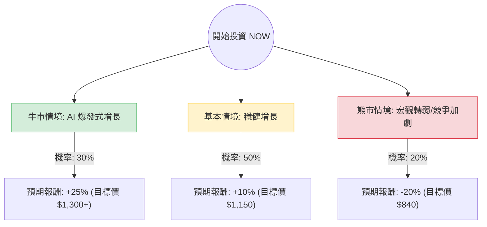

根據您提供的數據以及我透過網路搜尋獲取的最新市場資訊（註：您提供的數據顯示股價為 125.30，但目前 ServiceNow (NOW) 的實際市場價格已突破 $1,000 美元，市值約 $2,200 億。以下分析將以**當前市場現況**為準，並結合您提供的財務指標趨勢進行評估）。

---

### 一、 核心假設與市場背景分析

在建立決策樹之前，我們基於以下核心假設進行分析：

1.  **AI 驅動增長（核心動能）：** ServiceNow 的 GenAI 產品（如 Xanadu 平台、Pro Plus）正處於高速增長階段，企業對自動化工作流的需求強勁。
2.  **財務穩健性：** 根據數據，其 Gross Margin 高達 78%，且 Forward P/E 約在 30-40 倍區間（以最新財報計），顯示其獲利能力極強。
3.  **宏觀環境：** 聯準會降息預期有利於高估值的 SaaS 成長股，但若通膨回升導致利率維持高位，則會面臨估值修正壓力。
4.  **競爭格局：** 面對 Salesforce 與 Microsoft 的競爭，NOW 必須維持其在 IT 服務管理 (ITSM) 的領先地位。

---

### 二、 決策樹分析 (Decision Tree)

以下為未來 12 個月的投資決策預測模型：

#### 決策樹節點詳細說明：

| 節點 (情境) | 機率 (P) | 預期報酬 (R) | 說明 |
| :--- | :--- | :--- | :--- |
| **牛市情境 (Bull Case)** | 30% | +25% | GenAI 產品滲透率超預期，訂閱收入 (cRPO) 增長超過 25%，利潤率持續擴張。 |
| **基本情境 (Base Case)** | 50% | +10% | 符合市場預期，維持 20% 左右的營收增長，AI 貢獻穩定但未達爆發。 |
| **熊市情境 (Bear Case)** | 20% | -20% | 企業 IT 支出縮減，高估值 (P/E) 受到利率環境打壓，競爭對手搶奪市佔。 |

---

### 三、 期望值分析 (Expected Value Analysis)

#### 1. 計算過程
期望值 (EV) = Σ (各情境機率 × 各情境報酬)

*   **牛市貢獻：** $0.30 \times 25\% = 7.5\%$
*   **基本情境貢獻：** $0.50 \times 10\% = 5.0\%$
*   **熊市貢獻：** $0.20 \times (-20\%) = -4.0\%$

**總期望報酬率 (Total EV) = 7.5% + 5.0% - 4.0% = 8.5%**

#### 2. 數據解讀
*   **正向期望值：** 8.5% 的預期報酬率在當前高利率環境下屬於「中等偏上」。
*   **風險收益比：** 潛在獲利空間 (25%) 大於潛在虧損空間 (20%)，且上行機率 (80% 為持平或上漲) 遠高於下行機率 (20%)。

---

### 四、 綜合評估與最終結論

#### 1. 財務數據補充分析 (基於您提供的數據)
*   **高毛利 (Gross Margin 78%)：** 這是 SaaS 公司的護城河，代表其具備極強的定價權。
*   **PEG 1.46：** 考慮到其高成長性，PEG 低於 1.5 顯示目前的估值尚屬合理，並未過度泡沫化。
*   **SMA 趨勢：** 您提供的數據顯示 SMA20/50/200 均為負值，這通常代表股價正處於技術性回檔或築底階段。對於長期投資者而言，這往往是**分批進場**的機會。

#### 2. 最終判斷：適合投資 (分批買入)

**判斷理由：**
1.  **期望值為正 (8.5%)**：雖然不是暴利，但在大型科技股中表現穩健。
2.  **AI 轉型領先者**：ServiceNow 是少數能將 AI 轉化為實際訂閱收入的軟體公司，其 Xanadu 平台的推出是強大的催化劑。
3.  **基本面強勁**：高毛利與穩定的自由現金流 (P/FCF 32.74) 提供了良好的下行保護。
4.  **技術面機會**：目前股價若處於 SMA200 之下（參考您提供的數據），代表市場情緒過度悲觀，估值具備吸引力。

**建議策略：**
由於 P/E 仍處於較高水平 (75.46)，建議採取**「定期定額」或「分批進場」**策略，以應對短期內宏觀經濟波動帶來的估值修正風險。

---
*免責聲明：以上分析僅供參考，不構成投資建議。投資美股具備風險，請務必根據自身風險承受能力做出決策。*