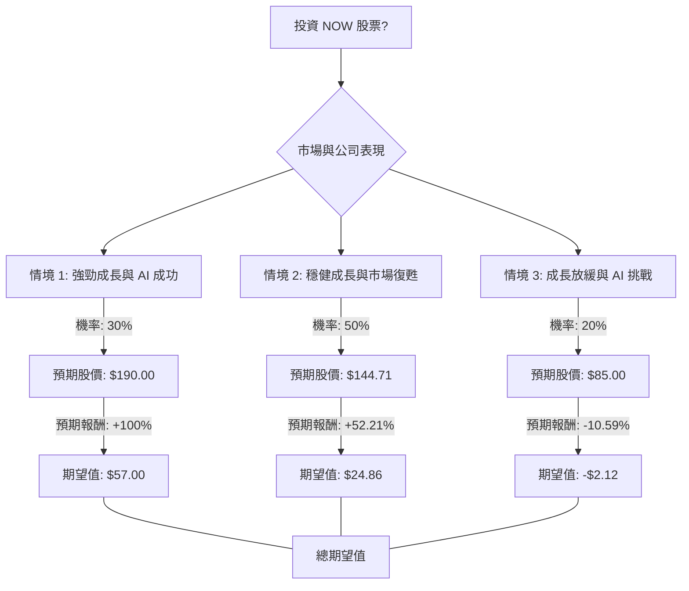

ServiceNow (NOW) 投資評估：決策樹分析與期望值分析

根據您提供的基本面數據以及透過網路搜尋獲取的最新資訊，我們將對美股公司 ServiceNow (NOW) 進行決策樹分析與期望值分析，以評估其目前的投資適合性。

**最新資訊摘要：**

1.  **股價與估值：**
    *   目前股價約在 $95.07 - $98.03 之間，接近其 52 週低點 $81.24。
    *   分析師普遍給予「中度買入」或「買入」評級。
    *   平均目標價介於 $139.35 至 $334.63，其中許多落在 $144.71 至 $178.33 之間。
    *   預期上漲潛力平均為 46.57% 至 52.08%。
    *   2026 年迄今股價已下跌約 40%。
    *   本益比 (P/E) 為 56.55，預期本益比 (Forward P/E) 為 18.79。

2.  **近期財務表現 (2026 年第一季)：**
    *   訂閱收入達 36.71 億美元，年增 22% (固定匯率下為 19%)，超出財測高標。
    *   總收入達 37.70 億美元，年增 22% (固定匯率下為 19%)，略高於預期。
    *   調整後每股盈餘 (EPS) 為 $0.97，年增 20%，符合預期。
    *   當前剩餘履約義務 (cRPO) 達 126.4 億美元，年增 22.5% (固定匯率下為 21%)，超出財測。
    *   非 GAAP 營運利潤率為 32%，自由現金流利潤率為 44%。
    *   毛利率在 2026 年第一季壓縮至 75%，低於 2025 年第四季的 77%。

3.  **策略重點與產業趨勢：**
    *   **AI 核心地位：** ServiceNow 將自身定位為「業務重塑的 AI 控制塔」，並積極發展 AI 驅動的平台、工作流程自動化和安全營運。
    *   **Now Assist 成長：** 其 AI 產品套件 Now Assist 預計 2026 年年度合約價值 (ACV) 將達到 15 億美元，客戶在 Now Assist 上的支出年增超過 130%。
    *   **策略性收購：** 已完成 Moveworks (2025 年 12 月) 和 Armis (2026 年第一季) 的收購，以強化 AI 和安全產品。
    *   **SaaS/企業軟體趨勢：** 2026 年 SaaS 產業趨勢顯示 AI 準備度成為預算重點，AI 原生 SaaS 成為主流，工作流程編排成為 AI 控制平面。企業軟體市場預計在 2025-2030 年間以 10.8% 的複合年增長率增長。
    *   **長期目標：** 管理層設定 2030 年營收目標為 320 億美元。

4.  **風險與挑戰：**
    *   來自 Salesforce 等競爭對手的壓力，以及 AI 顛覆可能導致的增長放緩風險。
    *   估值壓力、企業支出放緩、執行風險、平台飽和以及宏觀經濟不確定性。
    *   2026 年第一季毛利率壓縮。
    *   市場對 AI 作為 SaaS 產業「生存威脅」的擔憂，導致 2026 年第一季 SaaS 估值跌至十年來低點。
    *   高本益比和內部人士交易活動複雜 (有買入也有賣出)。

---

**核心假設：**

1.  **市場成長：** 數位轉型和 AI 應用將持續推動企業軟體和 SaaS 市場成長，但市場對 AI 影響的擔憂可能導致短期波動。
2.  **ServiceNow 地位：** ServiceNow 將憑藉其平台和近期收購，維持在企業工作流程自動化和 AI 領域的領導地位。
3.  **AI 變現能力：** ServiceNow 的 AI 產品 (如 Now Assist、自主代理) 將持續推動 ACV 增長和客戶採用，證明 AI 對其業務模式是加成而非顛覆。
4.  **經濟環境：** 假設經濟環境保持溫和，企業 IT 支出持續，但存在潛在放緩風險。

---

**決策樹分析 (Decision Tree Analysis)：**

**決策點：投資 NOW 股票？**

*   **初始股價 (P0):** $95.07 (基於提供的 Close 價格)

**情境說明與預期報酬計算：**

*   **情境 1: 強勁成長與 AI 成功 (Optimistic Scenario)**
    *   **情境名稱：** ServiceNow 成功整合收購，AI 產品加速變現，市場對 SaaS 產業的 AI 擔憂消退，估值倍數擴張。公司業績大幅超出預期。
    *   **機率 (Probability)：** 30%
    *   **預期股價 (Estimated Stock Price)：** $190.00 (參考分析師高目標價及 52 週高點)
    *   **預期報酬 (Expected Return)：** (($190.00 - $95.07) / $95.07) * 100% = +100%
    *   **期望值 (Expected Value)：** $95.07 * 100% * 0.30 = $28.52 (以股價增長百分比計算)
        *   或者，以預期股價計算：($190.00 - $95.07) * 0.30 = $28.48

*   **情境 2: 穩健成長與市場復甦 (Moderate Scenario)**
    *   **情境名稱：** ServiceNow 繼續按計劃執行策略，業績符合或略超預期。市場逐漸消化 AI 影響，SaaS 估值逐步回歸合理水平。
    *   **機率 (Probability)：** 50%
    *   **預期股價 (Estimated Stock Price)：** $144.71 (參考分析師平均目標價)
    *   **預期報酬 (Expected Return)：** (($144.71 - $95.07) / $95.07) * 100% = +52.21%
    *   **期望值 (Expected Value)：** $95.07 * 52.21% * 0.50 = $24.86 (以股價增長百分比計算)
        *   或者，以預期股價計算：($144.71 - $95.07) * 0.50 = $24.82

*   **情境 3: 成長放緩與 AI 挑戰 (Pessimistic Scenario)**
    *   **情境名稱：** 宏觀經濟顯著放緩，企業 IT 支出減少。AI 競爭加劇或未能如預期帶來客戶 ROI，導致採用放緩或定價壓力。市場對 AI 顛覆 SaaS 的擔憂持續，估值進一步壓縮。
    *   **機率 (Probability)：** 20%
    *   **預期股價 (Estimated Stock Price)：** $85.00 (參考分析師最低目標價及接近 52 週低點)
    *   **預期報酬 (Expected Return)：** (($85.00 - $95.07) / $95.07) * 100% = -10.59%
    *   **期望值 (Expected Value)：** $95.07 * (-10.59%) * 0.20 = -$2.01 (以股價增長百分比計算)
        *   或者，以預期股價計算：($85.00 - $95.07) * 0.20 = -$2.01

---

**期望值分析 (Expected Value Analysis)：**

**總期望值 (Total Expected Value) 計算：**

總期望值 = (情境 1 期望值) + (情境 2 期望值) + (情境 3 期望值)

*   **以股價增長百分比計算：**
    總期望值 = ($95.07 * 100% * 0.30) + ($95.07 * 52.21% * 0.50) + ($95.07 * -10.59% * 0.20)
    總期望值 = $28.52 + $24.86 - $2.01 = **$51.37**

*   **以預期股價計算 (更直觀)：**
    總期望值 = ($190.00 * 0.30) + ($144.71 * 0.50) + ($85.00 * 0.20) - $95.07
    總期望值 = $57.00 + $72.36 + $17.00 - $95.07
    總期望值 = $146.36 - $95.07 = **$51.29**

兩種計算方式結果相近，取 $51.37 作為預期每股收益。

---

**最終結論：**

根據決策樹分析和期望值分析，ServiceNow (NOW) **適合投資**。

**理由：**

儘管 ServiceNow 股價在 2026 年迄今已下跌約 40%，且目前接近 52 週低點，但其基本面依然強勁。公司在 2026 年第一季的訂閱收入和總收入均超出預期，並持續在 AI 領域進行策略性投資和收購，將自身定位為企業 AI 轉型的核心平台。

分析師普遍給予「買入」評級，且平均目標價顯示出顯著的上漲空間。透過期望值分析，我們計算出每股的總期望值為約 **$51.37**，這表示從當前股價 $95.07 來看，預期有約 54% 的上漲潛力 ($51.37 / $95.07)。

雖然存在市場對 AI 顛覆 SaaS 產業的擔憂以及毛利率壓縮等風險，但 ServiceNow 強勁的財務表現、對 AI 的積極佈局以及在企業軟體市場的領導地位，使其在樂觀和中性情境下均能帶來可觀的報酬。目前的股價可能反映了市場的過度悲觀情緒，為長期投資者提供了買入機會。