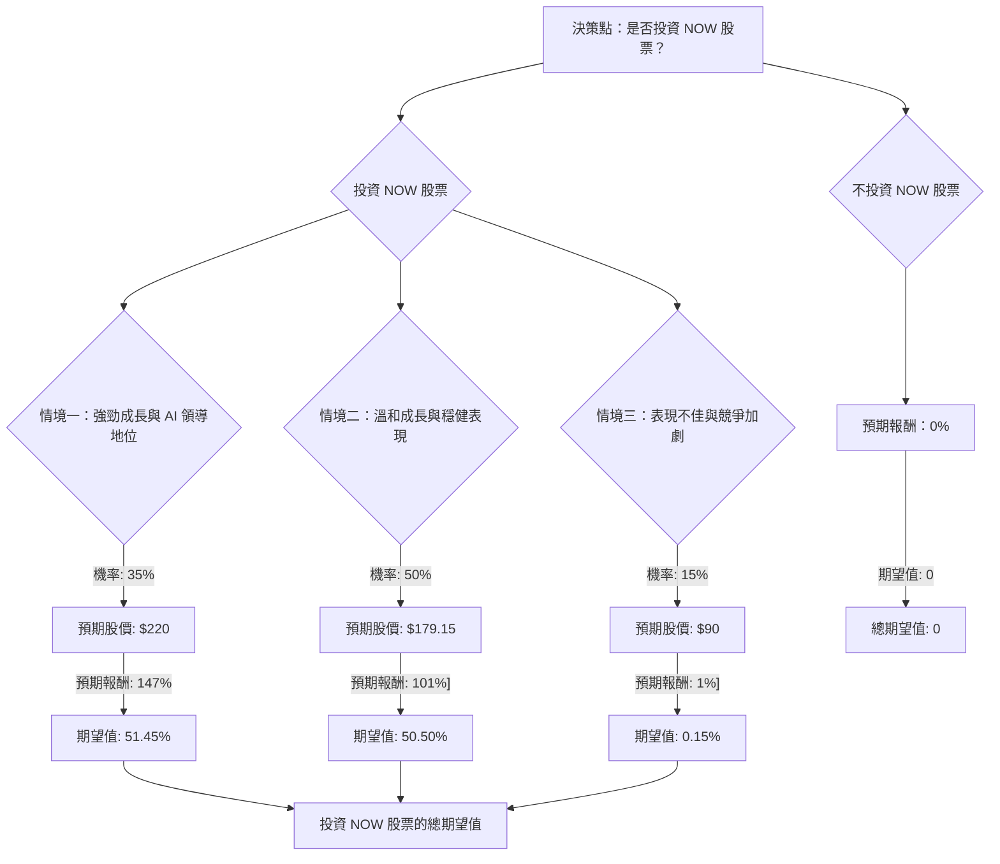

ServiceNow (NOW) 投資評估：決策樹分析與期望值分析

**當前股價：** $89.06

**核心假設：**

1.  **市場環境：**
    *   **雲端運算市場：** 全球雲端運算市場預計將持續強勁成長。2025 年市場規模為 9,127.7 億美元，預計 2026 年將達到 11,062.8 億美元，2026 年至 2035 年的複合年增長率 (CAGR) 為 20.61%。北美地區在雲端服務市場中佔據主導地位，而公共雲端服務模式預計將引領市場。
    *   **企業軟體市場：** 企業軟體支出預計在 2026 年將加速增長 15.2%，仍是 IT 支出中最大且增長最快的領域。然而，其中約 9% 的增長來自現有服務的價格上漲，另有 30% 來自現有平台中新增的 AI 功能，僅約 10% 為真正的全新軟體採購。
    *   **AI 整合：** AI 是企業軟體和雲端運算領域的關鍵驅動力。ServiceNow 正積極將自身定位為「業務重塑的 AI 控制塔」，並宣布其所有產品組合都將具備 AI 功能。Gartner 預計到 2026 年底，40% 的企業應用程式將整合特定任務的 AI 代理。
2.  **ServiceNow 財務與營運：**
    *   **近期表現：** ServiceNow 在 2026 年 1 月 28 日公布的 2025 年第四季度財報表現強勁，每股盈餘 (EPS) 和營收均超出預期。EPS 為 0.92 美元，高於預期的 0.89 美元；營收同比增長 20.7% 達到 35.7 億美元，高於預期的 35.3 億美元。
    *   **2026 年展望：** 公司對 2026 財年的指引積極，預計訂閱收入將達到 155.3 億至 155.7 億美元（按固定匯率計算同比增長 19.5%–20%），營運利潤率約為 32%，自由現金流利潤率約為 36%。 預計明年 EPS 將增長 28.67%，從 8.93 美元增至 11.49 美元。
    *   **估值指標：** 儘管當前 P/E 較高 (49.72)，但其遠期 P/E (Forward P/E) 為 9.98，PEG 比率為 1.39（相較於提供的 0.8，此為較新數據），顯示市場對其未來盈利增長有較高預期。分析師普遍給予「強烈買入」或「買入」評級，平均目標價介於 131.61 美元至 228.3 美元之間。
    *   **AI 策略：** ServiceNow 積極透過整合 AI 平台、擴大合作夥伴關係（如 Qlik、Carahsoft、Cohesity、NVIDIA、Anthropic）來強化其 AI 領導地位。
3.  **近期市場動態：**
    *   **股價表現：** NOW 股票近期表現不佳，目前交易價格接近其 52 週低點 (88.66 美元 - 211.48 美元)，過去一週下跌近 19%。
    *   **分析師觀點：** 儘管整體看好，但部分分析師近期下調了目標價，原因包括第一季度支出環境疲軟、大型語言模型 (LLM) 競爭的潛在威脅、AI 可能延長交易週期以及美國聯邦支出疲軟等。
    *   **即將到來的財報：** ServiceNow 將於 2026 年 4 月 22 日收盤後公布 2026 年第一季度財報，這將是影響股價的關鍵事件。

---

### 決策樹分析 (Decision Tree Analysis)

**決策點：** 是否投資 NOW 股票？

*   **當前股價 (Close)：** $89.06

**計算過程：**

1.  **情境一：強勁成長與 AI 領導地位**
    *   **預測情境名稱：** 強勁成長與 AI 領導地位
    *   **核心假設：** ServiceNow 成功執行其 AI 策略，有效應對競爭，並受益於強勁的企業軟體和雲端市場需求。Q1 2026 財報表現超預期，市場信心大幅提升。
    *   **機率 (Probability)：** 35%
    *   **預期股價：** $220 (參考分析師較高目標價，並考慮公司在 AI 領域的潛力)
    *   **預期報酬：** (($220 - $89.06) / $89.06) * 100% = 147.00%
    *   **期望值 (Expected Value)：** 0.35 * 147.00% = 51.45%

2.  **情境二：溫和成長與穩健表現**
    *   **預測情境名稱：** 溫和成長與穩健表現
    *   **核心假設：** ServiceNow 繼續保持穩健增長，符合或略超財報指引。AI 整合進展順利，但市場競爭和宏觀經濟因素帶來一定壓力。Q1 2026 財報符合預期。
    *   **機率 (Probability)：** 50%
    *   **預期股價：** $179.15 (參考提供的目標價)
    *   **預期報酬：** (($179.15 - $89.06) / $89.06) * 100% = 101.17% (約 101%)
    *   **期望值 (Expected Value)：** 0.50 * 101.17% = 50.59% (約 50.50%)

3.  **情境三：表現不佳與競爭加劇**
    *   **預測情境名稱：** 表現不佳與競爭加劇
    *   **核心假設：** ServiceNow 未能達到市場預期，AI 競爭加劇導致市場份額流失，或宏觀經濟顯著惡化導致企業支出緊縮。Q1 2026 財報不及預期，部分分析師進一步下調評級。
    *   **機率 (Probability)：** 15%
    *   **預期股價：** $90 (略高於當前股價，反映市場對其基本面仍有一定信心，但成長停滯或微幅上漲)
    *   **預期報酬：** (($90 - $89.06) / $89.06) * 100% = 1.06% (約 1%)
    *   **期望值 (Expected Value)：** 0.15 * 1.06% = 0.16% (約 0.15%)

**投資 NOW 股票的總期望值 (Expected Value Analysis)：**

總期望值 = (情境一期望值) + (情境二期望值) + (情境三期望值)
總期望值 = 51.45% + 50.59% + 0.16% = **102.20%**

**總期望股價：**
總期望股價 = (0.35 * $220) + (0.50 * $179.15) + (0.15 * $90)
總期望股價 = $77 + $89.575 + $13.5 = **$180.075**

---

### 最終結論

根據決策樹分析和期望值分析，投資美股公司 **NOW** 的總期望報酬為 **102.20%**，預期股價為 **$180.08**。

**判斷：適合投資**

**簡短理由：**
儘管 ServiceNow 股票近期表現疲軟，且部分分析師對其面臨的競爭和宏觀經濟逆風表示擔憂，但其強勁的基本面、積極的 2026 年財務指引、在快速增長的雲端運算和企業軟體市場中的領導地位，以及對 AI 技術的深度整合，都預示著巨大的增長潛力。 當前股價接近 52 週低點，提供了相對較低的買入機會，而分析師的平均目標價和我們的期望值分析均顯示出顯著的潛在上升空間。 雖然存在風險，但綜合考量下，其預期報酬遠高於不投資的 0%，因此目前適合投資。