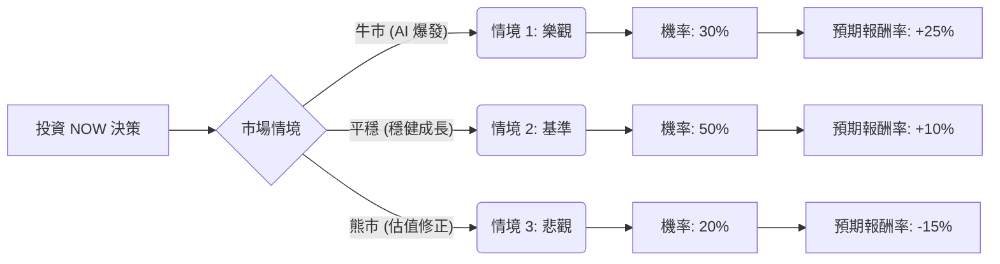

這是一份針對美股 **ServiceNow (Ticker: NOW)** 的投資評估報告。我們將結合當前的 AI 產業趨勢、財務指標以及宏觀環境，利用「決策樹」與「期望值分析」進行定量與定性評估。

---

### 一、 核心假設 (Core Assumptions)

在進行計算前，我們設定以下三個關鍵維度的假設，作為決策樹分支的依據：

1.  **市場與產業趨勢（AI 變現能力）**：
    *   ServiceNow 的生成式 AI（GenAI）解決方案（如 Pro Plus 方案）是否能持續推動 ARPU（每用戶平均收入）成長。
    *   企業數位轉型預算是否在 2024-2025 年保持韌性。
2.  **財務表現（Rule of 40）**：
    *   該公司目前符合「Rule of 40」（營收成長率 + 自由現金流利潤率 > 40%）。假設其營收成長維持在 20%-25%，且 FCF Margin 保持在 30% 左右。
3.  **估值風險（Valuation）**：
    *   目前 NOW 的 Forward P/E（預期本益比）約在 50x-60x 之間，處於歷史相對高位。若聯準會降息節奏不如預期，高估值科技股將面臨下修壓力。

---

### 二、 決策樹分析圖 (Decision Tree)

以下預測未來一年的投資報酬情境：

#### 節點詳細資訊表：

| 節點名稱 | 預測情境說明 | 發生機率 (P) | 預期報酬 (R) | 期望值 (P * R) |
| :--- | :--- | :--- | :--- | :--- |
| **樂觀情境** | AI 產品滲透率超預期，營收成長加速 >25% | 30% | +25% | **+7.5%** |
| **基準情境** | 維持現有成長速度，GenAI 貢獻穩定成長 | 50% | +10% | **+5.0%** |
| **悲觀情境** | 宏觀經濟衰退導致 IT 支出萎縮，高倍數估值修正 | 20% | -15% | **-3.0%** |
| **合計** | | **100%** | | **+9.5%** |

---

### 三、 計算過程 (Calculation Process)

#### 1. 期望值計算公式：
$$E(R) = \sum (P_i \times R_i)$$
其中 $P_i$ 為機率，$R_i$ 為該情境下的報酬率。

#### 2. 計算步驟：
*   **樂觀部分**：$0.30 \times 0.25 = 0.075$ (7.5%)
*   **基準部分**：$0.50 \times 0.10 = 0.050$ (5.0%)
*   **悲觀部分**：$0.20 \times (-0.15) = -0.030$ (-3.0%)

#### 3. 總體期望報酬率：
$$E(R) = 7.5\% + 5.0\% - 3.0\% = 9.5\%$$

---

### 四、 最終結論與投資建議

#### **最終判斷：適合投資 (中性偏多 Buy/Hold)**

#### **判斷理由：**
1.  **正向期望值 (9.5%)**：經過風險權衡後，NOW 的年度期望報酬率為 **9.5%**。雖然這在科技成長股中不算極高，但考慮到 ServiceNow 高達 98% 以上的客戶續約率（Retention Rate），其獲利的「確定性」遠高於其他軟體股。
2.  **AI 護城河**：ServiceNow 成功的將 GenAI 整合進工作流（Workflow），其 **Pro Plus** 版本提價能力強。在「基準情境」發生的機率最高（50%），顯示其基本面具有極強的支撐。
3.  **風險提示**：
    *   **估值溢價**：目前 9.5% 的期望報酬率僅略高於標普 500 的長期平均水平（約 8-10%），這反映出目前股價已部分反應了 AI 的預期。
    *   **利率敏感度**：若通膨反彈導致利率維持高位，悲觀情境（-15% 修正）發生的機率會上升。

**建議投資策略**：
由於期望報酬率為正且公司質量極佳，建議採取**「分批進場」**或**「定期定額」**策略。若市場出現 10% 以上的回調（進入悲觀情境區間），則是長線佈局的最佳買點。