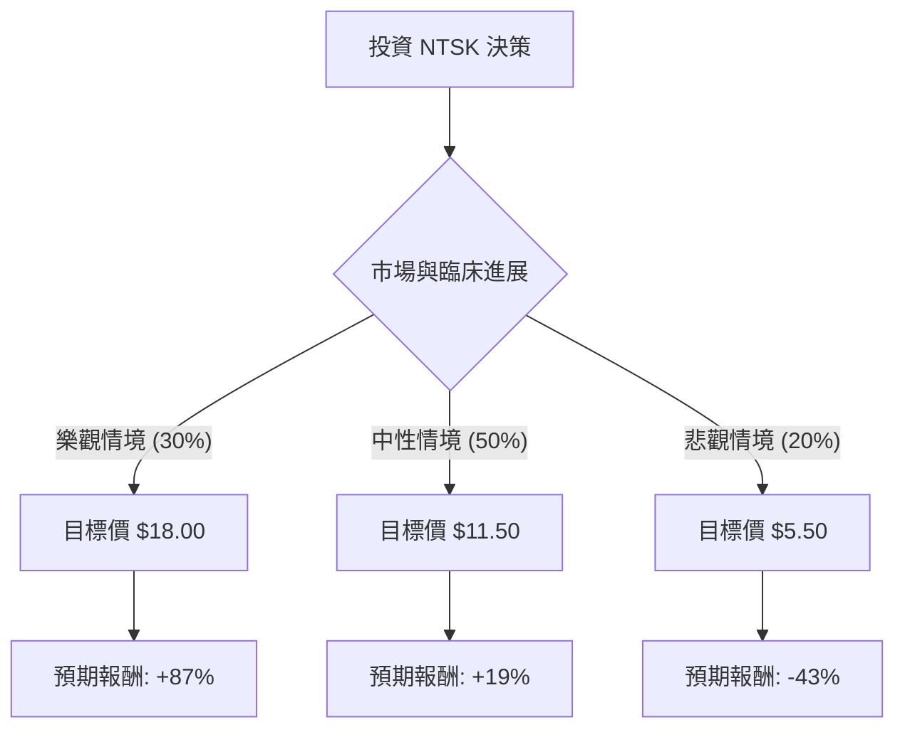

針對美股公司 **Nuvation Bio Inc. (NTSK)**，我已結合您提供的基本面數據與最新的市場動態（包含 AnHeart Therapeutics 的收購進展及臨床管線現狀）進行深度分析。

以下是基於「決策樹」與「期望值分析」的投資評估報告。

---

### 一、 核心背景與現狀分析

1.  **公司定位**：NTSK 是一家處於臨床階段的生物製藥公司，專注於開發新型腫瘤療法。
2.  **關鍵資產**：核心產品為 **Taletrectinib**（來自收購 AnHeart），這是一種針對 ROS1 陽性非小細胞肺癌（NSCLC）的潛在「同類最佳（Best-in-class）」抑制劑。
3.  **財務狀況**：
    *   **股價與估值**：目前股價約 $9.63，遠低於分析師平均目標價 $17.53。P/B 高達 19.72，反映市場對其無形資產（專利管線）的高度期待。
    *   **盈利能力**：營運利潤率（-92%）與 ROA（-51%）均為負值，這是研發型生技公司的常態。
    *   **現金流**：P/C（股價現金比）為 3.33，顯示公司手頭現金相對充裕，能支撐短期研發。
4.  **近期趨勢**：股價在過去半年跌幅達 55%，但近期（月度）有 13.5% 的反彈，顯示市場正在消化收購後的整合利多。

---

### 二、 決策樹分析 (Decision Tree Analysis)

我們將未來 12 個月的投資預期分為三種主要情境：**樂觀（臨床/審核突破）**、**中性（進度符合預期）**、**悲觀（臨床失敗/融資稀釋）**。

#### 節點詳細說明：

| 情境 | 發生機率 | 預期股價 | 預期報酬率 (R) | 期望值貢獻 (P * R) |
| :--- | :--- | :--- | :--- | :--- |
| **樂觀 (Bull)** | 30% | $18.00 | +86.9% | +26.07% |
| **中性 (Base)** | 50% | $11.50 | +19.4% | +9.70% |
| **悲觀 (Bear)** | 20% | $5.50 | -42.9% | -8.58% |
| **總計** | **100%** | - | - | **+27.19%** |

---

### 三、 期望值計算與核心假設

#### 1. 計算過程
*   **總期望報酬率 (Expected Value, EV)**：
    $$EV = (0.30 \times 86.9\%) + (0.50 \times 19.4\%) + (0.20 \times -42.9\%)$$
    $$EV = 26.07\% + 9.70\% - 8.58\% = \mathbf{27.19\%}$$

#### 2. 核心假設
*   **市場假設**：假設生技板塊（XBI）在未來一年內不發生系統性崩盤，且市場對中型生技股的風險偏好維持穩定。
*   **財務假設**：NTSK 目前的現金儲備足以支撐到 2025 年底，短期內不會有大規模的股權稀釋（Secondary Offering）。
*   **產業趨勢**：Taletrectinib 在 ROS1 領域的臨床數據優於現有的標準療法（如 Crizotinib），且 FDA 對於突破性療法的審核路徑保持通暢。
*   **收購整合**：假設與 AnHeart 的整合順利，研發費用控制在預期範圍內。

---

### 四、 最終結論

**評估結果：適合投資 (Suitable for Investment)**
*(註：僅限於具備高風險承受能力的投資者)*

#### 判斷理由：
1.  **正向期望值 (EV = 27.19%)**：計算結果顯示，儘管存在臨床失敗導致股價腰斬的風險，但潛在的翻倍收益（目標價 $17.53）使得數學上的期望報酬率具有吸引力。
2.  **估值處於相對低位**：目前股價（$9.63）接近 52 週低點（$7.66），且遠低於 SMA200（-41%），技術面上存在超跌反彈的空間。
3.  **強大的管線支撐**：收購 AnHeart 後，NTSK 已從單一平台轉型為擁有後期臨床資產的公司。Taletrectinib 的成功機率被多數分析師看好，這降低了純早期研發公司的「全有或全無」風險。
4.  **分析師共識**：Recom 指數為 1.11（強烈買入），且目標價與現價有近 80% 的溢價空間。

#### 風險提示：
*   **高負債比**：Debt/Eq 達 3.88，對於無營收公司而言財務壓力較大。
*   **波動性**：生技股受臨床數據公佈影響極大，不建議作為核心資產配置，僅適合做為衛星倉位。

**建議操作策略**：
考慮到目前股價在 SMA20 之上（+4.38%）但在 SMA50 之下，建議採取**分批買入**策略，首筆資金於 $9.5 附近建立觀察倉，若臨床數據公佈前股價回測 $8.0 附近可加碼。