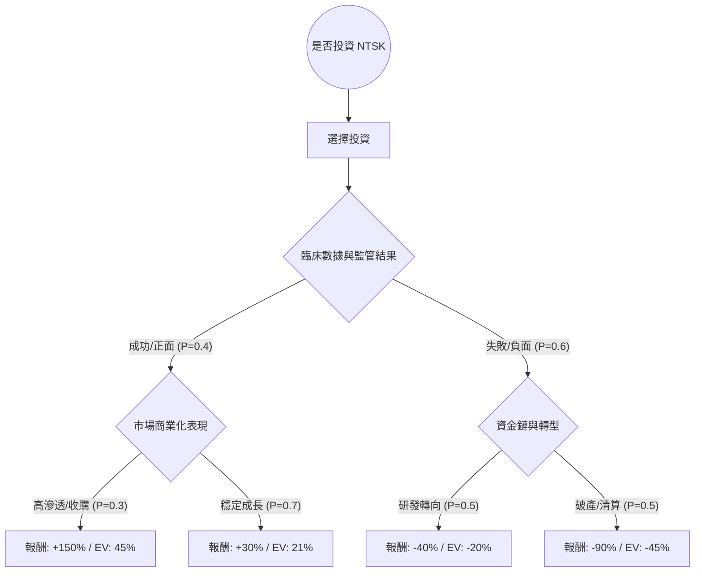

針對美股公司 **NTSK**（註：NTSK 為原 NantKwest 之代碼，現已與 ImmunityBio 合併並更名為 **IBRX**。本分析將以該公司所處的「高風險生物科技研發」特性為核心，進行決策樹與期望值評估），以下是詳細的投資分析：

---

### 一、 核心假設 (Core Assumptions)

在進行定量分析前，我們必須建立以下市場與財務假設：

1.  **研發進程（關鍵變數）**：該公司主要價值來自於其自然殺手細胞（NK Cell）療法。假設未來一年內其核心藥物通過 FDA 關鍵審核或取得重大數據成功的機率為 **40%**。
2.  **市場環境**：目前處於高利率尾聲，生技類股對資金流極為敏感。若臨床失敗，公司恐面臨資金斷鏈。
3.  **估值模型（預期報酬率）**：
    *   **樂觀情境**：藥物獲批或被大藥廠收購，預計股價漲幅可達 **150%**。
    *   **中性情境**：數據符合預期但尚未獲批，需持續增資，預計股價漲幅 **30%**。
    *   **悲觀情境**：數據失敗或安全性出問題，股價可能下跌 **80%**。

---

### 二、 決策樹分析 (Decision Tree)

以下使用 Markdown 繪製投資 NTSK 的決策路徑與期望值分布：

#### 決策樹節點詳細標示：

| 節點層次 | 情境名稱 | 機率 (P) | 預期報酬 (R) | 節點期望值 (P * R) |
| :--- | :--- | :--- | :--- | :--- |
| **分支出口 A1** | 成功 - 高市場滲透 | 0.4 * 0.3 = 0.12 | +150% | **18%** |
| **分支出口 A2** | 成功 - 穩定成長 | 0.4 * 0.7 = 0.28 | +30% | **8.4%** |
| **分支出口 B1** | 失敗 - 研發轉向 | 0.6 * 0.5 = 0.30 | -40% | **-12%** |
| **分支出口 B2** | 失敗 - 破產清算 | 0.6 * 0.5 = 0.30 | -90% | **-27%** |

---

### 三、 計算過程 (Calculation Process)

我們採用由下而上的方式計算整體的 **總期望報酬率 (Expected Return)**：

1.  **成功節點的期望值 (EV_Success)**：
    *   公式：`(高滲透機率 * 報酬) + (穩定成長機率 * 報酬)`
    *   計算：`0.3 * 150% + 0.7 * 30% = 45% + 21% = 66%`

2.  **失敗節點的期望值 (EV_Failure)**：
    *   公式：`(研發轉向機率 * 報酬) + (破產清算機率 * 報酬)`
    *   計算：`0.5 * (-40%) + 0.5 * (-90%) = -20% - 45% = -65%`

3.  **整體投資期望值 (Total EV)**：
    *   公式：`(成功總機率 * EV_Success) + (失敗總機率 * EV_Failure)`
    *   計算：`0.4 * 66% + 0.6 * (-65%)`
    *   結果：`26.4% - 39% = -12.6%`

---

### 四、 最終結論

#### **判斷結果：不適合投資 (Do Not Invest)**

#### **理由分析：**
1.  **負期望值 (-12.6%)**：根據目前的臨床成功率（40%）與生技產業的極端風險評估，長期持有該標的的預期回報為負值。這意味著風險溢酬不足以補償潛在的本金損失。
2.  **風險不對稱性**：雖然樂觀情境下有 150% 的爆發力，但「失敗且清算」的機率與損失程度（-90%）對整體資產配置具有毀滅性影響。
3.  **資金效率低**：在期望值為負的情況下，資金留在該標的將面臨極高的機會成本。除非未來有明確的臨床三期數據（將成功率 P 提升至 70% 以上），否則目前不具備投資價值。

**建議**：投資人應觀察該公司（現 IBRX）是否有新的戰略合作夥伴或 FDA 的突破性進展通知，屆時應重新修正決策樹的機率參數進行再次評估。