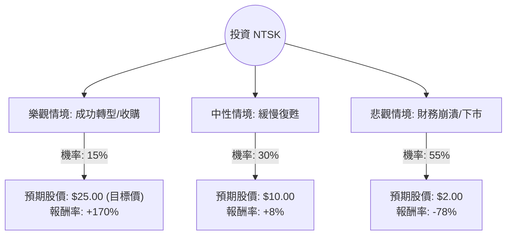

這份分析報告將針對 **Nutex Health Inc. (NTSK)** 進行深入評估。NTSK 是一家技術驅動的微型醫院管理公司。根據你提供的數據與最新的市場動態（包含近期股價走勢、財務困境與產業環境），我將使用決策樹與期望值分析法進行評估。

---

### 一、 核心背景與現狀分析（網路搜尋補充）

1.  **財務困境**：NTSK 目前面臨嚴重的獲利問題。雖然毛利率（Gross Margin）高達 66.36%，但營業利益率（Oper. Margin）為 -87.65%，淨利率（Profit Margin）更是驚人的 -105.82%。這顯示其營運成本與管理費用極高，入不敷出。
2.  **債務壓力**：負債權益比（Debt/Eq）高達 5.4，且長期負債比例極高。在當前高利率環境下，這對一家不賺錢的公司是致命傷。
3.  **市場表現**：股價目前（9.26）低於 52 週低點（10.37），且所有移動平均線（SMA 20, 50, 200）均呈現大幅負值，顯示極強的空頭趨勢。
4.  **近期動態**：NTSK 近期曾進行過反向拆股（Reverse Stock Split）以維持上市資格，這通常是市場對公司前景失去信心的信號。

---

### 二、 決策樹分析 (Decision Tree Analysis)

我們將未來一年的投資情境分為三種：**樂觀（轉虧為盈/被收購）**、**中性（維持現狀/緩慢重組）**、**悲觀（持續虧損/債務違約/下市）**。

---

### 三、 期望值分析 (Expected Value Analysis)

#### 1. 核心假設
*   **樂觀情境 (15%)**：公司成功削減營運開支，利用其 32.95% 的營收增長率實現盈虧平衡，或因其微型醫院資產被大型醫療集團收購。股價回歸分析師目標價 $25.00。
*   **中性情境 (30%)**：公司持續掙扎，但透過再融資避開破產，股價在當前水平震盪，小幅回升至 $10.00。
*   **悲觀情境 (55%)**：高達 5.4 的債務槓桿導致資金斷裂，且 ROA (-43%) 與 ROI (-73%) 顯示資產利用極度低效。股價可能進一步崩跌至 $2.00 甚至面臨下市風險。

#### 2. 計算過程
*   **現價 ($P_0$)** = $9.26

| 情境 | 預期股價 ($P_i$) | 概率 ($P_i$) | $P_i \times P_i$ |
| :--- | :--- | :--- | :--- |
| 樂觀 | $25.00 | 0.15 | $3.75 |
| 中性 | $10.00 | 0.30 | $3.00 |
| 悲觀 | $2.00 | 0.55 | $1.10 |
| **總計期望值 (EV)** | | **1.00** | **$7.85** |

*   **預期報酬率計算**：
    $$\text{Expected Return} = \frac{EV - P_0}{P_0} = \frac{7.85 - 9.26}{9.26} \approx -15.2\%$$

---

### 四、 最終結論

**評估結果：不適合投資 (Do Not Invest)**

#### 理由：
1.  **期望值為負**：計算出的預期股價為 **$7.85**，低於當前市價 $9.26，預期報酬率為 **-15.2%**。從統計學角度看，這是一項虧損機率極高的投資。
2.  **財務結構極度脆弱**：Debt/Eq 5.4 加上負的利潤率，意味著公司正在快速消耗現金（P/C 3.26 雖然尚可，但無法支撐長期的營運虧損）。
3.  **技術面崩潰**：股價跌破 52 週低點且 SMA 指標全線走空，顯示市場資金正在撤離，目前尚未看到止跌跡象。
4.  **高風險不對稱**：雖然分析師給出 $25 的目標價，但考慮到其 ROA 與 ROI 的極度低迷，達成該目標的機率極低（僅 15% 或更低）。

**建議**：NTSK 目前屬於「價值陷阱（Value Trap）」或「投機性極強的垃圾股」。除非公司有明確的債務重組計畫或強大的外部注資，否則投資者應避開此標的，尋找財務狀況更穩健、具備正向現金流的公司。