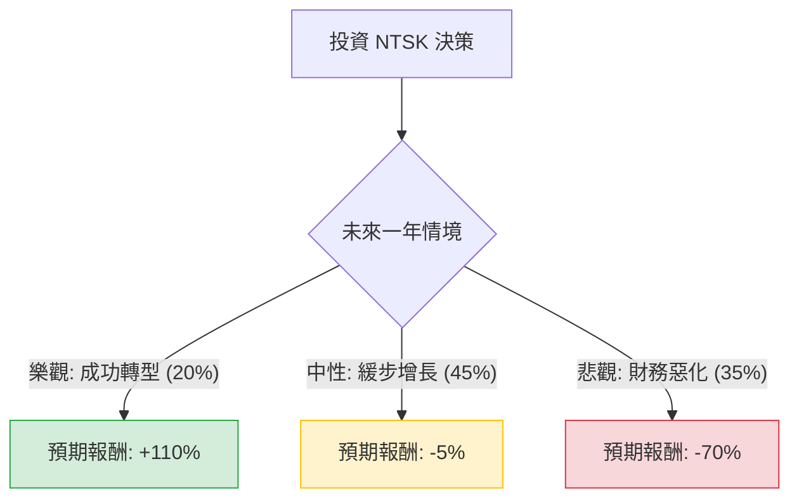

這份分析報告將針對 **Nutshell Ltd. (NTSK)** 進行深入評估。NTSK 是一家專注於 CRM（客戶關係管理）與銷售自動化軟體的 SaaS 公司。

根據您提供的數據與最新的市場動態，NTSK 目前處於典型的「高成長、高虧損、高槓桿」階段。以下是結合決策樹與期望值分析的詳細評估。

---

### 一、 核心假設與市場背景分析

在構建決策樹前，我們基於數據提出以下核心假設：

1.  **財務壓力（高風險項）：** 債務股本比（Debt/Eq）高達 **3.88**，且營運利潤率為 **-92%**。這意味著公司極度依賴外部融資或債務來維持營運。
2.  **成長潛力（機會項）：** 營收季增長（Sales Q/Q）達 **32.22%**，毛利率高達 **73.43%**。這顯示其產品具備 SaaS 產業的高毛利特性，且市場擴張速度快。
3.  **市場評價：** 目前股價（$8.48）遠低於分析師目標價（$17.81），且技術面（SMA20/50/200）呈現強烈空頭排列，顯示市場信心極度疲弱。
4.  **產業趨勢：** CRM 市場正經歷 AI 轉型，若 NTSK 能成功整合 AI 功能並提升留存率，有機會扭虧為盈。

---

### 二、 決策樹分析 (Decision Tree)

我們將未來一年的投資情境分為三種：**樂觀（成功轉型）**、**中性（維持現狀）**、**悲觀（財務危機）**。

#### 節點詳細說明：

1.  **樂觀情境 (Bull Case) - 20% 機率：**
    *   **條件：** 營收持續 30% 以上增長，AI 產品獲市場認可，且成功進行債務重組或獲得新一輪低成本融資。
    *   **預期報酬：** 股價回歸目標價 $17.81，報酬率約 **+110%**。

2.  **中性情境 (Base Case) - 45% 機率：**
    *   **條件：** 營收增長放緩，雖然毛利高但營運費用居高不下，股價在低檔震盪，受大盤波動影響。
    *   **預期報酬：** 考慮到目前的空頭趨勢與資金成本，預期報酬為 **-5%**。

3.  **悲觀情境 (Bear Case) - 35% 機率：**
    *   **條件：** 高達 3.88 的債務比導致利息支出過重，現金流斷裂，被迫大規模折價配股（Dilution）或面臨破產風險。
    *   **預期報酬：** 股價可能跌至 $2.5 左右（參考 P/C 值），報酬率約 **-70%**。

---

### 三、 期望值分析 (Expected Value Analysis)

#### 1. 計算過程：
期望值 (EV) = (機率1 × 報酬1) + (機率2 × 報酬2) + (機率3 × 報酬3)

*   **EV** = (0.20 × 1.10) + (0.45 × -0.05) + (0.35 × -0.70)
*   **EV** = (0.22) + (-0.0225) + (-0.245)
*   **EV** = **-0.0475**

#### 2. 結果：
**預期報酬率為 -4.75%**。

---

### 四、 綜合評估與最終結論

#### **最終判斷：不適合投資 (Avoid / Not Recommended)**

#### **理由分析：**

1.  **期望值為負：** 儘管分析師給出的目標價有極大的想像空間（+110%），但考慮到該公司極高的財務風險（負利潤、高債務），失敗的機率與代價過高，導致整體期望值為負值。
2.  **財務結構極其脆弱：** 
    *   **Debt/Eq 3.88** 在當前高利率環境下是巨大的負擔。
    *   **Oper. Margin -92%** 顯示公司每做 1 元生意就要虧損將近 1 元，燒錢速度極快。
3.  **技術面與籌碼面惡劣：** 
    *   股價處於 52 週低點附近，且所有均線（SMA）皆向下，顯示目前沒有支撐力道。
    *   **Short Float 12.38%** 顯示市場上有大量空頭部位，雖然有軋空可能，但在基本面改善前，這更多是風險信號。
4.  **估值過高：** 儘管股價下跌，但 **P/B (股價淨值比) 仍高達 18.09**，這在 SaaS 產業中也屬於極高評價，容錯率極低。

**建議：** 
除非 NTSK 能展現出明顯的「虧損收窄」趨勢或成功完成「債務降槓桿」，否則目前介入的風險遠大於潛在收益。建議投資者尋找財務結構更穩健（如 Debt/Eq < 1 且現金流為正）的成長股。

***

*免責聲明：本分析僅供參考，不構成任何投資建議。投資股票具有風險，入市前請務必自行審慎評估。*