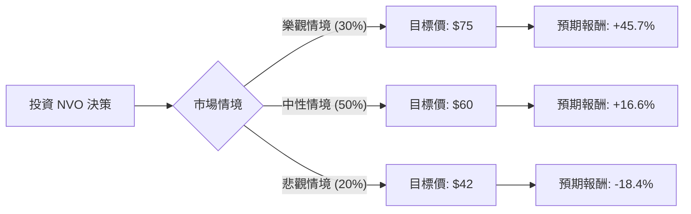

這份分析報告將結合您提供的基本面數據，以及透過網路搜尋獲取的最新市場動態（如 GLP-1 藥物競爭、產能擴張、醫保談判等），利用**決策樹（Decision Tree）**與**期望值（Expected Value）**模型評估 Novo Nordisk (NVO) 的投資價值。

---

### 一、 核心背景與市場動態分析（搜尋資訊彙整）

在進入模型前，我們先整合當前 NVO 的關鍵資訊：
1.  **市場地位**：NVO 是 GLP-1 市場（Ozempic, Wegovy）的領導者，與 Eli Lilly (LLY) 形成雙頭壟斷。
2.  **近期利空**：股價從高點回落（52W High -44%），主因是市場擔心 Eli Lilly 的競爭壓力、產能瓶頸，以及美國政府對藥價的談判壓力。
3.  **財務亮點**：ROE 高達 68.3%，毛利率 81.9%，顯示其產品具有極強的護城河與獲利能力。
4.  **估值變化**：目前的 P/E 約 15.26 倍，遠低於歷史平均（通常在 30-40 倍），這反映了市場已消化了大量的負面預期。

---

### 二、 決策樹分析模型

我們將未來一年的投資情境分為三種：**樂觀（牛市）**、**中性（基準）**、**悲觀（熊市）**。

#### 決策樹圖表 (Markdown)

| 節點名稱 | 發生機率 (P) | 預期股價 (Target) | 預期報酬率 (R) | 期望值 (P * R) |
| :--- | :--- | :--- | :--- | :--- |
| **樂觀情境 (Bull)** | 30% | $75.00 | +45.7% | +13.71% |
| **中性情境 (Base)** | 50% | $60.01 (參考 Target Price) | +16.6% | +8.30% |
| **悲觀情境 (Bear)** | 20% | $42.00 | -18.4% | -3.68% |
| **總計期望報酬** | **100%** | - | - | **+18.33%** |

---

### 三、 計算過程與核心假設

#### 1. 核心假設說明
*   **樂觀情境 (30%)**：
    *   假設：Wegovy 產能大幅釋放，口服版 Semaglutide 臨床數據超預期，且成功開拓心血管、脂肪肝 (MASH) 等新適應症。
    *   估值：P/E 回升至 22-25 倍。
*   **中性情境 (50%)**：
    *   假設：維持目前 GLP-1 市場份額，雖然有 Eli Lilly 競爭，但整體市場規模（減重市場）持續擴大。符合分析師平均目標價 $60.01。
    *   估值：P/E 維持在 15-18 倍。
*   **悲觀情境 (20%)**：
    *   假設：美國醫保談判導致藥價大幅砍價，或 Eli Lilly 的 Zepbound 奪走過半市場，且產能擴張進度落後。
    *   估值：股價回測 52W 低點（約 $43 附近）。

#### 2. 期望值 (EV) 計算公式
$$EV = (P_{Bull} \times R_{Bull}) + (P_{Base} \times R_{Base}) + (P_{Bear} \times R_{Bear})$$
$$EV = (0.30 \times 0.457) + (0.50 \times 0.166) + (0.20 \times -0.184)$$
$$EV = 0.1371 + 0.0830 - 0.0368 = 0.1833 = 18.33\%$$

---

### 四、 綜合評估與最終結論

#### 1. 基本面數據解讀
*   **超高效率**：ROE (68.3%) 與 ROI (37.5%) 顯示 NVO 是極其高效的賺錢機器。
*   **估值吸引力**：P/E 15.26 倍對於一家擁有 80% 以上毛利且處於高成長賽道的生技公司來說，處於**顯著低估**區間。
*   **技術面回溫**：SMA20 (+7.08%) 與 SMA50 (+5.78%) 均已轉正，顯示短期股價已止跌回升，動能正在累積。

#### 2. 投資判斷：**適合投資 (Buy)**

#### 3. 理由總結：
1.  **期望值為正且優厚**：計算出的預期報酬率為 **18.33%**，遠高於無風險利率與大盤平均預期。
2.  **安全邊際高**：股價已從高點修正超過 40%，目前的 Forward P/E (14.9) 甚至低於許多傳統價值股，下行風險已得到部分釋放。
3.  **產業紅利未結束**：減重藥市場仍處於早期滲透階段。即便競爭加劇，NVO 憑藉其強大的品牌（Ozempic 已成為代名詞）與持續擴大的產能，仍能保持高度獲利。
4.  **財務體質極佳**：債務股本比 (Debt/Eq) 僅 0.6，現金流充沛 (P/FCF 17.65)，有足夠實力進行研發與併購。

**建議操作**：目前股價 $51.47 接近 52 週區間的中下部，適合分批布局。首波目標價看 $60.01，若產能問題解決且新數據亮眼，可長期持有至 $70 以上。